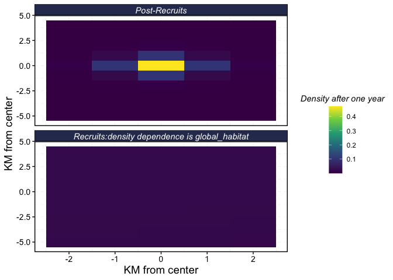
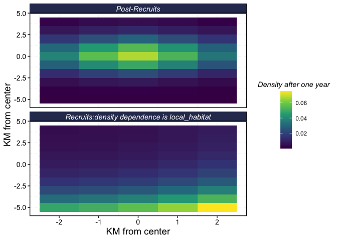
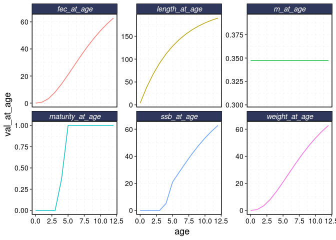
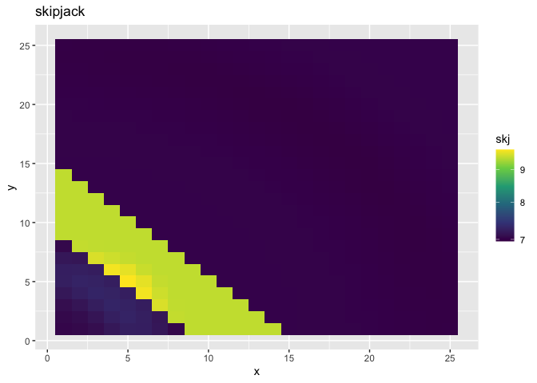
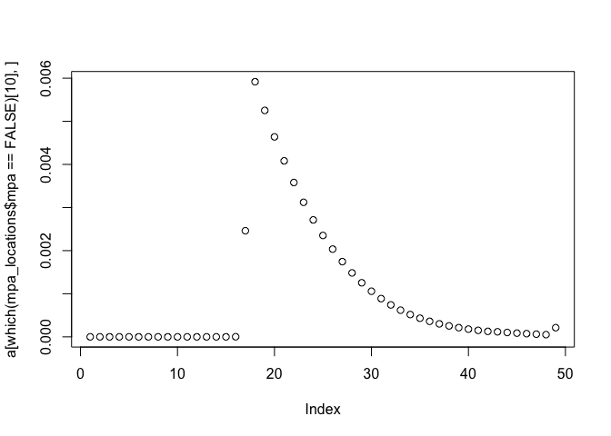
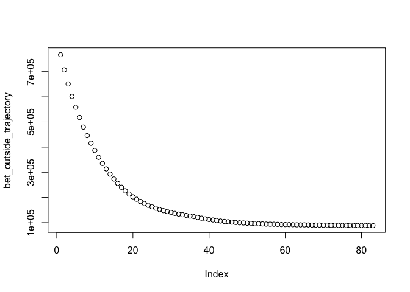
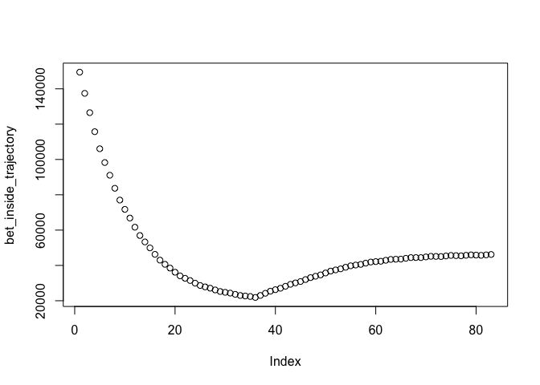
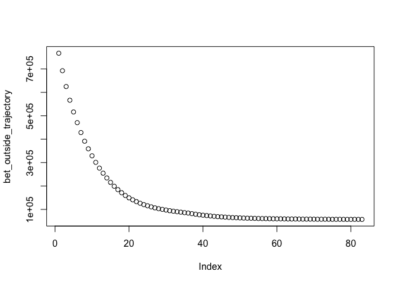
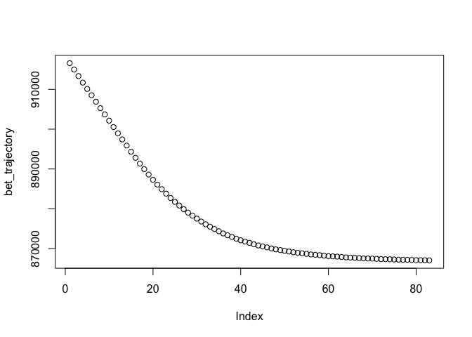
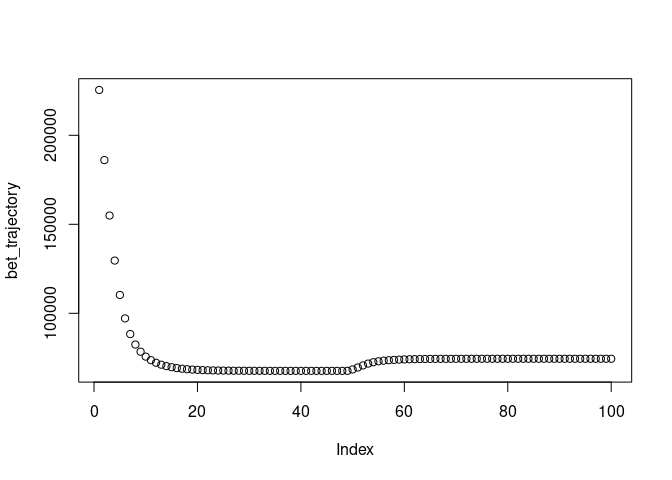

A list of movement matrices

A list specifying which seasons each movement matrix applies to

assume that if there’s only one, it’s static

sub in the correct movement matrix inside simmar.R

create spawning habitat that can move everyone to spawning habitat in a
time step if needed

<!-- README.md is generated from README.Rmd. Please edit that file -->

# marlin

<!-- badges: start -->

[](https://www.tidyverse.org/lifecycle/#experimental)
[](https://CRAN.R-project.org/package=mar)
<!-- badges: end -->

marlin is a package for efficiently running simulations of marine fauna
and fisheries. Age-structured population model of different
(independent) animal types in a 2D system with multiple fishing fleets.

## Installation

You can install the development version from
[GitHub](https://github.com/) with:

``` r
# install.packages("devtools")
devtools::install_github("DanOvando/marlin")
```

## Naviation

The core wrapper function is located in R/simmar.R. This funcion keeps
track of each of the populations and fleets.

The actual population models are found in src/fish\_model.cpp.
Additional modules will be put in there as they are developed

### Troubleshooting

Make sure you try the install with a fresh R session (go to
“Session\>Restart R” to make sure)

If you run into an error, first off try updating your R packages. From
there….

If your version of R is lower than 3.5, you might want to consider
updating R itself. Updating from 3.51 to 3.52 shouldn’t be any hassle.
BIG WARNING THOUGH, updating from say R 3.1 to 3.5 is a major update,
and you’ll lose all your installed packages in the process. I recommend
following the instructions
[here](https://www.datascienceriot.com/r/upgrade-R-packages/) to deal
with that, but even with that fix it can take a while, so I don’t
recommend doing a major R update if you’re on a deadline. There are also
packages to help you with this process, specifically
[`installR`](https://github.com/talgalili/installr/issues) for Windows
and [`updateR`](https://github.com/AndreaCirilloAC/updateR) for Mac.

From there…

  - On Windows, make sure you have the appropriate version of Rtools
    installed ([here](https://cran.r-project.org/bin/windows/Rtools/)),
    most likely Rtools35 if you have R version 3.3 or higher
      - Make sure that you select the box that says something about
        adding Rtools to the PATH variable
  - On macOS, there might be some issues with the your compiler,
    particularly if your versino of R is less than 4.0.0.

If you get an error that says something like `clang: error: unsupported
option '-fopenmp'`, follow the instructions
[here](https://thecoatlessprofessor.com/programming/cpp/r-compiler-tools-for-rcpp-on-macos-before-r-4.0.0/)

Once you’ve tried those, restart your computer and try running

## Example

Create two critters, skipjack tuna and bigeye tuna, and simulate their
unfished conditions

``` r
library(marlin)
library(tidyverse)
#> ── Attaching packages ─────────────────────────────────── tidyverse 1.3.0 ──
#> ✓ ggplot2 3.3.2          ✓ purrr   0.3.4     
#> ✓ tibble  3.0.3.9000     ✓ dplyr   1.0.0     
#> ✓ tidyr   1.1.0          ✓ stringr 1.4.0     
#> ✓ readr   1.3.1          ✓ forcats 0.5.0
#> ── Conflicts ────────────────────────────────────── tidyverse_conflicts() ──
#> x dplyr::filter() masks stats::filter()
#> x dplyr::lag()    masks stats::lag()
options(dplyr.summarise.inform = FALSE)

# hellos
resolution <- 25 # resolution is in squared patches, so 20 implies a 20X20 system, i.e. 400 patches 

years <- 20

seasons <- 4

steps <- years * seasons
# for now make up some habitat


skipjack_habitat <- expand_grid(x = 1:resolution, y = 1:resolution) %>%
  dplyr::mutate(habitat =  dnorm((x ^ 2 + y ^ 2), 20, 200)) %>% 
  pivot_wider(names_from = y, values_from = habitat) %>% 
  select(-x) %>% 
  as.matrix()


bigeye_habitat <- expand_grid(x = 1:resolution, y = 1:resolution) %>%
  mutate(habitat =  dnorm((x ^ 2 + y ^ 2), 300, 100)) %>% 
  pivot_wider(names_from = y, values_from = habitat) %>% 
  select(-x) %>% 
  as.matrix()


bigeye_habitat2 <- expand_grid(x = 1:resolution, y = 1:resolution) %>%
  mutate(habitat =  dnorm((x ^ .2 + y ^ .2), 100, 100)) %>% 
  pivot_wider(names_from = y, values_from = habitat) %>% 
  select(-x) %>% 
  as.matrix()

# create a fauna object, which is a list of lists
# marlin::create_critter will look up relevant life history information
# that you don't pass explicitly

fauna <- 
  list(
    "skipjack" = create_critter(
      scientific_name = "Katsuwonus pelamis",
      seasonal_habitat = list(skipjack_habitat, skipjack_habitat), # pass habitat as lists
      habitat_seasons = list(c(1, 2), c(3, 4)), # seasons each habitat apply to
      rec_habitat = skipjack_habitat,
      adult_movement = 2,# the mean number of patches moved by adults
      adult_movement_sigma = 2, # standard deviation of the number of patches moved by adults
      fished_depletion = .6, # desired equilibrium depletion with fishing (1 = unfished, 0 = extinct),
      rec_form = 1, # recruitment form, where 1 implies local recruitment
      seasons = seasons,
      init_explt = 0.2, 
      explt_type = "f"
      ),
    "bigeye" = create_critter(
      common_name = "bigeye tuna",
      seasonal_habitat = list(bigeye_habitat, bigeye_habitat2), # pass habitat as lists
      habitat_seasons = list(c(1, 2), c(3, 4)), # seasons each habitat apply to
      rec_habitat = bigeye_habitat,
      adult_movement = 3,
      adult_movement_sigma = 1,
      fished_depletion = .1,
      rec_form = 1,
      seasons = seasons,
      init_explt = 0.3, 
      explt_type = "f"
    )
  )
#> ══  1 queries  ═══════════════
#> 
#> Retrieving data for taxon 'Katsuwonus pelamis'
#> ✔  Found:  Katsuwonus+pelamis
#> ══  Results  ═════════════════
#> 
#> ● Total: 1 
#> ● Found: 1 
#> ● Not Found: 0


# create a fleets object, which is a list of lists (of lists). Each fleet has one element, 
# with lists for each species inside there. Price specifies the price per unit weight of that 
# species for that fleet
# sel_form can be one of logistic or dome


fleets <- list("longline" = list(
  skipjack = list(
    price = 100, # price per unit weight
    sel_form = "logistic", # selectivity form, one of logistic or dome
    sel_start = .9, # percentage of length at maturity that selectivity starts
    sel_delta = .1, # additional percentage of sel_start where selectivity asymptotes
    catchability = .01, # overwritten by tune_fleet but can be set manually here
    p_explt = 0.1
  ),
  bigeye = list(
    price = 1000,
    sel_form = "logistic",
    sel_start = .1,
    sel_delta = .01,
    catchability = .01,
    p_explt = 1
  )
),
"purseseine" = list(
  skipjack = list(
    price = 100,
    sel_form = "logistic",
    sel_start = 0.25,
    sel_delta = .1,
    catchability = .01,
    p_explt = 0.9
  ),
  bigeye = list(
    price = 100,
    sel_form = "logistic",
    sel_start = .25,
    sel_delta = .5,
    catchability = .01,
    p_explt = 1
  )
))


fleets <-
  create_fleet(fleets = fleets,
               fauna = fauna,
               base_effort = resolution ^ 2) # creates fleet objects, basically adding in selectivity ogives

a <- Sys.time()

fleets <- tune_fleets(fauna, fleets, years = 50) # tunes the catchability by fleet to achieve target depletion

# fleets$purseseine$skipjack$catchability / fleets$longline$skipjack$catchability

# fleets$purseseine$bigeye$catchability / fleets$longline$bigeye$catchability

## different fleets for each species?
Sys.time() - a
#> Time difference of 7.309484 secs

# run simulations


# run the simulation using marlin::simmar
a <- Sys.time()

storage <- simmar(fauna = fauna,
                  fleets = fleets,
                  years = years)

Sys.time() - a
#> Time difference of 2.786458 secs
  

# process results, will write some wrappers to automate this
ssb_skj <- rowSums(storage[[steps]]$skipjack$ssb_p_a)

check <- expand_grid(x = 1:resolution, y = 1:resolution) %>%
  mutate(skj = ssb_skj)

ggplot(check, aes(x, y, fill = skj)) +
  geom_tile() +
  scale_fill_viridis_c() +
  labs(title = "skipjack")
```



``` r

ssb_bet <- rowSums(storage[[steps]]$bigeye$ssb_p_a)

check <- expand_grid(x = 1:resolution, y = 1:resolution) %>%
  mutate(bet = ssb_bet)

ggplot(check, aes(x, y, fill = bet)) +
  geom_tile() +
  scale_fill_viridis_c() +
  labs(title = "bigeye")
```



``` r


# double check that target depletions are reached

(sum(ssb_bet) / fauna$bigeye$ssb0) / fauna$bigeye$fished_depletion
#> [1] 0.0002207086

(sum(ssb_skj) / fauna$skipjack$ssb0) / fauna$skipjack$fished_depletion
#> [1] 0.05403034
```

Now, simulate effects of MPAs

``` r


set.seed(42)
#specify some MPA locations
mpa_locations <- expand_grid(x = 1:resolution, y = 1:resolution) %>%
  # mutate(mpa = rbinom(n(), 1, .25))
mutate(mpa = between(x,7,13) & between(y,7,13))
# 
# mpa_locations %>% 
#   ggplot(aes(x,y, fill = mpa)) + 
#   geom_tile()


# run the simulation, starting the MPAs at year 50 of the simulation
a <- Sys.time()

mpa_storage <- simmar(
  fauna = fauna,
  fleets = fleets,
  years = years,
  mpas = list(locations = mpa_locations,
              mpa_year = floor(years * .5))
)

Sys.time() - a
#> Time difference of 2.417782 secs

ssb_skj <- rowSums(mpa_storage[[steps]]$skipjack$ssb_p_a)

check <- expand_grid(x = 1:resolution, y = 1:resolution) %>%
  mutate(skj = ssb_skj)

ggplot(check, aes(x, y, fill = skj)) +
  geom_tile() +
  scale_fill_viridis_c() +
  labs(title = "skipjack")
```



``` r

ssb_bet <- rowSums(mpa_storage[[steps]]$bigeye$ssb_p_a)

check <- expand_grid(x = 1:resolution, y = 1:resolution) %>%
  mutate(bet = ssb_bet)

# plot(check$bet[check$x == 1])

ggplot(check, aes(x, y, fill = bet)) +
  geom_tile() +
  scale_fill_viridis_c() +
  labs(title = "bigeye")
```



``` r

# 

mpa_storage[[77]]$bigeye$ssb_p_a -> a

plot(a[which(mpa_locations$mpa == FALSE)[10],])
```



``` r
# (sum(ssb_bet) / fauna$bigeye$ssb0) / fauna$bigeye$fished_depletion
# 
# (sum(ssb_skj) / fauna$skipjack$ssb0) / fauna$skipjack$fished_depletion

bet_outside_trajectory <- map_dbl(mpa_storage,~ sum(.x$bigeye$ssb_p_a[mpa_locations$mpa == FALSE,]))

plot(bet_outside_trajectory)
```



``` r


bet_inside_trajectory <- map_dbl(mpa_storage,~ sum(.x$bigeye$ssb_p_a[mpa_locations$mpa == TRUE,]))

plot(bet_inside_trajectory)
```



``` r

bet_outside_trajectory <- map_dbl(mpa_storage,~ sum(.x$bigeye$ssb_p_a[mpa_locations$mpa == FALSE,]))

plot(bet_outside_trajectory)
```



``` r


bet_trajectory <- map_dbl(mpa_storage,~ sum(.x$bigeye$ssb_p_a))

plot(bet_trajectory)
```



``` r

skj_trajectory <- map_dbl(mpa_storage,~ sum(.x$skipjack$ssb_p_a))

plot(skj_trajectory)
```



Ah interesting, so need to think through the movement a bit more: the
problem is that movement is effectively 0 for the really good habitats:
critters stay put once they get there. Is that so bad? Problem is that
it doesn’t really allow for spillover.
