<!-- README.md is generated from README.Rmd. Please edit that file -->

# marlin

<!-- badges: start -->

<!-- [](https://www.tidyverse.org/lifecycle/#experimental) -->

<!-- [](https://CRAN.R-project.org/package=mar) -->

<!-- badges: end -->

`marlin` is an R package for running spatially explicit simulations of
marine fauna and fisheries. It tracks the age-structured populations of
multiple species targeted by multiple fishing fleets across a
two-dimensional grid, and supports a wide range of life histories,
movement dynamics, fleet behaviours, and management strategies. See the
examples below and the vignettes under the Articles tab for worked
demonstrations of how to:

- simulate the displacement of fishing effort across multiple species
- model seasonal spawning aggregations or climate-driven range shifts
- explore the role of port distance in shaping fleet spatial dynamics
- generate spatially explicit data for stock assessment model testing

The model is described in the following papers:

Ovando, D., Bradley, D., Burns, E., Thomas, L., & Thorson, J. (2023).
Simulating benefits, costs and trade-offs of spatial management in
marine social-ecological systems. *Fish and Fisheries*.
<https://doi.org/10.1111/faf.12804>

Ovando, D. (2025). Predicted effects of marine protected areas on
conservation and catches are sensitive to model structure. *Theoretical
Ecology*, 18(1), 7. <https://doi.org/10.1007/s12080-024-00602-7>

See [Getting Started with
marlin](https://danovando.github.io/marlin/articles/getting-started.html)
for examples of how to get started with `marlin`.

## What is `marlin` for?

`marlin` is best suited to asking *what if* questions rather than *what
will* questions.

For example, `marlin` is well-suited to “how might the impacts of a
proposed MPA network change if fishing effort is displaced rather than
removed?” It is not designed to answer “what will the exact biodiversity
impacts of this specific MPA be down to the sixth decimal place?”

This distinction matters because `marlin` is a *structural* rather than
*statistical* simulation model: its parameters are not estimated by
fitting to observed data. Instead, users set parameters to reflect the
general dynamics of the system they are studying. This makes `marlin`
well-suited to sensitivity analysis and scenario comparison, but less
suited to precise, site-specific prediction.

The simpler and more comparative the question, the easier it is to use
`marlin` well. “How sensitive are MPA outcomes to hyperallometry?” is a
much more tractable question than “what will catch and biodiversity look
like under a proposed MPA for 17 data-limited species in a rapidly
changing coastal bay?” Both are feasible, but the latter demands much
more careful parameterisation.

Some intended use cases:

- Assessing sensitivity of MPA network designs to ecological and
  economic uncertainty
- Designing dynamic ocean management strategies under climate change
- Management strategy evaluation for spatially explicit fisheries
  management

## Installation

You can install the development version from
[GitHub](https://github.com/DanOvando/marlin) with:

``` r
# install.packages("devtools")
devtools::install_github("DanOvando/marlin")
```

### Installation troubleshooting

- Start with a fresh R session (**Session \> Restart R**) before
  attempting the install.
- R version 4.1 or higher is required.
- If you encounter an error, try updating all installed packages first,
  then retry.
- `marlin` requires R compiler tools:
  - **Windows**: install the appropriate version of
    [Rtools](https://cran.r-project.org/bin/windows/Rtools/) for your R
    version (e.g. Rtools44 for R 4.4). When prompted, check the box to
    add Rtools to the PATH.
  - **macOS**: use the
    [macrtools](https://github.com/coatless-mac/macrtools) package or
    follow the [official CRAN
    instructions](https://mac.r-project.org/tools/).
- After installing compiler tools, restart R and try again.

## A note on complexity and expectations

`marlin` is designed to be fast and approachable given the complexity of
what it models. That said, it is not a push-button tool for automated
MPA design. Users need a working understanding of the model’s core
behaviour, and results will depend on thoughtful parameterisation and
solid R skills.

While `marlin` includes helpers for common outputs and plots, the raw
simulation output is a deeply nested list spanning ages, time steps,
patches, species, and fleet units simultaneously. Fluency with list
manipulation will serve you well;
[`purrr`](https://purrr.tidyverse.org/) is particularly useful here.

The `tidyverse` is not required to run `marlin`, but the examples below
make extensive use of `dplyr`, `tidyr`, `ggplot2`, and `purrr` to
extract and visualise results.

## Simple example

The following example walks through a minimal one-fleet, one-species
simulation to introduce the core `marlin` workflow.

Key global parameters:

- `resolution`: grid dimensions. A single integer creates a square grid
  (e.g. `resolution = 10` gives a 10×10 grid). A length-2 vector
  `c(nx, ny)` creates a rectangular grid, so `resolution = c(2, 10)`
  gives a 2×10 grid.
- `years`: number of years to simulate.
- `seasons`: number of seasons per year. `4` gives a quarterly model,
  `12` a monthly model, etc.
- `patch_area`: area of each patch in km².

``` r
library(marlin)
library(tidyverse)
options(dplyr.summarise.inform = FALSE)
theme_set(marlin::theme_marlin(base_size = 14))

resolution <- c(5, 10) 

patch_area <- 2

years <- 20

seasons <- 4

time_step <- 1 / seasons

steps <- years * seasons
```

`marlin` is structured around three list objects:

- `fauna`: life histories of the species being simulated
- `fleets`: fleet dynamics and fishing behaviour
- `manager`: management strategies (MPAs, quotas, effort caps)

### A note on FishLife default values

Each species in `fauna` is created with `create_critter`. If you supply
a common or scientific name, the function attempts to populate life
history parameters from
[FishLife](https://github.com/James-Thorson-NOAA/FishLife). This
requires an internet connection; running `marlin` offline requires
supplying all life history values manually.

**Important:** FishLife values are model estimates, not direct
measurements. Always verify that the retrieved values are appropriate
for your application, and update them with local data where possible.

After calling `create_critter`, check the `closest_taxa_match` field on
the returned object to confirm that FishLife matched the intended taxon.
We recommend using `scientific_name` rather than `common_name`. If you
see an error like
`Error in seq.default(min_age, max_age, by = time_step)`, this is
typically a network connectivity issue — simply re-running the code
usually resolves it.

### Creating a basic simulation

We start by building a `fauna` object using `create_critter`. Most
arguments are straightforward life history parameters. Two worth
highlighting: `adult_home_range` and `recruit_home_range` specify the
linear distance (in km) within which 95% of adults or recruits,
respectively, are expected to disperse from a source patch over the
course of a year.

``` r
fauna <-
  list(
    "bigeye" = create_critter(
      common_name = "bigeye tuna",
      adult_home_range = 5,
      recruit_home_range = 15,
      density_dependence = "local_habitat",
      seasons = seasons,
      depletion = .25,
      resolution = resolution,
      patch_area = patch_area,
      steepness = 0.6,
      ssb0 = 42,
      m = 0.4
    )
  )

fauna$bigeye$plot()
```

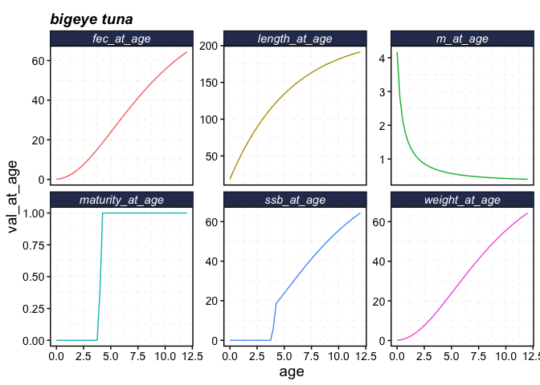

``` r

fauna$bigeye$plot_movement()
```

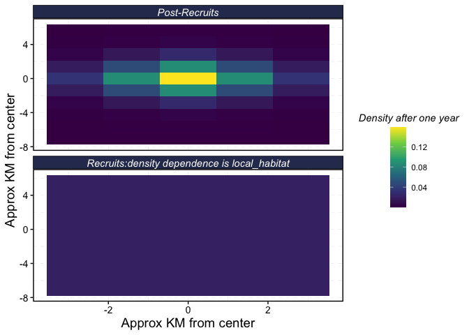

The `fleets` object is a list of fishing fleets, each created with
`create_fleet`. Every fleet contains one **metier** per species,
specifying that fleet’s interaction with a given critter: price per unit
weight, selectivity, and exploitation share. The `p_explt` argument
controls the share of total fishing mortality for each species
attributed to that metier — values are relative, not absolute. If two
metiers have `p_explt = 1` and `p_explt = 2` for species X, the first
accounts for one-third of total mortality and the second for two-thirds.

``` r
fleets <- list(
  "longline" = create_fleet(
    list("bigeye" = Metier$new(
      critter = fauna$bigeye,
      price = 10,
      sel_form = "logistic",
      sel_start = 1,
      sel_delta = .01,
      catchability = 0,
      p_explt = 1,
    )),
    base_effort = prod(resolution),
    resolution = resolution
  )
)
fleets$longline$metiers$bigeye$plot_selectivity()
```

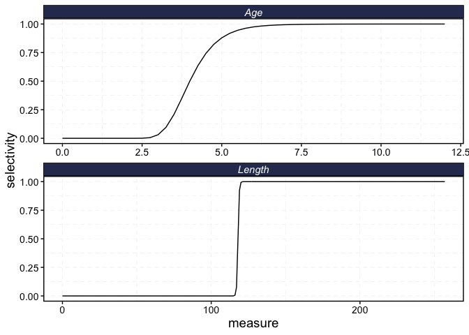

`tune_fleets` calibrates catchability coefficients so that each fleet
achieves a specified equilibrium depletion level. Here the target is 25%
depletion, meaning fished biomass equals 25% of unfished biomass at
equilibrium. The calibration accounts for all fleet dynamics and
`p_explt` weights.

``` r
fleets <- tune_fleets(fauna, fleets, tune_type = "explt")

fleets$longline$metiers$bigeye$plot_catchability()
```

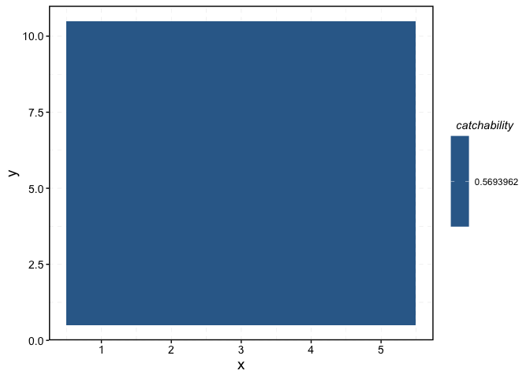

With fauna and fleets defined, we pass them to `simmar` to run the
simulation:

``` r
start_time <- Sys.time()

example_sim <- simmar(
  fauna = fauna,
  fleets = fleets,
  years = years
)

Sys.time() - start_time
#> Time difference of 0.03535891 secs
```

`process_marlin` tidies the raw simulation output into data frames;
`plot_marlin` provides quick visualisations:

``` r
# options(warn = 2)

processed_marlin <- process_marlin(sim = example_sim, time_step = time_step)

plot_marlin(processed_marlin)
```

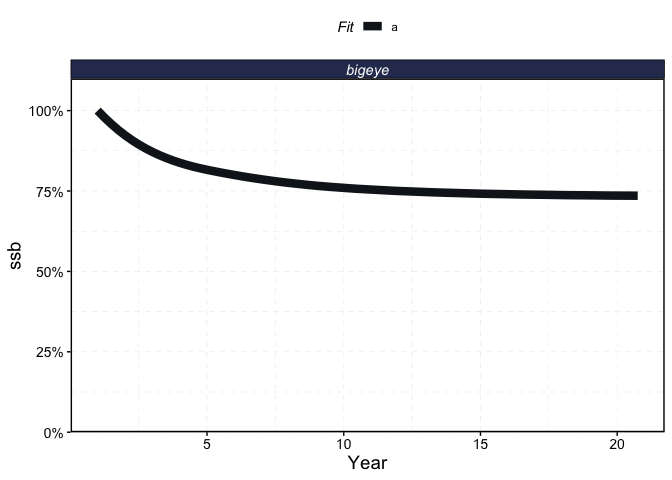

``` r

plot_marlin(processed_marlin, plot_var = "c", max_scale = FALSE)
```

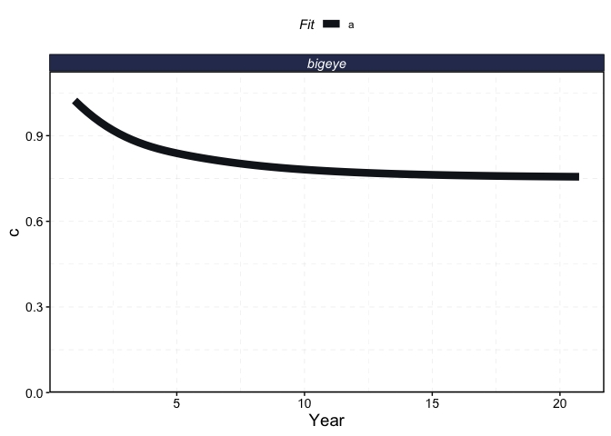

``` r

plot_marlin(processed_marlin, plot_var = "n", plot_type = "length", fauna = fauna)
```

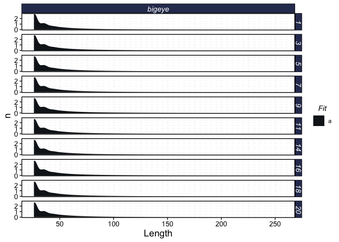

``` r

plot_marlin(processed_marlin, plot_var = "ssb", plot_type = "space", steps_to_plot = max(processed_marlin$fauna$step))
```

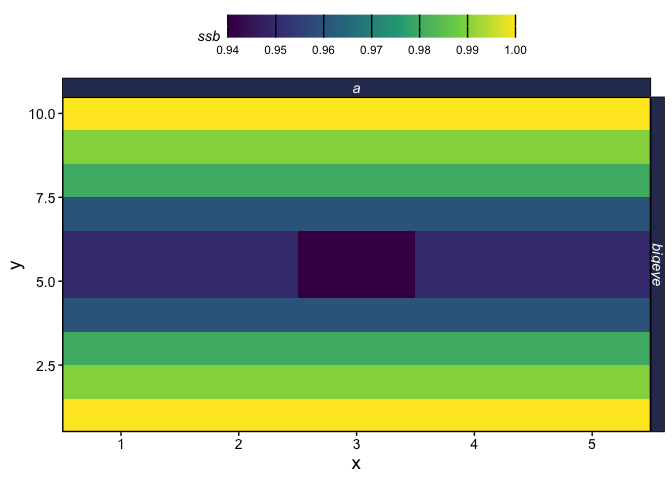

## Two species, two fleets, with seasonal habitat shifts

This example extends the simulation to two species and two fleets,
adding seasonal habitat dynamics where each species occupies a different
spatial distribution depending on the time of year.

``` r
seasons <- 4

steps <- years * seasons

time_step <- 1 / seasons

skipjack_home_range <- 2

bigeye_home_range <- 5

# Construct habitat quality surfaces as [ny, nx] matrices

skipjack_habitat <- expand_grid(x = 1:resolution[1], y = 1:resolution[2]) %>%
  dplyr::mutate(
    habitat = dnorm((x^2 + y^2), 20, 200),
    habitat = habitat / max(habitat) * skipjack_home_range
  ) |>
  pivot_wider(names_from = x, values_from = habitat) %>%
  select(-y) %>%
  as.matrix()


bigeye_habitat <- expand_grid(x = 1:resolution[1], y = 1:resolution[2]) %>%
  mutate(
    habitat = dnorm((x^2 + y^2), 300, 100),
    habitat = habitat / max(habitat) * bigeye_home_range
  ) %>%
  pivot_wider(names_from = x, values_from = habitat) %>%
  select(-y) %>%
  as.matrix()


bigeye_habitat2 <- expand_grid(x = 1:resolution[1], y = 1:resolution[2]) %>%
  mutate(
    habitat = dnorm((x^.2 + y^.2), 100, 100),
    habitat = habitat / max(habitat) * bigeye_home_range
  ) %>%
  pivot_wider(names_from = x, values_from = habitat) %>%
  select(-y) %>%
  as.matrix()

a <- Sys.time()

fauna <-
  list(
    "skipjack" = create_critter(
      scientific_name = "Katsuwonus pelamis",
      habitat = list(skipjack_habitat, skipjack_habitat), # pass habitat as lists
      season_blocks = list(c(1, 2), c(3, 4)), # seasons each habitat apply to
      recruit_habitat = skipjack_habitat,
      adult_home_range = skipjack_home_range, # standard deviation of the number of patches moved by adults
      depletion = .6, # desired equilibrium depletion with fishing (1 = unfished, 0 = extinct),
      density_dependence = "global_habitat", # recruitment form, where 1 implies local recruitment
      seasons = seasons,
      init_explt = 0.2,
      explt_type = "f"
    ),
    "bigeye" = create_critter(
      common_name = "bigeye tuna",
      habitat = list(bigeye_habitat, bigeye_habitat2), # pass habitat as lists
      season_blocks = list(c(1, 2), c(3, 4)), # seasons each habitat apply to
      recruit_habitat = bigeye_habitat,
      adult_home_range = bigeye_home_range,
      depletion = .1,
      density_dependence = "local_habitat",
      seasons = seasons,
      init_explt = 0.3,
      explt_type = "f"
    )
  )
Sys.time() - a
#> Time difference of 2.023347 secs

# Each fleet contains one metier per species.
# price = price per unit weight; sel_form = "logistic" or "dome"


fauna$skipjack$plot_movement()
```

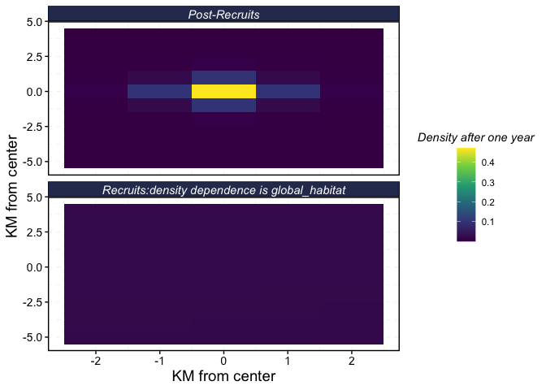

``` r

fauna$bigeye$plot_movement()
```

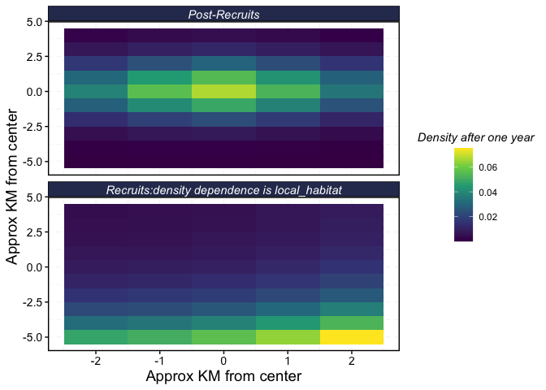

``` r


fleets <- list(
  "longline" = create_fleet(
    list(
      "skipjack" = Metier$new(
        critter = fauna$skipjack,
        price = 100,
        # price per unit weight
        sel_form = "logistic",
        # selectivity form, one of logistic or dome
        sel_start = .3,
        # percentage of length at maturity that selectivity starts
        sel_delta = .1,
        # additional percentage of sel_start where selectivity asymptotes
        catchability = .01,
        # overwritten by tune_fleet but can be set manually here
        p_explt = 1
      ),
      "bigeye" = Metier$new(
        critter = fauna$bigeye,
        price = 10,
        sel_form = "logistic",
        sel_start = .1,
        sel_delta = .01,
        catchability = 0,
        p_explt = 1
      )
    ),
    base_effort = prod(resolution),
    resolution = resolution
  ),
  "purseseine" = create_fleet(
    list(
      skipjack = Metier$new(
        critter = fauna$skipjack,
        price = 100,
        sel_form = "logistic",
        sel_start = 0.25,
        sel_delta = .1,
        catchability = .01,
        p_explt = 0.9
      ),
      bigeye = Metier$new(
        critter = fauna$bigeye,
        price = 100,
        sel_form = "logistic",
        sel_start = .25,
        sel_delta = .5,
        catchability = .01,
        p_explt = 1
      )
    ),
    base_effort = prod(resolution), resolution = resolution
  )
)

a <- Sys.time()

fleets <- tune_fleets(fauna, fleets)

Sys.time() - a
#> Time difference of 0.1785212 secs


# Run the simulation
a <- Sys.time()

sim3 <- simmar(
  fauna = fauna,
  fleets = fleets,
  years = years
)

Sys.time() - a
#> Time difference of 0.07958889 secs
# a <- Sys.time()

processed_marlin <- process_marlin(sim = sim3, time_step = time_step, keep_age = TRUE)
# Sys.time() - a

plot_marlin(processed_marlin)
```

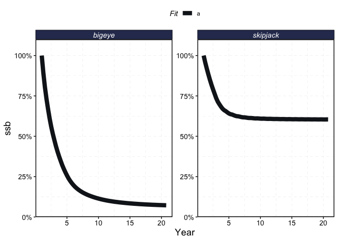

``` r

plot_marlin(processed_marlin, plot_var = "c")
```

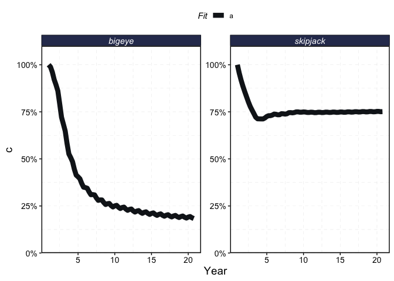

``` r

plot_marlin(processed_marlin, plot_var = "n", plot_type = "length", fauna = fauna)
```

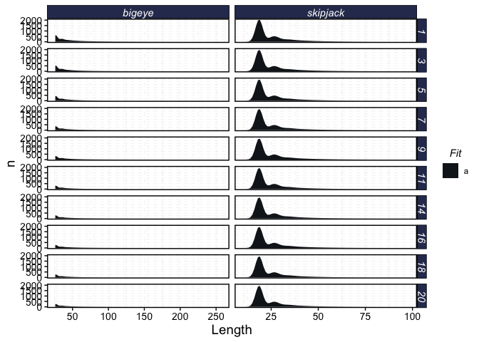

## Evaluating MPAs

This example compares the effect of an identical MPA on two species —
yellowfin tuna and shortfin mako shark — under two spatial
configurations. In the first scenario both species share nearshore
(eastern) habitat. In the second, the tuna remain nearshore but the mako
population is centred further offshore. The MPA is designed around tuna
distribution in both cases, illustrating how a bycatch species’
unobserved range shift can determine whether an MPA helps or harms that
species.

``` r
resolution <- c(20, 20) # resolution is in squared patches, so 20 implies a 20X20 system, i.e. 400 patches

seasons <- 1

years <- 100

tune_type <- "depletion"

steps <- years * seasons

yft_home_range <- 6

yft_depletion <- 0.6

mako_depletion <- 0.2

mako_home_range <- 5

yft_b0 <- 10000

mako_b0 <- 420

# Both species share the same nearshore (high-x) habitat in this first scenario

yft_habitat <- expand_grid(x = 1:resolution[1], y = 1:resolution[2]) %>%
  mutate(
    habitat = dnorm(x, resolution, 8),
    habitat = habitat / max(habitat) * yft_home_range
  ) %>%
  pivot_wider(names_from = x, values_from = habitat) %>%
  select(-y) %>%
  as.matrix()


mako_habitat <- expand_grid(x = 1:resolution[1], y = 1:resolution[2]) %>%
  mutate(
    habitat = dnorm(x, resolution, 8),
    habitat = habitat / max(habitat) * mako_home_range
  ) %>%
  pivot_wider(names_from = x, values_from = habitat) %>%
  select(-y) %>%
  as.matrix()


# Nearshore scenario: both species concentrated toward the eastern edge
fauna <-
  list(
    "Yellowfin Tuna" = create_critter(
      scientific_name = "Thunnus albacares",
      habitat = yft_habitat, # pass habitat as lists
      recruit_habitat = yft_habitat,
      adult_home_range = yft_home_range, # cells per year
      depletion = yft_depletion, # desired equilibrium depletion with fishing (1 = unfished, 0 = extinct),
      density_dependence = "global_habitat", # recruitment form, where 1 implies local recruitment
      seasons = seasons,
      b0 = yft_b0
    ),
    "Shortfin Mako" = create_critter(
      scientific_name = "Isurus oxyrinchus",
      habitat = list(mako_habitat), # pass habitat as lists
      recruit_habitat = mako_habitat,
      adult_home_range = mako_home_range,
      depletion = mako_depletion,
      density_dependence = "global_habitat", # recruitment form, where 1 implies local recruitment
      burn_years = 200,
      seasons = seasons,
      fec_form = "pups",
      pups = 6,
      b0 = mako_b0,
      lorenzen_m = TRUE,
      lorenzen_c = -0.25
    )
  )

fauna$`Shortfin Mako`$plot()
```


``` r

fleets <- list("longline" = create_fleet(
  list(
    `Yellowfin Tuna` = Metier$new(
      critter = fauna$`Yellowfin Tuna`,
      price = 100, # price per unit weight
      sel_form = "logistic", # selectivity form, one of logistic or dome
      sel_start = .3, # percentage of length at maturity that selectivity starts
      sel_delta = .1, # additional percentage of sel_start where selectivity asymptotes
      catchability = .01, # overwritten by tune_fleet but can be set manually here
      p_explt = 1
    ),
    `Shortfin Mako` = Metier$new(
      critter = fauna$`Shortfin Mako`,
      price = 10,
      sel_form = "logistic",
      sel_start = .1,
      sel_delta = .01,
      catchability = 0,
      p_explt = 1
    )
  ),
  mpa_response = "stay",
  base_effort = prod(resolution),
  resolution = resolution,
  spatial_allocation = "rpue",
  cost_per_unit_effort = 1,
  effort_cost_exponent = 1.3
))

a <- Sys.time()

# before <- fleets$longline$metiers$`Yellowfin Tuna`$catchability
# 
# fleets$longline$metiers$`Yellowfin Tuna`$spatial_catchability


fleets <- tune_fleets(fauna, fleets, tune_type = tune_type, tune_costs = TRUE,years = floor(years * .5)) # tunes the catchability by fleet to achieve target depletion

# fleets$longline$base_effort
# after =  fleets$longline$metiers$`Yellowfin Tuna`$catchability


# fleets$longline$metiers[[1]]$catchability
# fleets$longline$metiers[[1]]$catchability
# fleets$longline$metiers[[2]]$catchability

# new_fleets$longline$base_effort
# before == after

# fleets$longline$metiers$`Yellowfin Tuna`$spatial_catchability

Sys.time() - a
#> Time difference of 1.507556 secs

# Run the nearshore baseline (no MPA)
a <- Sys.time()

nearshore <- simmar(
  fauna = fauna,
  fleets = fleets,
  years = years
)

Sys.time() - a
#> Time difference of 0.3025711 secs

proc_nearshore <- process_marlin(nearshore, time_step = fauna[[1]]$time_step)

plot_marlin(proc_nearshore, max_scale = FALSE, plot_var = "b")
```

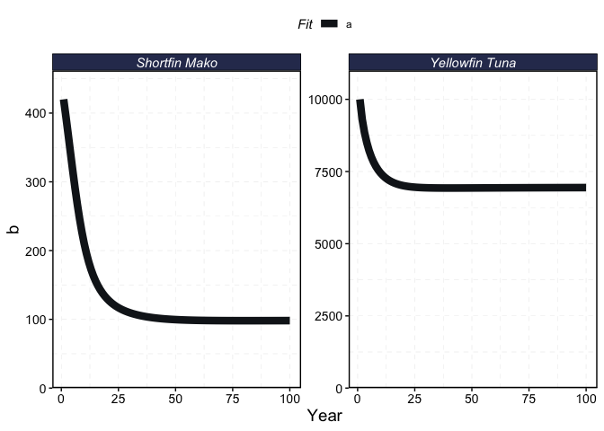

``` r
plot_marlin(proc_nearshore, max_scale = FALSE, plot_var = "ssb")
```

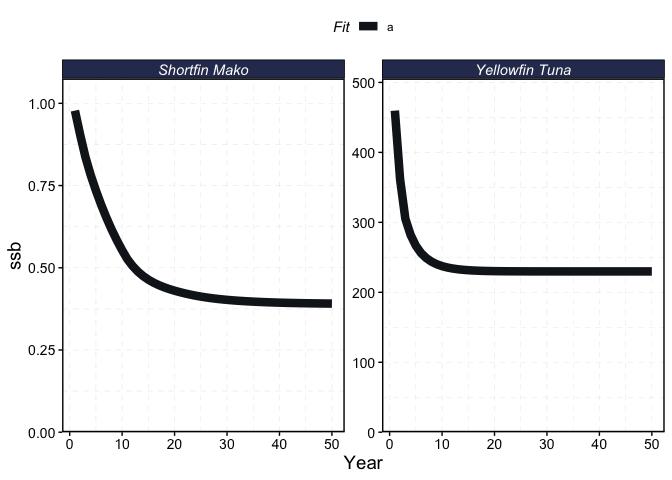

We define the MPA as a data frame with columns `x`, `y`, and `mpa`,
where `mpa = TRUE` marks closed patches:

``` r
set.seed(42)
# specify some MPA locations
mpa_locations <- expand_grid(x = 1:resolution[1], y = 1:resolution[2]) %>%
  mutate(mpa = x > 15 & y < 15)

mpa_locations %>%
  ggplot(aes(x, y, fill = mpa)) +
  geom_tile() +
  scale_fill_brewer(palette = "Accent", direction = -1, name = "MPA") +
  scale_x_continuous(name = "Lon") +
  scale_y_continuous(name = "Lat")
```

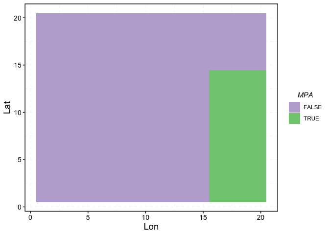

We simulate the MPA by passing it to `simmar` via the `manager`
argument. `mpa_year` controls when the closure is activated:

``` r
a <- Sys.time()

nearshore_mpa <- simmar(
  fauna = fauna,
  fleets = fleets,
  years = years,
  manager = list(mpas = list(
    locations = mpa_locations,
    mpa_year = floor(years * .5)
  ))
)

Sys.time() - a
#> Time difference of 0.302891 secs

proc_nearshore_mpa <- process_marlin(nearshore_mpa, time_step = fauna[[1]]$time_step)

plot_marlin(proc_nearshore_mpa, max_scale = FALSE)
```

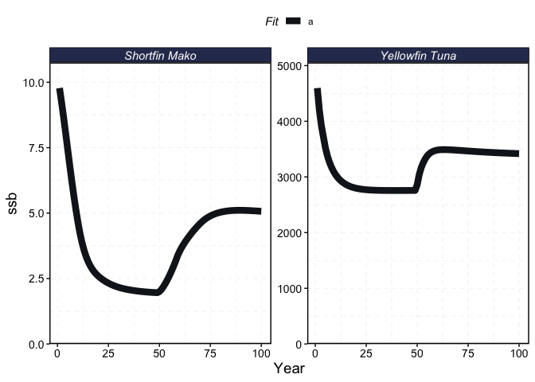

Now we run the offshore scenario: tuna habitat is unchanged, but the
mako population has shifted further offshore. We apply the exact same
MPA and compare outcomes.

``` r
mako_habitat <- expand_grid(x = 1:resolution[1], y = 1:resolution[2]) %>%
  mutate(
    habitat = dnorm(x, .7 * resolution, 6),
    habitat = habitat / max(habitat) * mako_home_range
  ) %>%
  pivot_wider(names_from = x, values_from = habitat) %>%
  select(-y) %>%
  as.matrix()


# Offshore scenario: same tuna habitat, mako now centred further from shore

fauna <-
  list(
    "Yellowfin Tuna" = create_critter(
      scientific_name = "Thunnus albacares",
      habitat = yft_habitat, # pass habitat as lists
      recruit_habitat = yft_habitat,
      adult_home_range = yft_home_range, # cells per year
      depletion = yft_depletion, # desired equilibrium depletion with fishing (1 = unfished, 0 = extinct),
      density_dependence = "global_habitat", # recruitment form, where 1 implies local recruitment
      seasons = seasons,
      b0 = yft_b0
    ),
    "Shortfin Mako" = create_critter(
      scientific_name = "Isurus oxyrinchus",
      habitat = list(mako_habitat), # pass habitat as lists
      recruit_habitat = mako_habitat,
      adult_home_range = mako_home_range,
      depletion = mako_depletion,
      density_dependence = "global_habitat", # recruitment form, where 1 implies local recruitment
      burn_years = 200,
      seasons = seasons,
      fec_form = "pups",
      pups = 6,
      b0 = mako_b0,
      lorenzen_m = TRUE,
      lorenzen_c = -0.25
    )
  )

fauna$`Shortfin Mako`$plot()
```

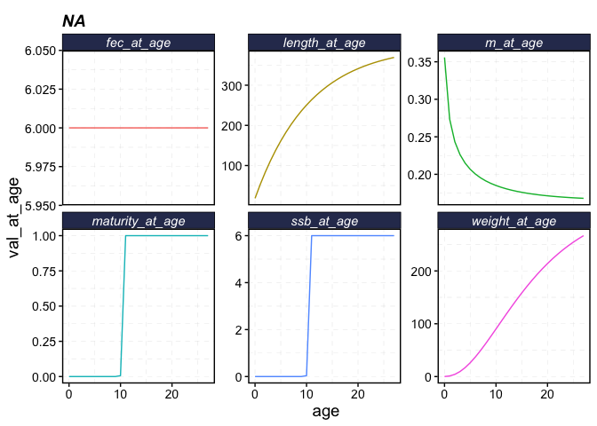

``` r
fleets$longline$metiers$`Shortfin Mako`$catchability
#>   longline 
#> 0.05342734
new_fleets <- tune_fleets(fauna, fleets, tune_type = tune_type,tune_costs = FALSE, years = floor(years * .5)) # tunes the catchability by fleet to achieve target depletion
new_fleets$longline$metiers$`Shortfin Mako`$catchability
#>  longline 
#> 0.3206818
new_fleets$longline$metiers$`Yellowfin Tuna`$catchability
#>   longline 
#> 0.09775678


# Run the offshore baseline (no MPA)
a <- Sys.time()

offshore <- simmar(
  fauna = fauna,
  fleets = new_fleets,
  years = years
)

Sys.time() - a
#> Time difference of 0.2008591 secs

proc_offshore <- process_marlin(offshore, time_step = fauna[[1]]$time_step)

a <- Sys.time()

offshore_mpa_sim <- simmar(
  fauna = fauna,
  fleets = new_fleets,
  years = years,
  manager = list(mpas = list(
    locations = mpa_locations,
    mpa_year = floor(years * .5)
  ))
)

Sys.time() - a
#> Time difference of 0.4300399 secs


proc_offshore_mpa <- process_marlin(offshore_mpa_sim, time_step = fauna[[1]]$time_step)

plot_marlin(proc_offshore)
```

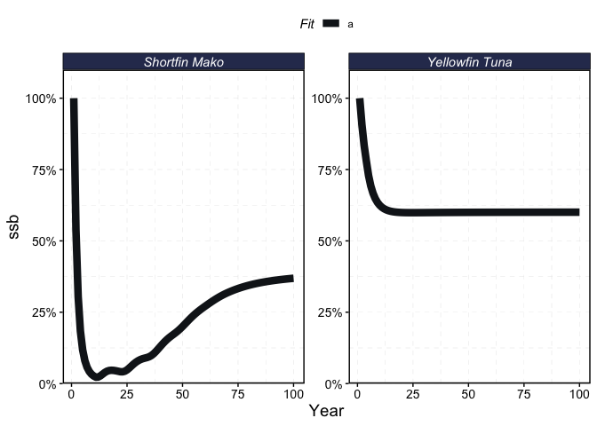

``` r

plot_marlin(proc_offshore_mpa)
```

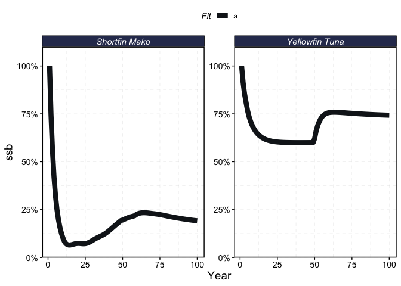

``` r
plot_marlin(
  `MPA: Sharks Offshore` = proc_offshore_mpa,
  `No MPA: Sharks Offshoe` = proc_offshore,
  `No MPA: Sharks Nearshore` = proc_nearshore,
  `MPA: Sharks Nearshore` = proc_nearshore_mpa,
  steps_to_plot = NA,
  plot_var = "ssb",
  max_scale = FALSE
)
```

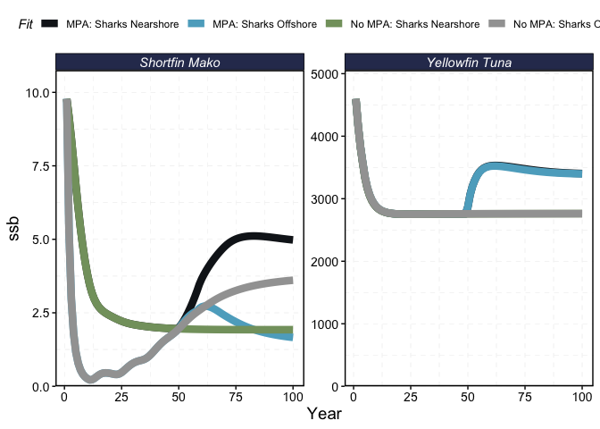

``` r
plot_marlin(
  `MPA: Sharks Offshore` = proc_offshore_mpa,
  `Sharks Nearshore` = proc_nearshore,
  `Sharks Offshore` = proc_offshore,
  `MPA: Sharks Nearshore` = proc_nearshore_mpa,
  plot_var = "ssb",
  plot_type = "space",
  steps_to_plot = c(years - 1)
) +
  scale_fill_viridis_c(name = "Spawning Biomass", guide = guide_colorbar(barwidth = unit(13, "lines"), frame.colour = "black")) +
  theme(
    axis.text.x = element_blank(),
    axis.text.y = element_blank(),
    axis.title.x = element_blank(),
    axis.title.y = element_blank(),
    axis.ticks = element_blank(),
    strip.text = element_text(size = 9)
  )
```

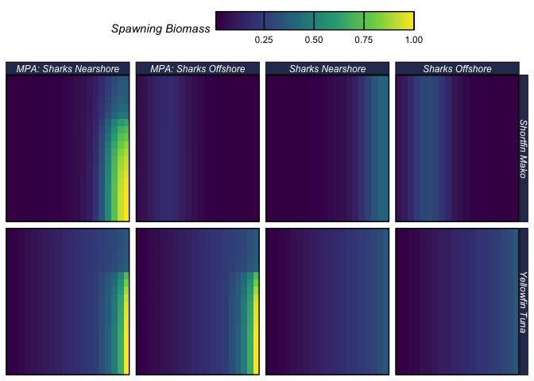

## De facto MPAs through bycatch penalties

Fishing fleets can be deterred from areas without formal closures by
making certain patches unprofitable. This example shows how assigning a
large negative price to shortfin mako — representing bycatch liability
or a regulatory penalty — causes the fleet to avoid mako habitat,
effectively creating a de facto protected area.

``` r
years <- 100

tune_type <- "f"

# YFT habitat increases linearly with x (nearshore); mako is confined to the far corner (x>12, y>12)

yft_habitat <- expand_grid(x = 1:resolution[1], y = 1:resolution[2]) %>%
  mutate(
    habitat = .05 * x,
    habitat = habitat / max(habitat) * yft_home_range
  ) %>%
  pivot_wider(names_from = x, values_from = habitat) %>%
  select(-y) %>%
  as.matrix()


mako_habitat <- expand_grid(x = 1:resolution[1], y = 1:resolution[2]) %>%
  mutate(
    habitat = x > 12 & y > 12,
    habitat = habitat / max(habitat) * mako_home_range
  ) %>%
  pivot_wider(names_from = x, values_from = habitat) %>%
  select(-y) %>%
  as.matrix()


# Build fauna for the bycatch penalty scenario

fauna <-
  list(
    "Yellowfin Tuna" = create_critter(
      scientific_name = "Thunnus albacares",
      habitat = list(yft_habitat),
      recruit_habitat = yft_habitat,
      adult_home_range = yft_home_range,
      depletion = .4,
      density_dependence = "local_habitat", # recruitment form, where 1 implies local recruitment
      seasons = seasons,
      init_explt = 0.12,
      explt_type = "f"
    ),
    "Shortfin Mako" = create_critter(
      scientific_name = "Isurus oxyrinchus",
      habitat = list(mako_habitat),
      recruit_habitat = mako_habitat,
      adult_home_range = mako_home_range,
      depletion = .3,
      density_dependence = "local_habitat", # recruitment form, where 1 implies local recruitment
      burn_years = 200,
      seasons = seasons,
      init_explt = 0.1,
      explt_type = "f"
    )
  )

# A large negative mako price makes patches where mako is present unprofitable, deterring effort

fleets <- list("longline" = create_fleet(
  list(
    `Yellowfin Tuna` = Metier$new(
      critter = fauna$`Yellowfin Tuna`,
      price = 100, # price per unit weight
      sel_form = "logistic", # selectivity form, one of logistic or dome
      sel_start = .3, # percentage of length at maturity that selectivity starts
      sel_delta = .1, # additional percentage of sel_start where selectivity asymptotes
      catchability = .01, # overwritten by tune_fleet but can be set manually here
      p_explt = 1
    ),
    `Shortfin Mako` = Metier$new(
      critter = fauna$`Shortfin Mako`,
      price = -20000,
      sel_form = "logistic",
      sel_start = .1,
      sel_delta = .01,
      catchability = 0,
      p_explt = 1
    )
  ),
  mpa_response = "stay",
  base_effort = prod(resolution),
  resolution = resolution
))

a <- Sys.time()

fleets <- tune_fleets(fauna, fleets, tune_type = tune_type) # tunes the catchability by fleet to achieve target depletion

Sys.time() - a
#> Time difference of 0.1169519 secs

# Run the simulation
negative_prices <- simmar(
  fauna = fauna,
  fleets = fleets,
  years = years
)


proc_negative_prices <- process_marlin(negative_prices, time_step = fauna[[1]]$time_step)
```

``` r
plot_marlin(
  `De-Facto MPA` = proc_negative_prices,
  plot_var = "ssb",
  plot_type = "space"
)
```

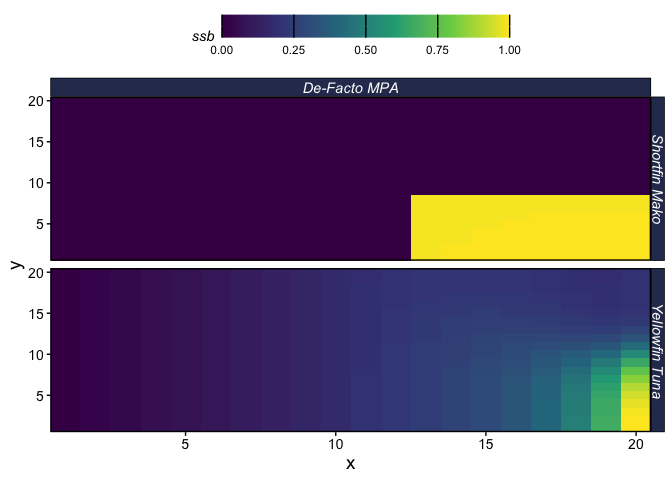

## Repository structure

The main simulation function is in `R/simmar.R`. It coordinates all
population and fleet dynamics across time steps.

The core age-structured population model is implemented in C++ in
`src/fish_model.cpp`.
