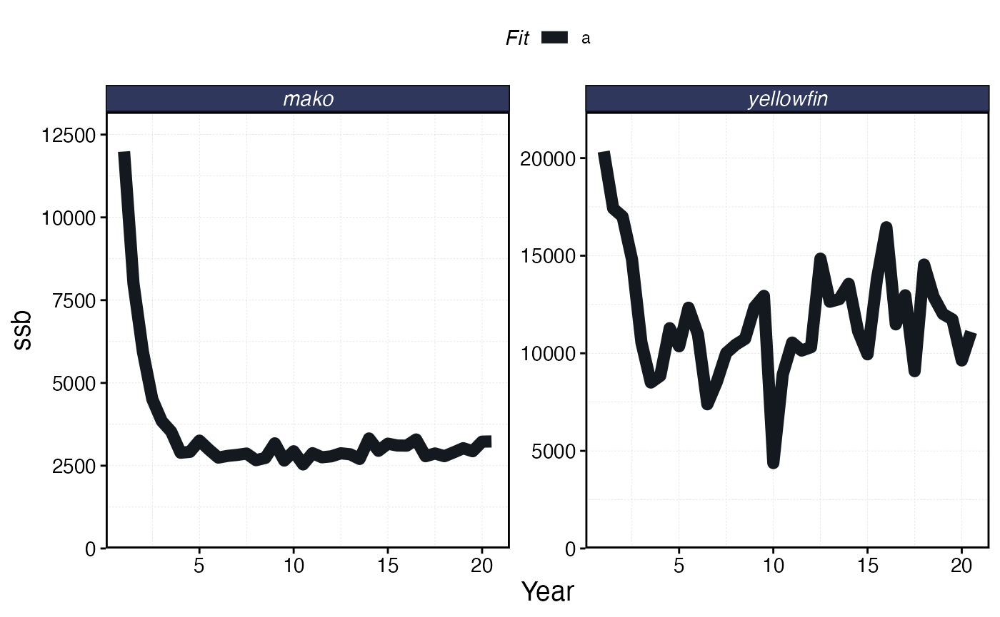

# Working with Recruitment Deviates

Fish populations are often characterized by variation, particularly in
the process known as “recruitment”, the entry of new individuals to the
population through reproduction (as opposed to immigration).

`marlin` allows users a range of options for simulating variability in
the recruitment process. At the most basic, users can specify the
variation of “recruitment deviations”, deviations in the value of
recruitment away from the mean level of recruitment, for example the
number of recruits given spawning stock biomass (SSB) given a
Beverton-Holt spawner-recruit relationship. From there, users can
specify whether recruitment deviations are autocorrelated, and lastly
the degree of correlation in recruitment deviates among species.

Users can also supply their own external recruitment deviates, allowing
users to for example generate recruitment deviates that are correlated
across space, time, and species in complex ways.

To start with, we’ll simulate two uncorrelated species with varying
degrees of recruitment variation (`sigma_rec`) and autocorrelation in
recruitment variation (`ac_rec`)

``` r
library(marlin)

library(tidyverse)
#> ── Attaching core tidyverse packages ──────────────────────── tidyverse 2.0.0 ──
#> ✔ dplyr     1.2.0     ✔ readr     2.1.6
#> ✔ forcats   1.0.1     ✔ stringr   1.6.0
#> ✔ ggplot2   4.0.2     ✔ tibble    3.3.1
#> ✔ lubridate 1.9.4     ✔ tidyr     1.3.2
#> ✔ purrr     1.2.1     
#> ── Conflicts ────────────────────────────────────────── tidyverse_conflicts() ──
#> ✖ dplyr::filter() masks stats::filter()
#> ✖ dplyr::lag()    masks stats::lag()
#> ℹ Use the conflicted package (<http://conflicted.r-lib.org/>) to force all conflicts to become errors

library(marlin)

theme_set(marlin::theme_marlin())

resolution <- c(10, 10) # resolution is in squared patches, so 20 implies a 20X20 system, i.e. 400 patches

patch_area <- 10

seasons <- 2

years <- 20

tune_type <- "depletion"

steps <- years * seasons

yft_diffusion <- 10

yft_depletion <- 0.9

rec_factor <- 1

mako_depletion <- 0.9

mako_diffusion <- 10

critters <- c("yellowfin", "mako")
```

``` r
set.seed(24)
fauna <-
  list(
    "yellowfin" = create_critter(
      scientific_name = "Thunnus albacares",
      adult_home_range  = yft_diffusion, # cells per year
      recruit_home_range = rec_factor * yft_diffusion,
      density_dependence = "pre_dispersal", # recruitment form, where 1 implies local recruitment
      seasons = seasons,
      ssb0 = 10000,
      sigma_rec = 0.25,
      ac_rec = 0.25,
      steepness = 1,
      t0 = -1
    ),
    "mako" = create_critter(
      scientific_name = "Isurus oxyrinchus",
      adult_home_range = mako_diffusion,
      recruit_home_range = rec_factor * 5,
      density_dependence = "local_habitat", # recruitment form, where 1 implies local recruitment
      burn_years = 10,
      ssb0 = 10000,
      seasons = seasons,
      sigma_rec = 0.1,
      ac_rec = 0,
      steepness = 1,
      t0 = -2
    )
  )

fleets <- list("longline" = create_fleet(
  list(
    `yellowfin` = Metier$new(
      critter = fauna$`yellowfin`,
      price = 10, # price per unit weight
      sel_form = "logistic", # selectivity form, one of logistic or dome
      sel_start = .5, # percentage of length at maturity that selectivity starts
      sel_delta = .1, # additional percentage of sel_start where selectivity asymptotes
      p_explt = 1,
      catchability = .1
    ),
    `mako` = Metier$new(
      critter = fauna$`mako`,
      price = 10,
      sel_form = "logistic",
      sel_start = 1,
      sel_delta = .01,
      p_explt = 1,
      catchability = 0.15
    )
  ),
  base_effort = 8*prod(resolution),
  resolution = resolution,
  spatial_allocation = "revenue"
))


# run simulations

a <- Sys.time()

recruitment_sim <- simmar(
  fauna = fauna,
  fleets = fleets,
  steps = steps
)

Sys.time() - a
#> Time difference of 0.155458 secs

sim <- process_marlin(recruitment_sim)

plot_marlin(sim, max_scale = FALSE, plot_var = "ssb")
```



``` r
sim$fauna |>
  filter(age == min(age)) |>
  group_by(step, critter) |> 
  summarise(n = sum(n)) |> 
  ggplot(aes(step, n)) +
  geom_line() +
  geom_point() +
  facet_wrap(~critter, scales = "free_y") + 
  scale_y_continuous(limits = c(0, NA))
#> `summarise()` has regrouped the output.
#> ℹ Summaries were computed grouped by step and critter.
#> ℹ Output is grouped by step.
#> ℹ Use `summarise(.groups = "drop_last")` to silence this message.
#> ℹ Use `summarise(.by = c(step, critter))` for per-operation grouping
#>   (`?dplyr::dplyr_by`) instead.
```


Timeline of recruits (age 0 fish) into the population over time given
degrees of variation and autocorrelation in the recruitment process.

We can expand on this simple analysis by adding in a new feature, a
correlation matrix for the recruitment deviates between the two
simulated species. As this is a simple two-species system, this is just
a two x two matrix with the off-diagonal elements indicating the
correlation between the recruitment deviates of the two species. We will
then pass this matrix to the `simmar` function.

``` r
critter_correlations <- matrix(c(1, -.8, -.8, 1), nrow = 2, byrow = TRUE)


# run simulations

a <- Sys.time()

recruitment_sim <- simmar(
  fauna = fauna,
  fleets = fleets,
  steps = steps,
  cor_rec = critter_correlations
)

Sys.time() - a
#> Time difference of 0.04018283 secs

sim <- process_marlin(recruitment_sim)
```

``` r
sim$fauna |>
  filter(age == min(age)) |>
  select(step, patch, critter, n) |>
  group_by(critter, step) |> 
  summarise(n = sum(n)) |> 
  pivot_wider(names_from = critter, values_from = n) |>
  ggplot(aes(mako, yellowfin)) +
  geom_point()
#> `summarise()` has regrouped the output.
#> ℹ Summaries were computed grouped by critter and step.
#> ℹ Output is grouped by critter.
#> ℹ Use `summarise(.groups = "drop_last")` to silence this message.
#> ℹ Use `summarise(.by = c(critter, step))` for per-operation grouping
#>   (`?dplyr::dplyr_by`) instead.
```


Scatter plot of negatively correlated recruitment between the two
simulated species.

Users can also supply their own matrix of recruitment deviates. This
matrix has number of columns equal to the number of critters, and rows
equal to the number of years to be simulated plus one additional number
of seasons per year (a required buffer). This step can be useful if for
example the user wants to share the same vector of recruitment deviates
across multiple simulations, or generate more complex recruitment
deviates driven by for example environmental covariates.

``` r
sigma_recs <- purrr::map_dbl(fauna, "sigma_rec") # gather recruitment standard deviations

ac_recs <- purrr::map_dbl(fauna, "ac_rec") # gather autocorrelation in recruitment standard deviations

n_critters <- length(fauna)

covariance_rec <- critter_correlations * (sigma_recs %o% sigma_recs)

rec_steps <- steps + seasons

log_rec_devs <- matrix(NA, nrow = rec_steps, ncol = n_critters, dimnames = list(1:(rec_steps), names(fauna)))

log_rec_devs[1, ] <- mvtnorm::rmvnorm(1, rep(0, n_critters), sigma = covariance_rec)

for (i in 2:rec_steps) {
  log_rec_devs[i, ] <- ac_recs * log_rec_devs[i - 1, ] + sqrt(1 - ac_recs^2) * mvtnorm::rmvnorm(1, rep(0, n_critters), sigma = covariance_rec)
}

a <- Sys.time()

recruitment_sim <- simmar(
  fauna = fauna,
  fleets = fleets,
  steps = steps,
  log_rec_devs = log_rec_devs
)

Sys.time() - a
#> Time difference of 0.1533852 secs

sim <- process_marlin(recruitment_sim)
```

``` r
sim$fauna |>
  filter(age == min(age)) |>
  select(step, critter, n) |>
    group_by(critter, step) |> 
  summarise(n = sum(n)) |>
  pivot_wider(names_from = critter, values_from = n) |>
  ggplot(aes(mako, yellowfin)) +
  geom_point()
#> `summarise()` has regrouped the output.
#> ℹ Summaries were computed grouped by critter and step.
#> ℹ Output is grouped by critter.
#> ℹ Use `summarise(.groups = "drop_last")` to silence this message.
#> ℹ Use `summarise(.by = c(critter, step))` for per-operation grouping
#>   (`?dplyr::dplyr_by`) instead.
```


Scatter plot of externally supplied negatively correlated recruitment
between the two simulated species.
