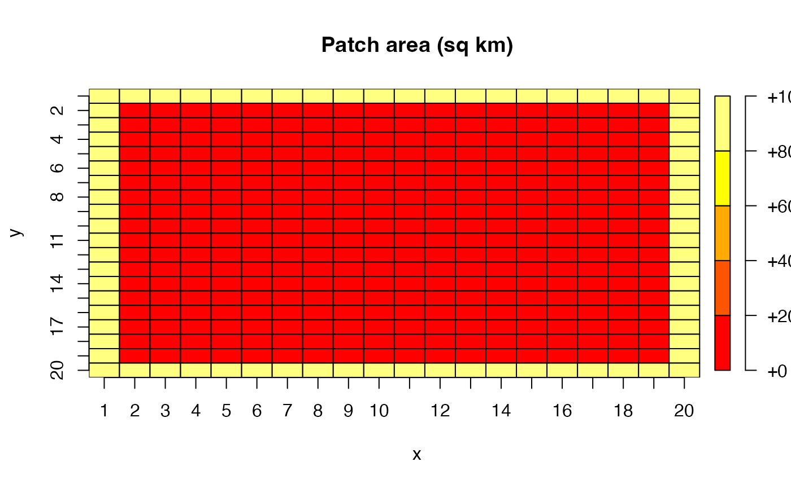
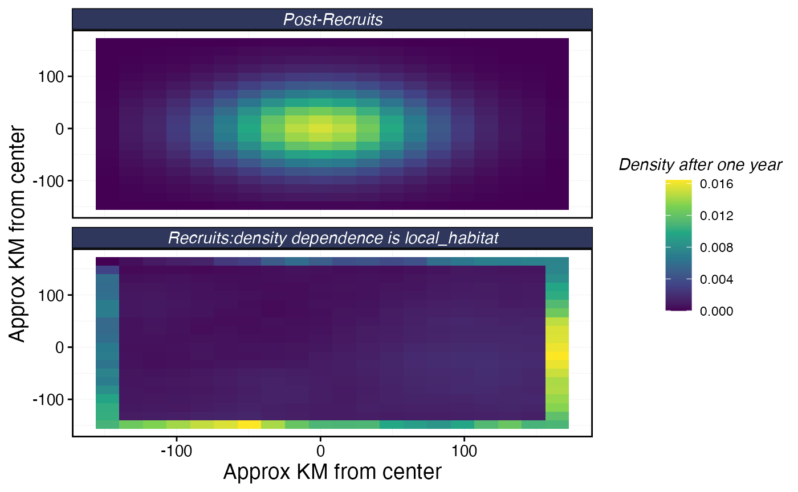

# Simulating large spatial extents with marlin

``` r

library(tidyverse)
library(marlin)
library(plot.matrix)
```

marlin allows users to set the spatial area of their simulation through
a combination of the number of patches and the area of those patches.
So, in theory, the entire Pacific ocean could be modeled as a two-by-two
system with a massive patch area parameter. However, this prevents the
user from modeling finer-scale habitat features, or of course of
modeling MPA networks at finer resolutions. One solution then would be
to run a massive simulation with a huge number of patches and a smaller
patch area. This however introduces a massive computational bottleneck,
both in storing the results and in processing the movement transition
matrices.

We present three potential strategies for dealing with large spatial
scales in marlin below.

## Steepness = 1

The steepness paramter *h* of the Beverton-Holt spawner-recruit
relationship sets how sensitive the number of recruits is to the amount
of spawning biomass. When *h* = 1, the number of recruits is independent
of the spawning biomass.

This can be a useful trick for simulation a scenario where post-recruit
movement is relatively limited, but the population is sustained by high
levels of larval influx from a much larger population, without actually
having to model the dynamics of that much larger population.

For example, consider the case of a lobster fishery surrounding a medium
sized island that is part of a large marine ecosystem. Lobsters have
relatively low post-recruit movement rates, meaning that once they
settle they don’t tend to move far in the grand scheme of things. But,
their larvae can travel massive distances, often staying in the water
column for over half a year before settling. So, one could imagine a
scenario where we used marlin to simulate the post-recruit population
around this island, but set *h=1* to simulate a scenario where no matter
how hard the post-recruit lobsters are fished around this island a new
crop of recruits will arrive from somewhere else. This is akin to
simulating a system that is closed to emigration and immigration of
post-recruits but open to influx of recruits from elsewhere (and assumes
that the spawning biomass around the island itself is trivial compared
to the overall population pool).

## Sparsity of movement matrix

Movement is one of the main computational bottlenecks in marlin.
`marlin` uses a continuous time markov chain (CTMC) movement model (link
to article xx), rather than say a simple diffusion coefficient. This is
what allows marlin to simulate movement as a complex mix of diffusion
and active movement towards attractive habitat with biologically
meaningful parameters.

However, the CTMC model comes at a cost. It requires calculating and
using a transition matrix from every patch to every other patch. This
means that if you wanted to run a 100x100 resolution model, you have
10,000 patches, so the model needs to keep track of a 10,000 by 10,000
transition matrix, or 100,000,000 cells. This gets computationally
intractable very quickly (or at least slows the model to a crawl).

One solution to this is to take advantage of the fact that `marlin` uses
a sparse matrix format for the CTMC calculations. Consider a 100x100
system with a relatively large patch area. If the movement rate of a
given animal is relatively small relative to the spatial domain, then
the movement rate from one patch to most other patches will be
effectively zero. In other words, if we’re talking about a seascape of
thousands of KM across, if a tuna starts in the bottom left corner, it
has effectively zero probability of moving to anything the the few
patches nearest the bottom left corner in a single time step of say 1
month. A reef fish would basically stay put.

This means that even though in theory you have a 100,000,000 cell matrix
to deal with in movement, the vast majority of entries in this matrix
are zero. `marlin` takes advantage of this to store and deal with the
matrix, allowing the model to actually run very quickly and with low
memory usage.

So, one solution to modeling a very large area is set the spatial
extent, patch area, and time step such that the movement matrix itself
is relatively sparse. This may still create large storage and processing
costs (tracking all the outputs in every patch in every time step), but
the movement calculations may still me tractable.

However, this requires the movement rate of all simulated animals to be
relatively small compared to the spatial extent. If the movement rate is
high relative to the spatial extent, then the sparsity of the matrix
will decrease until it approaches a full matrix with all the associated
computational bottlenecks.

The key dimensionless quantity that governs sparsity is the ratio of
`adult_home_range` to the patch width (`sqrt(patch_area)`). When this
ratio is small — say a reef fish with a 2 km home range on a grid with
10 km patch widths — the transition matrix is extremely sparse because
almost all transition probabilities are effectively zero. When the ratio
is large — a highly migratory tuna on the same grid — the matrix fills
in and the computational advantages of sparsity disappear.

To demonstrate this, we build CTMC transition matrices across a range of
home ranges and patch areas on a 50x50 grid (2,500 patches), then
examine how the density of the resulting transition matrices changes.

``` r

library(Matrix)
library(expm)
library(knitr)

resolution_sp <- c(50, 50)
P_sp <- prod(resolution_sp)
water_mask <- rep(TRUE, P_sp)
adj <- find_neighbors(resolution = resolution_sp, water_mask = water_mask)

# Three home ranges spanning reef fish to pelagic migrant
home_ranges <- c(2, 10, 50, 200)
# Three patch areas spanning fine to coarse grids
patch_areas <- c(4, 25, 100) # patch widths of 2, 5, and 10 km

results <- expand_grid(
  home_range_km = home_ranges,
  patch_area_km2 = patch_areas
) |>
  mutate(
    patch_side_km = sqrt(patch_area_km2),
    hr_over_patchside = home_range_km / patch_side_km
  )
```

For each scenario we use `tune_diffusion` to convert the home range to a
diffusion coefficient, build the CTMC generator matrix, exponentiate it
to get the transition matrix, and then apply `sparsify_transition`
(which drops entries contributing less than 0.1% of total probability
mass). We record the number of nonzero entries, the matrix density, and
the object size in memory.

``` r

results$nnz_transition <- NA_integer_
results$density_pct <- NA_real_
results$median_nnz_per_col <- NA_real_
results$obj_size_sparse_MB <- NA_real_
results$obj_size_dense_MB <- NA_real_

for (i in seq_len(nrow(results))) {
  hr <- results$home_range_km[i]
  pa <- results$patch_area_km2[i]
  dd <- sqrt(pa)

  D <- tune_diffusion(hr)

  # Build generator and exponentiate

  M <- adj * D * (1 / dd^2)
  diag(M) <- -Matrix::colSums(M)
  T_dense <- as.matrix(expm(as.matrix(M)))
  T_sparse <- sparsify_transition(T_dense, retain = 0.999)

  results$nnz_transition[i] <- nnzero(T_sparse)
  results$density_pct[i] <- 100 * nnzero(T_sparse) / P_sp^2
  results$median_nnz_per_col[i] <- median(diff(T_sparse@p))
  results$obj_size_sparse_MB[i] <- as.numeric(object.size(T_sparse)) / 1e6
  results$obj_size_dense_MB[i] <- as.numeric(object.size(T_dense)) / 1e6
}
```

The most intuitive way to see this is to visualize the transition
probabilities from a single patch in the center of the grid. With a
small home range, probability mass is tightly concentrated around the
origin. As home range increases, probability spreads across the entire
grid.

``` r

resolution_vis <- c(20, 20)
P_vis <- prod(resolution_vis)
adj_vis <- find_neighbors(resolution = resolution_vis,
                          water_mask = rep(TRUE, P_vis))

center_patch <- which(
  rep(1:resolution_vis[1], each = resolution_vis[2]) == 10 &
    rep(1:resolution_vis[2], times = resolution_vis[1]) == 10
)

vis_hrs <- c(2, 20, 100)
vis_pa <- 25
vis_dd <- sqrt(vis_pa)

vis_data <- purrr::map_dfr(vis_hrs, function(hr) {
  D <- tune_diffusion(hr)
  M_vis <- adj_vis * D * (1 / vis_dd^2)
  diag(M_vis) <- -Matrix::colSums(M_vis)
  T_vis <- sparsify_transition(as.matrix(expm(as.matrix(M_vis))))

  expand_grid(x = 1:resolution_vis[1], y = 1:resolution_vis[2]) |>
    mutate(
      patch = row_number(),
      prob = as.numeric(T_vis[, center_patch]),
      home_range = hr
    )
})

vis_data |>
  mutate(label = paste0("home_range = ", home_range, " km")) |>
  mutate(label = fct_relevel(label, "home_range = 2 km", "home_range = 20 km")) |> 
  ggplot(aes(x = x, y = y, fill = prob)) +
  geom_tile() +
  scale_fill_viridis_c("P(transition)", limits = c(0, NA), trans = "sqrt") +
  coord_fixed() +
  facet_wrap(~ label) +
  labs(
    title = "Transition probabilities from center patch",
    subtitle = "20×20 grid, patch_area = 25 km², sqrt color scale",
    x = "x", y = "y"
  ) +
  theme_minimal()
```


Transition probabilities from a center patch on a 20x20 grid. With a 2
km home range, almost all probability stays in the immediate
neighborhood. At 100 km, probability is spread across the entire domain.

Now we can look at the quantitative relationship between home range,
patch area, and matrix density. The critical insight is that when we
plot density against the dimensionless ratio
`home_range / sqrt(patch_area)`, the results from different patch areas
collapse onto a single curve. This ratio — the number of patch-widths
the home range spans — is the quantity that determines sparsity.

``` r

results |>
  mutate(patch_area_label = paste0(patch_area_km2, " km²")) |>
  ggplot(aes(x = hr_over_patchside, y = density_pct,
             color = patch_area_label, shape = patch_area_label)) +
  geom_line(linewidth = 0.8) +
  geom_point(size = 2.5) +
  scale_x_log10() +
  labs(
    x = "home_range / √(patch_area)  [# of patch widths]",
    y = "Transition matrix density (%)",
    color = "patch_area",
    shape = "patch_area",
    title = "Sparsity is governed by the ratio of home range to patch width"
  ) +
  theme_minimal()
```


Matrix density as a function of home_range / sqrt(patch_area). All three
patch area series collapse onto the same curve, confirming that this
ratio is the fundamental quantity controlling sparsity.

The practical payoff of sparsity is memory. A dense 2,500 × 2,500
transition matrix is always ~47 MB regardless of the species. With
sparsification, a low-mobility species needs only a fraction of a
megabyte. The savings are dramatic when the home range is small relative
to the patch width, and disappear as the ratio grows.

``` r

results |>
  select(home_range_km, patch_area_km2, hr_over_patchside,
         obj_size_sparse_MB, obj_size_dense_MB) |>
  pivot_longer(cols = starts_with("obj_size"),
               names_to = "storage", values_to = "MB") |>
  mutate(
    storage = ifelse(grepl("sparse", storage), "Sparse", "Dense"),
    patch_area_label = paste0("patch_area = ", patch_area_km2, " km²")
  ) |>
  ggplot(aes(x = hr_over_patchside, y = MB,
             color = storage, linetype = storage)) +
  geom_line(linewidth = 0.8) +
  geom_point(size = 2) +
  facet_wrap(~ patch_area_label) +
  scale_x_log10() +
  scale_y_log10() +
  labs(
    x = "home_range / √(patch_area)",
    y = "Object size (MB, log scale)",
    color = NULL, linetype = NULL,
    title = "Memory savings from sparse transition matrices"
  ) +
  theme_minimal()
```


Memory footprint of sparse vs dense transition matrices. For
low-mobility species the sparse representation is orders of magnitude
smaller.

These results are from a 50×50 grid, but the per-column nonzero count
(i.e. the number of patches each patch can reach in one time step)
depends on the home range to patch width ratio, not on the total grid
size. We can use this to extrapolate what a 100×100 grid (10,000
patches) would look like. A dense 10,000 × 10,000 matrix requires 800
MB. Whether the sparse version is tractable depends entirely on the
species in question.

``` r

P_100 <- 10000

extrap <- results |>
  mutate(
    est_nnz_100 = pmin(median_nnz_per_col * P_100, P_100^2),
    est_density_pct = 100 * est_nnz_100 / P_100^2,
    est_sparse_MB = round((est_nnz_100 * 12) / 1e6, 1)
  ) |>
  arrange(patch_area_km2, home_range_km) |>
  transmute(
    `Home range (km)` = home_range_km,
    `Patch area (km²)` = patch_area_km2,
    `HR / √PA` = round(hr_over_patchside, 1),
    `Est. density (%)` = round(est_density_pct, 3),
    `Est. sparse size (MB)` = est_sparse_MB,
    `Dense size (MB)` = 800
  )

knitr::kable(
  extrap,
  caption = "Estimated transition matrix properties at 100×100 resolution, extrapolated from 50×50 results. Dense storage is always 800 MB."
)
```

| Home range (km) | Patch area (km²) | HR / √PA | Est. density (%) | Est. sparse size (MB) | Dense size (MB) |
|---:|---:|---:|---:|---:|---:|
| 2 | 4 | 1.0 | 0.13 | 1.6 | 800 |
| 10 | 4 | 5.0 | 1.35 | 16.2 | 800 |
| 50 | 4 | 25.0 | 13.86 | 166.3 | 800 |
| 200 | 4 | 100.0 | 24.97 | 299.6 | 800 |
| 2 | 25 | 0.4 | 0.05 | 0.6 | 800 |
| 10 | 25 | 2.0 | 0.33 | 4.0 | 800 |
| 50 | 25 | 10.0 | 3.86 | 46.3 | 800 |
| 200 | 25 | 40.0 | 22.46 | 269.5 | 800 |
| 2 | 100 | 0.2 | 0.05 | 0.6 | 800 |
| 10 | 100 | 1.0 | 0.13 | 1.6 | 800 |
| 50 | 100 | 5.0 | 1.35 | 16.2 | 800 |
| 200 | 100 | 20.0 | 10.33 | 124.0 | 800 |

Estimated transition matrix properties at 100×100 resolution,
extrapolated from 50×50 results. Dense storage is always 800 MB.
{.table}

The takeaway for practical use is straightforward: if the species you
are modeling has a home range that spans fewer than ~5 patch widths, the
sparse transition matrix will be a small fraction of the dense size and
`marlin` will run efficiently even at high resolution. If the home range
spans 20+ patch widths, the matrix approaches full density and you may
need to either increase patch area, reduce resolution, or accept longer
run times.

## Flexible Patch Area - Island Chain and High Seas Moat

One new feature of `marlin` is allowing for a flexible `patch_area()`
parameter, in which users can supply a single value (if all grid cells
are the same size), or a matrix or vector of values denoting different
grid cell areas. This is particularly useful for modeling species with
large habitat ranges with a particular focus on a small subset of the
total modeled area.

Setting steepness,*h*, to 1 can approximate a system with external
inputs of recruits, but assumes no immigration or emmigration of
post-recruits. The flexible patch area approach can be used to allow for
this type of open system without having to model the entire system.

Suppose you wanted to simulate an large island ecosystem and its
associated tunas and tuna fisheries. These tunas hang out around the
island some, but move on from the area, and new tunas arrive from
elsewhere; the island is part of a bigger ecosystem.

To approximate this, we can create a “moat” around the core area. The
core island area will have a relatively small patch size, but this moat
around the border will have a massive patch size. Effectively, this moat
will act as the reservoir of the larger tuna population the the island
interacts with. The movement and recruitment dynamics keep track of all
the implications of these different patch areas.

Consider a Pacific island chain whose waters support a bigeye tuna
population that is connected to a much larger oceanic stock. Tuna move
between island and oceanic waters, and two distinct fleets operate in
the system: a domestic island fleet restricted to the waters around the
island chain, and a distant-water high seas fleet operating in the
surrounding ocean.

We model this by constructing a one-patch-wide “moat” around the
perimeter of our 20x20 grid. The moat patches have 10 times the area of
the interior patches, representing the vast expanse of open ocean
surrounding a comparatively small island domain. The interior 18x18 grid
represents the island chain’s waters at finer spatial resolution. Most
of the catch of the population comes from the “high seas” fleet.

``` r

resolution <- c(20, 20)
years <- 25

# Define patch areas: interior = 100 sq km, moat = 1000 sq km (10x larger)
interior_area <- 100
moat_area <- interior_area * 10

patch_area_moat <- matrix(interior_area, nrow = resolution[2], ncol = resolution[1])

# Set the 1-patch-wide border to moat area
patch_area_moat[1, ] <- moat_area       # y = 1 (bottom)
patch_area_moat[resolution[2], ] <- moat_area  # y = 20 (top)
patch_area_moat[, 1] <- moat_area       # x = 1 (left)
patch_area_moat[, resolution[1]] <- moat_area  # x = 20 (right)

plot(patch_area_moat, main = "Patch area (sq km)", xlab = "x", ylab = "y")
```



The outer moat patches each represent 1,000 sq km of ocean, while the
interior patches each represent 100 sq km. This means the total area of
the moat — just 76 patches — is actually 7.6^{4} sq km, comparable to
the 3.24^{4} sq km of the 324 interior patches. This captures the idea
that the island chain occupies a relatively small footprint within a
much larger oceanic domain.

Now we build a patches dataframe that keeps track of which zone each
patch belongs to, and construct separate fishing grounds for each fleet.

``` r

patches <- expand_grid(x = 1:resolution[1], y = 1:resolution[2]) |>
  mutate(
    patch_id = row_number(),
    is_moat = x == 1 | x == resolution[1] | y == 1 | y == resolution[2]
  )

# High seas fleet: can only fish in moat patches
high_seas_grounds <- patches |>
  transmute(x, y, fishing_ground = is_moat)

# Island fleet: can only fish in interior patches
island_grounds <- patches |>
  transmute(x, y, fishing_ground = !is_moat)
```

``` r

bind_rows(
  high_seas_grounds |> mutate(fleet = "High seas"),
  island_grounds |> mutate(fleet = "Island")
) |>
  ggplot(aes(x, y, fill = fishing_ground)) +
  geom_tile() +
  facet_wrap(~fleet) +
  scale_fill_manual(values = c("TRUE" = "steelblue", "FALSE" = "grey90"),
                    labels = c("TRUE" = "Open", "FALSE" = "Closed")) +
  coord_equal() +
  theme_minimal() +
  labs(fill = "Fishing\nground")
```


Fishing grounds for the high seas fleet (left) and island fleet (right)

We generate spatially correlated habitat for both adults and recruits.
Habitat quality varies smoothly across the entire domain — the moat and
interior share a single continuous habitat surface, since the tuna
population spans both zones.

``` r

recruit_habitat <- sim_habitat(
  "bigeye", kp = 0.01, resolution = resolution,
  patch_area = mean(patch_area_moat), output = "list"
)

adult_habitat <- sim_habitat(
  "bigeye", kp = 0.01, resolution = resolution,
  patch_area = mean(patch_area_moat), output = "list"
)
```

Create the bigeye tuna population. The key parameters here are
`fished_depletion = 0.4` (the target equilibrium SSB/SSB0 that
`tune_fleets` will calibrate to), and a moderate `adult_home_range` of
100 km — enough for tuna to move between interior and moat patches over
time, linking the two zones biologically.

``` r

fauna <- list(
  "bigeye" = create_critter(
    common_name = "bigeye tuna",
    adult_home_range = 100,
    recruit_home_range = 4,
    habitat = adult_habitat$critter_distributions$bigeye,
    recruit_habitat = recruit_habitat$critter_distributions$bigeye,
    density_dependence = "local_habitat",
    resolution = resolution,
    patch_area = patch_area_moat,
    steepness = 0.9,
    ssb0 = 1000,
    fished_depletion = 0.4
  )
)

fauna$bigeye$plot_movement()
```



Now we set up two fleets. Both operate under constant effort and use
`marginal_profit` spatial allocation, which distributes effort based on
the marginal return of adding effort to each patch.

The island fleet has two port locations within the interior and a
`travel_fraction` of 0.3, meaning 30% of its operating costs come from
travel. This will pull effort toward ports, creating spatial
heterogeneity in fishing pressure within the island zone. The high seas
fleet has no ports and no travel costs, it is simply an external source
of fishing mortality.

``` r

# Island ports
ports <- data.frame(x = c(8, 14), y = c(8, 14))

fleets <- list(
  "high_seas" = create_fleet(
    list("bigeye" = Metier$new(
      critter = fauna$bigeye,
      price = 10,
      sel_form = "logistic",
      sel_start = 1,
      sel_delta = 0.01,
      catchability = 0,
      p_explt = 10
    )),
    base_effort = prod(resolution),
    resolution = resolution,
    patch_area = patch_area_moat,
    fleet_model = "constant_effort",
    spatial_allocation = "marginal_profit",
    fishing_grounds = high_seas_grounds,
    cr_ratio = 0.9
  ),
  "island" = create_fleet(
    list("bigeye" = Metier$new(
      critter = fauna$bigeye,
      price = 10,
      sel_form = "logistic",
      sel_start = 1,
      sel_delta = 0.01,
      catchability = 0,
      p_explt = 1
    )),
    base_effort = prod(resolution),
    resolution = resolution,
    patch_area = patch_area_moat,
    fleet_model = "constant_effort",
    spatial_allocation = "marginal_profit",
    fishing_grounds = island_grounds,
    ports = ports,
    travel_fraction = 0.3,
    cr_ratio = 0.9
  )
)

fleets <- tune_fleets(fauna, fleets, tune_type = "depletion")
```

With the fleets tuned, we run the simulation forward for 25 years.

``` r

moat_sim <- simmar(
  fauna = fauna,
  fleets = fleets,
  years = years
)

proc_moat <- process_marlin(moat_sim)
```

First, let’s look at the SSB trajectory over time to confirm the
population reaches a stable equilibrium under fishing.

``` r

plot_marlin(proc_moat, plot_var = "ssb")
```


Total SSB over time under the island chain / high seas scenario

Now examine the spatial distribution of SSB and catch at the end of the
simulation. Because the moat patches have 10x the area of interior
patches, we expect them to hold substantially more biomass in absolute
terms. The spatial pattern of depletion (SSB relative to unfished) will
reflect the combined effects of habitat quality, fleet access, and the
movement of tuna between zones.

``` r

plot_marlin(proc_moat, plot_var = "ssb", plot_type = "space",
            steps_to_plot = max(proc_moat$fauna$step))
```


Spatial SSB at equilibrium

``` r

plot_marlin(proc_moat, plot_var = "c", plot_type = "space",
            steps_to_plot = max(proc_moat$fauna$step))
```


Spatial catch at equilibrium

Let’s look at effort allocation for each fleet. The high seas fleet is
confined to the moat and distributes effort based on marginal
profitability across those 76 patches. The island fleet is confined to
the interior and additionally shaped by distance to its two ports.

``` r

fleet_summary <- proc_moat$fleets |>
  filter(step == max(step)) |>
  group_by(fleet, x, y) |>
  summarise(
    catch = sum(catch),
    effort = sum(effort),
    .groups = "drop"
  ) |>
  mutate(cpue = catch / effort)

fleet_summary |>
  group_by(fleet) |> 
  mutate(effort = effort / max(effort, na.rm = TRUE)) |> 
  ggplot(aes(x, y, fill = effort)) +
  geom_tile() +
  geom_point(data = ports |> mutate(fleet = "island"),
             aes(x, y), color = "red", size = 2, shape = 17,
             inherit.aes = FALSE) +
  facet_wrap(~fleet) +
  scale_fill_viridis_c() +
  coord_equal() +
  theme_minimal() +
  labs(fill = "Effort")
```


Effort distribution by fleet at equilibrium. Red triangles show island
fleet ports.

The island fleet’s effort concentrates around its two ports, with effort
falling off with distance — a direct consequence of the
`travel_fraction` parameter. The high seas fleet, with no travel costs,
distributes effort more evenly across the moat, shaped primarily by the
underlying habitat quality and the marginal returns to fishing.

We can also compare catch rates (CPUE) across fleets:

``` r

fleet_summary |>
  filter(effort > 0) |>
  ggplot(aes(x, y, fill = cpue)) +
  geom_tile() +
  facet_wrap(~fleet) +
  scale_fill_viridis_c(option = "B") +
  coord_equal() +
  theme_minimal() +
  labs(fill = "CPUE")
```


CPUE by fleet at equilibrium

Finally, let’s visualize the spatial pattern of depletion — SSB at the
final time step relative to unfished SSB — to see how fishing pressure
from the two fleets has shaped the population across the domain.

``` r

ssb_final <- proc_moat$fauna |>
  filter(step == max(step)) |>
  group_by(x, y) |>
  summarise(ssb = sum(ssb), .groups = "drop")

ssb0_by_patch <- tibble(
  ssb0 = fauna$bigeye$ssb0_p
) |>
  bind_cols(expand_grid(x = 1:resolution[1], y = 1:resolution[2]))

depletion_map <- ssb_final |>
  left_join(ssb0_by_patch, by = c("x", "y")) |>
  mutate(depletion = ssb / ssb0)

depletion_map |>
  left_join(patches |> select(x, y, is_moat), by = c("x", "y")) |>
  ggplot(aes(x, y, fill = depletion)) +
  geom_tile() +
  geom_point(data = ports, aes(x, y), color = "red", size = 2, shape = 17,
             inherit.aes = FALSE) +
  scale_fill_viridis_c(option = "C", limits = c(0, 1)) +
  coord_equal() +
  theme_minimal() +
  labs(fill = "SSB / SSB0",
       title = "Spatial depletion under island chain / high seas scenario")
```


Spatial depletion (SSB/SSB0) at equilibrium. Interior patches are fished
by the island fleet, moat patches by the high seas fleet.

This scenario illustrates several features of the flexible patch area
approach. The moat acts as a reservoir for the broader tuna population,
with tuna moving between the high seas and island waters. Because the
moat patches are so much larger, they hold most of the population
biomass even though they occupy only the perimeter of the grid. The two
fleets operate in completely separate spatial domains but are connected
through the movement of their shared target species: heavy fishing by
the island fleet can reduce the flow of tuna into the moat, and vice
versa. The `marginal_profit` allocation ensures that both fleets respond
to diminishing returns, while the island fleet’s port-based cost
structure creates additional spatial heterogeneity within the interior.
