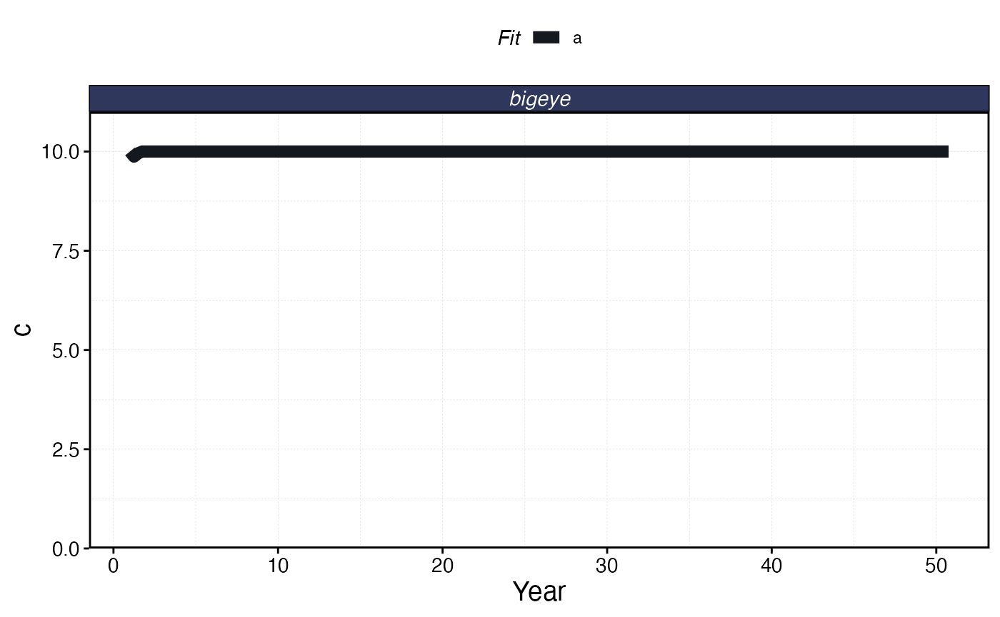
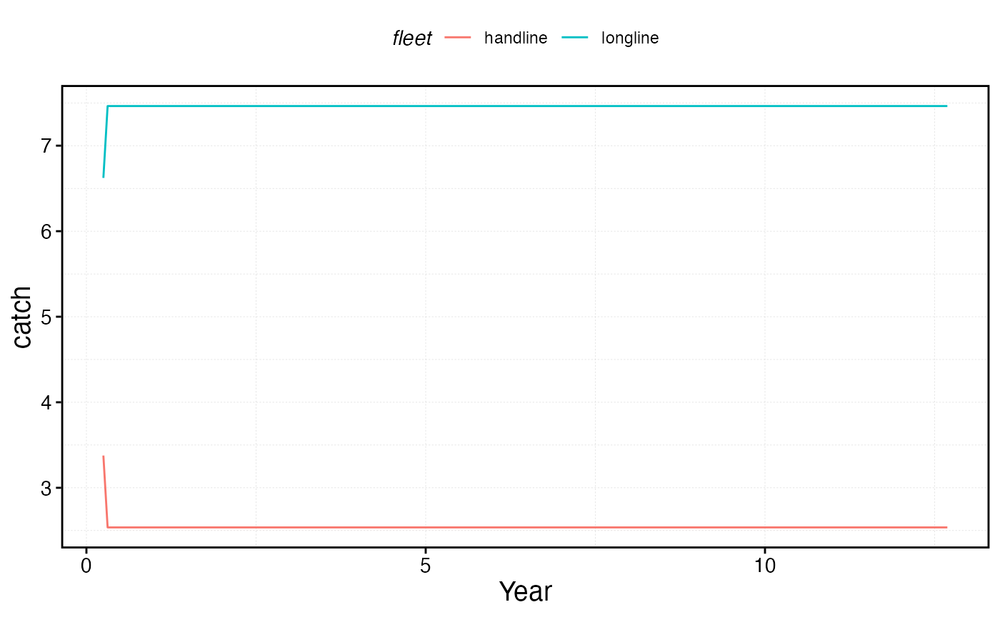
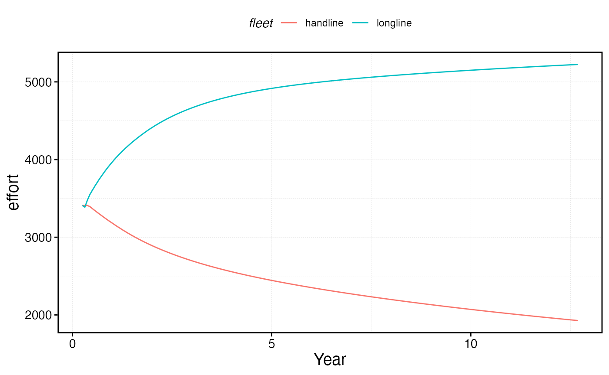

# Manage Catch and Effort of Fleets

`marlin` allows for a wide range of options to govern both the
management and internal dynamics of fishing fleets.

Things you can adjust include

- The `fleet_model` option, which at the moment supports
  `constant effort`, in which total fishing effort remains constant, and
  `open access` where total effort increases or decreases in response to
  profits.

- Closed fishing seasons per critter, for example enforcing a closed
  season for species X but not species Y

- Catch quotas per species

- Effort caps per fleet

- Size limits and selectivity forms per metier and critter

- no-take Marine Protected Areas

You can mix and match most of these options (e.g. an open-access fleet
subjected to a total quota for some species but not for others).

First, let’s set up the system and the critters we will deal with, in
this case a simple example of one bigeye tuna population.

``` r
library(marlin)

library(tidyverse)

theme_set(theme_marlin(base_size = 14) + theme(legend.position = "top"))

resolution <- 10 # resolution is in squared patches, so 20 implies a 20X20 system, i.e. 400 patches 

years <- 50

seasons <- 4

time_step <- 1 / seasons

steps <- years * seasons

fauna <- 
  list(
    "bigeye" = create_critter(
      scientific_name = "Thunnus obesus",
      adult_diffusion = 10,
      density_dependence = "post_dispersal", 
      seasons = seasons,
      fished_depletion = 0.8,
      resolution = resolution,
      steepness = 0.6,
      ssb0 = 1000
    )
  )

fauna$bigeye$m_at_age
#>  [1] 3.6234693 2.4692787 1.8927609 1.5473114 1.3173955 1.1534981 1.0308614
#>  [8] 0.9357311 0.8598546 0.7979800 0.7466060 0.7033087 0.6663565 0.6344796
#> [15] 0.6067255 0.5823660 0.5608345 0.5416836 0.5245555 0.5091604 0.4952612
#> [22] 0.4826621 0.4711996 0.4607368 0.4511574 0.4423625 0.4342675 0.4267990
#> [29] 0.4198938 0.4134967 0.4075592 0.4020388 0.3968982 0.3921040 0.3876268
#> [36] 0.3834400 0.3795203 0.3758463 0.3723991 0.3691613 0.3661175 0.3632535
#> [43] 0.3605564 0.3580146 0.3556173 0.3533547 0.3512180 0.3491988 0.3472895
```

## Open Access

Let’s set up two fleets, one open access, one constant effort. open
access dynamics are based around the profitability of the fishery, and
so require a few more parameters, though reasonable defaults are
provided.

The open access fleet model is

``` math
E_{t+1,f} = E_{t,f} \times e^{\theta log(R_{t,f} / C_{t,f})} 
```

where *E* is total effort in time *t* for fleet *f*. $`\theta`$ controls
the responsiveness of effort to the ratio of revenues *R* to costs *C*
in log space. A value of 0.1 means that a 1 unit increase in the revenue
to cost ratio results in a roughly 10% increase in effort.

Revenue is defined as

``` math
R_{t,f} = \sum_{s=1}^Sp_{f,s}Catch_{f,s}
```
where *p* is the price and *Catch* is the catch for species *s* caught
by fleet *f*

Costs are defined as

``` math
C_{t,f} = \sum_{p=1}^P \gamma_f (E_{t,p,f}^{\beta_f} + \eta_{f,p} E_{t,p})
```

where
``` math
\gamma_f
```
is the base cost per unit effort for fleet *f*, $`\beta`$ allows for
thec cost of effort to scale non-linearly, and $`\eta`$ is the cost of
fishing in each patch *p*, allowing for the model to account for travel
costs for different patches.

Many of these parameters are intuitive and easy to set (e.g. price), but
others are not. In particular, the cost per unit effort parameter
$`\gamma`$ can be difficult to adjust as it depends on the units of
effort and biomass to work correctly.

As such, the model works bets when specifying a `cr_ratio` rather than a
$`\gamma`$. The `cr_ratio` specifies the ratio of costs to revenue at
equilibrium conditions. So, a value of 1 means that profits are zero at
equilibrium, \>1 that profits are negative, \< 1 that profits are
positive.

The function `tune_fleets` then takes these parameters and finds the
cost parameters that results in the desired equilibrium `cr_ratio`.

``` r

fleets <- list(
  "longline" = create_fleet(
    list("bigeye" = Metier$new(
        critter = fauna$bigeye,
        price = 10,
        sel_form = "logistic",
        sel_start = 1,
        sel_delta = .01,
        catchability = 0,
        p_explt = 2
      )
    ),
    base_effort = resolution ^ 2,
    resolution = resolution,
    cr_ratio = 1,
    travel_fraction = 0.5,
    fleet_model = "open access")
,
"handline" = create_fleet(
  list("bigeye" = Metier$new(
    critter = fauna$bigeye,
    price = 10,
    sel_form = "logistic",
    sel_start = 1,
    sel_delta = .01,
    catchability = 0,
    p_explt = 1
  )
  ),
  base_effort = resolution ^ 2,
  resolution = resolution,
  fleet_model = "constant effort",
  cost_per_unit_effort = 2
))

fleets <- tune_fleets(fauna, fleets, tune_type = "depletion") 
```

We can now run our simulation and examine the resulting fleet dynamics

``` r

sim <- simmar(fauna = fauna,
                  fleets = fleets,
                  years = years)
proc_sim <- process_marlin(sim)

plot_marlin(proc_sim)
```


``` r

proc_sim$fleets %>% 
  group_by(step, fleet) %>%
  summarise(effort = sum(effort)) %>% 
  ggplot(aes(step * time_step, effort, color = fleet)) + 
  geom_line() + 
    scale_x_continuous(name = "Year")
```


## Open Access and MPAs

To see the effect of the fleet model choices, let’s examine the
trajectory of each fleet after the addition of an MPA. Under the default
constant effort with reallocation dynamics of the model, when an MPA is
put in place, the total effort in the fishery remains the same but is
reallocated to from inside the MPA to the remaining fishable patches.
Under the open access model, effort reacts to the MPA in accordance to
the MPAs impacts on fishing profits.

As a result, when the MPA is put in place effort decreases rapidly,
until profits increase some due to spillover from the MPA, at which time
effort increases until a new open access equilibrium of zero profits
with the MPAs is achieved.

``` r

set.seed(42)
#specify some MPA locations
mpa_locations <- expand_grid(x = 1:resolution, y = 1:resolution) %>%
mutate(mpa = x > 4 & y < 6)

with_mpa <- simmar(fauna = fauna,
                  fleets = fleets,
                  years = years,
                  manager = list(mpas = list(locations = mpa_locations,
              mpa_year = floor(years * .5))))

proc_mpa_sim <- process_marlin(with_mpa)


proc_mpa_sim$fleets %>% 
  group_by(step, fleet) %>%
  summarise(effort = sum(effort)) %>% 
  ggplot(aes(step * time_step, effort, color = fleet)) + 
  geom_line() + 
  scale_x_continuous(name = "year")
```


## Quotas

We can also layer quotas onto the fleet model. Here, we will impose a
total quota of 100 tons of bigeye caught across all fleets. Notice that
quotas impose a *cap*, not a requirement, on catch. So, in the early
days of the fishery when catches would have been high, the quota is in
effect. However, in the later days of the fishery, the fleets have no
incentive to catch up to the quota, and so catch less than the allowable
amount.

``` r
sim_quota <- simmar(fauna = fauna,
                  fleets = fleets,
                  years = years,
                  manager = list(quotas = list(bigeye = 8)))

proc_sim_quota <- process_marlin(sim_quota)

plot_marlin(proc_sim_quota, plot_var = "c", max_scale = FALSE)
```



``` r

proc_sim_quota$fleets %>% 
  group_by(step, fleet) %>% 
  summarise(catch = sum(catch)) %>% 
  ggplot(aes(step * time_step, catch, color = fleet)) + 
  geom_line()+
    scale_x_continuous(name = "Year")
```



``` r


proc_sim_quota$fleets %>% 
  group_by(step, fleet) %>%
  summarise(effort = sum(effort)) %>% 
  ggplot(aes(step * time_step, effort, color = fleet)) + 
  geom_line() + 
    scale_x_continuous(name = "Year")
```



## Effort Caps

Another management option is to set a maximum amount of effort per
fleet. This could reflect regulation, or reality. For example, if the
user wishes to think of effort in terms of “days fished per year” by a
fixed number of vessels, clearly there are limits.

Users set this by
`manager = list(effort_cap = list(FLEET_NAME = EFFORT_CAP))`, where
`FLEET_NAME` is filled in with the name of the fleet to apply a given
total `EFFORT_CAP` to.

Note that effort caps only really apply when
`fleet_model == "open access`; when `fleet_model == "constant effort"`
effort it already capped. Under open access though, the effort cap
ensures that while open access dynamics might **reduce** the total
amount of effort, effort will never expand beyond the supplied cap for
that fleet.

``` r

cap = 1.1*fleets$longline$base_effort

sim_effort <- simmar(fauna = fauna,
                  fleets = fleets,
                  years = years,
                  manager = list(effort_cap = list(longline = cap)))

proc_sim_effort <- process_marlin(sim_effort)

plot_marlin(proc_sim_effort, plot_var = "c", max_scale = FALSE)
```


``` r

proc_sim_effort$fleets %>% 
  group_by(step, fleet) %>% 
  summarise(catch = sum(catch)) %>% 
  ggplot(aes(step * time_step, catch, color = fleet)) + 
  geom_line()+
    scale_x_continuous(name = "Year")
```


``` r


proc_sim_effort$fleets %>% 
  group_by(step, fleet, patch) %>%
  summarise(effort = unique(effort)) %>% 
  group_by(step, fleet) |> 
  summarise(effort = sum(effort)) |> 
  ggplot(aes(step * time_step, effort, color = fleet)) + 
  geom_line() + 
  geom_hline(yintercept = cap) +
    scale_x_continuous(name = "Year") + 
  scale_y_continuous(limits = c(0, NA))
```


## Manual Effort

As another option, you can manually specify the effort in each time step
for each fleet. Inside the `fleet` object, set `fleet_model = "manual"`,
and then provide a timeseries of effort in each time step.

``` r
time_steps <- years * seasons

fleets$longline$fleet_model <- "manual"

fleets$longline$effort <- fleets$longline$base_effort *  rlnorm(time_steps,0,.2)
  
fleets <- tune_fleets(fauna, fleets, tune_type = "depletion")

sim_effort <- simmar(
  fauna = fauna,
  fleets = fleets,
  years = years
)

proc_sim_effort <- process_marlin(sim_effort)

plot_marlin(proc_sim_effort, plot_var = "c", max_scale = FALSE)
```


``` r

proc_sim_effort$fleets %>%
  group_by(step, fleet) %>%
  summarise(catch = sum(catch)) %>%
  ggplot(aes(step * time_step, catch, color = fleet)) +
  geom_line() +
  scale_x_continuous(name = "Year")
```


``` r


proc_sim_effort$fleets %>%
  group_by(step, fleet) %>%
  summarise(effort = sum(effort)) %>%
  ggplot(aes(step * time_step, effort, color = fleet)) +
  geom_line() +
  scale_x_continuous(name = "Year")
```


