# Manage Catch and Effort of Fleets

`marlin` allows for a wide range of options to govern both the
management and internal dynamics of fishing fleets.

Things you can adjust include:

- **Fleet models**: `fleet_model` controls effort dynamics. Options are:

  - `"constant_effort"`: total effort fixed at `base_effort` each time
    step
  - `"open_access"`: effort adjusts based on average profitability,
    equilibrating where total profits = 0
  - `"sole_owner"`: effort adjusts based on marginal profitability,
    equilibrating at maximum economic yield (MEY) where marginal profit
    = 0
  - `"manual"`: effort taken from a user-supplied vector

- **Closed fishing seasons** per species (e.g. enforcing a closed season
  for species X but not species Y)

- **Catch quotas** per species

- **Effort caps** per fleet

- **Size limits and selectivity** forms per metier and species

- **No-take marine protected areas** (MPAs)

You can mix and match most of these options — for example, running an
open-access fleet subject to a total quota for some species but not
others.

First, let’s set up the system and the species. In this case we use a
simple example with one bigeye tuna population.

``` r

library(marlin)

library(tidyverse)

theme_set(theme_marlin(base_size = 14) + theme(legend.position = "top"))

resolution <- 10 # resolution is in squared patches, so 10 implies a 10x10 system, i.e. 100 patches

years <- 50

seasons <- 4

time_step <- 1 / seasons

steps <- years * seasons

fauna <- 
  list(
    "bigeye" = create_critter(
      scientific_name = "Thunnus obesus",
      adult_diffusion = 10,
      density_dependence = "post_dispersal", 
      seasons = seasons,
      depletion = 0.8,
      resolution = resolution,
      steepness = 0.6,
      ssb0 = 1000
    )
  )

fauna$bigeye$m_at_age
#>  [1] 3.6234693 2.4692787 1.8927609 1.5473114 1.3173955 1.1534981 1.0308614
#>  [8] 0.9357311 0.8598546 0.7979800 0.7466060 0.7033087 0.6663565 0.6344796
#> [15] 0.6067255 0.5823660 0.5608345 0.5416836 0.5245555 0.5091604 0.4952612
#> [22] 0.4826621 0.4711996 0.4607368 0.4511574 0.4423625 0.4342675 0.4267990
#> [29] 0.4198938 0.4134967 0.4075592 0.4020388 0.3968982 0.3921040 0.3876268
#> [36] 0.3834400 0.3795203 0.3758463 0.3723991 0.3691613 0.3661175 0.3632535
#> [43] 0.3605564 0.3580146 0.3556173 0.3533547 0.3512180 0.3491988 0.3472895
```

## Open access

Let’s set up two fleets: one open access, one constant effort.
Open-access dynamics are based on the profitability of the fishery and
require a few more parameters, though reasonable defaults are provided.

### Open-access effort dynamics

Total effort adjusts each time step in response to a normalised
profitability signal:

``` math
E_{t+1,f} = E_{t,f} \times \exp\left(\rho \cdot \tanh\left(\frac{s_t}{k}\right)\right)
```

where the profitability signal $`s_t`$ is:

``` math
s_t = \frac{R_t - C_t}{|R_t| + C_t}
```

and $`R_t`$ and $`C_t`$ are total revenue and total cost in the previous
step, respectively. This signal is bounded in $`[-1, 1]`$, handles
negative revenue safely, and is invariant to rescaling.

The parameters control entry/exit dynamics:

- $`\rho`$ (`oa_rho_year`): annual effort adjustment rate. A value of
  0.5 means effort can grow or shrink by roughly 50% per year under
  strong profit or loss signals.
- $`k`$ (`oa_signal_half`): signal value at which the tanh response
  reaches half its maximum. Lower values make fleets more responsive.
  Typical range 0.15–0.4; default 0.3.
- `oa_max_growth_per_year`: maximum fractional increase in effort per
  year under highly profitable conditions (e.g. 0.5 = +50% per year).
- `oa_max_decline_per_year`: maximum fractional decrease in effort per
  year under highly unprofitable conditions (e.g. 0.5 = -50% per year).

The tanh function ensures that:

- Entry/exit speed saturates under extreme profits or losses (avoiding
  unrealistic boom/bust cycles).
- Response is approximately linear near break-even profitability.
- Effort converges to an equilibrium where total profits equal zero (the
  classic open-access outcome).

### Revenue and costs

Revenue is:

``` math
R_{t,f} = \sum_{s=1}^S p_{f,s} \, \text{Catch}_{f,s}
```

where $`p`$ is price and Catch is catch for species $`s`$ by fleet
$`f`$.

Costs are:

``` math
C_{t,f} = c_0 \, E^{\text{ref}} \sum_{l=1}^P \left[\left(\frac{E_{t,l,f}}{E^{\text{ref}}}\right)^\gamma + \theta \, \tilde{d}_l \, \frac{E_{t,l,f}}{E^{\text{ref}}}\right]
```

where:

- $`c_0`$ (`cost_per_unit_effort`): base cost per unit of effort
- $`E^{\text{ref}}`$: reference effort per patch (typically
  `base_effort / n_patches`)
- $`\gamma`$ (`effort_cost_exponent`): exponent controlling
  congestion/convexity. Values \> 1 make additional units of effort
  progressively more expensive. Default 1.2.
- $`\theta`$ (`travel_weight`): derived internally from
  `travel_fraction`
- $`\tilde{d}_l`$: normalised distance from patch $`l`$ to the nearest
  port

### Calibrating costs with `cr_ratio`

Rather than setting $`c_0`$ manually, specify a target cost-to-revenue
ratio (`cr_ratio`) at equilibrium. A value of 1 means zero profits at
equilibrium (classic open access), \> 1 means losses, \< 1 means
positive profits.

`tune_fleets(..., tune_costs = TRUE)` then solves for the $`c_0`$ that
achieves the desired `cr_ratio` at the tuned depletion level.

``` r


fleets <- list(
  "longline" = create_fleet(
    list("bigeye" = Metier$new(
        critter = fauna$bigeye,
        price = 10,
        sel_form = "logistic",
        sel_start = 1,
        sel_delta = .01,
        catchability = 0,
        p_explt = 2
      )
    ),
    base_effort = resolution ^ 2,
    resolution = resolution,
    cr_ratio = 1,
    travel_fraction = 0.5,
    fleet_model = "open_access",
    oa_max_growth_per_year = 0.5,
    oa_max_decline_per_year = 0.5,
    oa_signal_half = 0.3)
,
"handline" = create_fleet(
  list("bigeye" = Metier$new(
    critter = fauna$bigeye,
    price = 10,
    sel_form = "logistic",
    sel_start = 1,
    sel_delta = .01,
    catchability = 0,
    p_explt = 1
  )
  ),
  base_effort = resolution ^ 2,
  resolution = resolution,
  fleet_model = "constant_effort",
  cost_per_unit_effort = 2
))

fleets <- tune_fleets(fauna, fleets, tune_type = "depletion", tune_costs = TRUE) 
```

We can now run our simulation and examine the resulting fleet dynamics

``` r


sim <- simmar(fauna = fauna,
                  fleets = fleets,
                  years = years)
proc_sim <- process_marlin(sim)

plot_marlin(proc_sim)
```

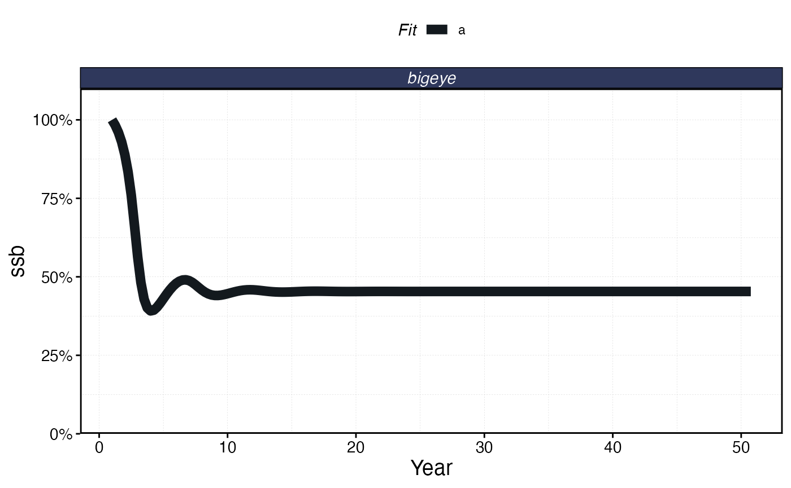

``` r


proc_sim$fleets %>% 
  group_by(step, fleet) %>%
  summarise(effort = sum(effort)) %>% 
  ggplot(aes(step * time_step, effort, color = fleet)) + 
  geom_line() + 
    scale_x_continuous(name = "Year")
```

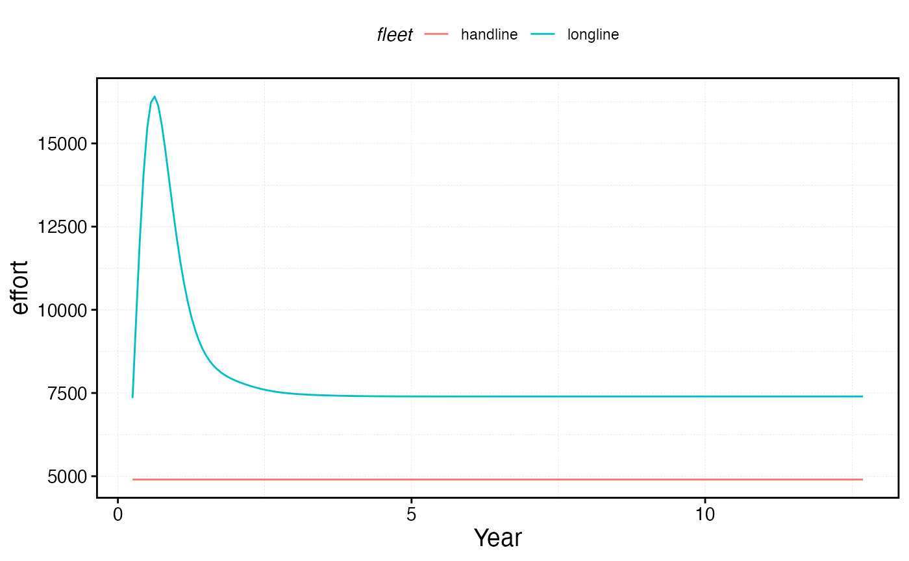

## Open access and MPAs

The fleet model choice determines how effort responds to an MPA. Under
the default **constant effort with reallocation** dynamics, total effort
stays fixed but is redistributed from inside the MPA to the remaining
fishable patches. Under the **open access** model, effort responds
dynamically to how the MPA affects profitability.

When an MPA is implemented, the open-access fleet initially loses access
to productive fishing grounds inside the closure. This reduces catch
while costs remain the same, driving down profits and triggering effort
contraction. As the MPA matures, spillover effects (adult movement and
larval export from the protected area) can increase catch rates in
adjacent patches, improving profitability and allowing effort to
partially recover. Eventually the fleet settles at a new zero-profit
equilibrium where the benefits of spillover are balanced against the
lost access inside the MPA.

``` r


set.seed(42)
#specify some MPA locations
mpa_locations <- expand_grid(x = 1:resolution, y = 1:resolution) %>%
mutate(mpa = x > 4 & y < 6)

with_mpa <- simmar(fauna = fauna,
                  fleets = fleets,
                  years = years,
                  manager = list(mpas = list(locations = mpa_locations,
              mpa_year = floor(years * .5))))

proc_mpa_sim <- process_marlin(with_mpa)


proc_mpa_sim$fleets %>% 
  group_by(step, fleet) %>%
  summarise(effort = sum(effort)) %>% 
  ggplot(aes(step * time_step, effort, color = fleet)) + 
  geom_line() + 
  scale_x_continuous(name = "year")
```

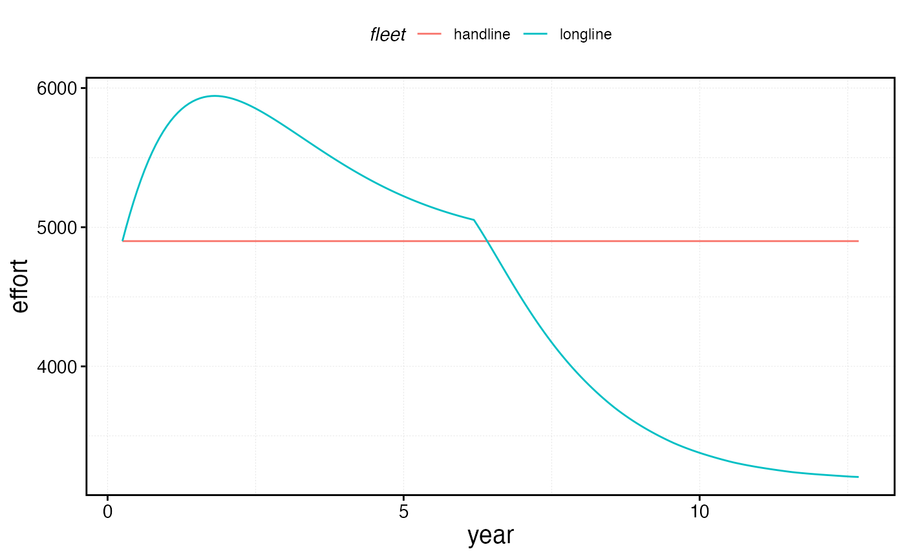

## Sole owner

The `"sole_owner"` fleet model is identical to open access in its effort
adjustment mechanics, but uses the *marginal* profit signal rather than
the *average* profit signal. This causes the fleet to equilibrate at
maximum economic yield (MEY), where marginal profit equals zero, rather
than at the open-access equilibrium where total profit equals zero.

Marginal profit is computed via finite-difference perturbations (see
[`?calc_marginal_value`](https://danovando.github.io/marlin/reference/calc_marginal_value.md)).
This requires additional computation each step, so `"sole_owner"` fleets
run slightly slower than `"open_access"` fleets. The equilibrium outcome
typically features lower effort and higher biomass than open access,
since the fleet stops expanding when the *next* unit of effort would no
longer be profitable, rather than waiting until *all* effort is
unprofitable.

To use sole owner dynamics:

``` r

fleets <- list(
  "longline" = create_fleet(
    list("bigeye" = Metier$new(...)),
    fleet_model = "sole_owner",
    cr_ratio = 0.8,  # MEY typically has positive profits, so cr_ratio < 1
    ...
  )
)
```

## Quotas

Quotas can be layered onto any fleet model. Here we impose a total catch
quota of 8 units of bigeye across all fleets. The quota is enforced each
time step by solving for a scalar effort multiplier that keeps total
catch at or below the quota.

**Important:** quotas impose a *cap*, not a requirement. In the early
days of the fishery when catches would naturally exceed the quota, the
quota is binding and effort is reduced proportionally. However, in later
years when the population has declined and effort dynamics (especially
under open access) would produce catches below the quota anyway, the
fleet is unconstrained and the quota has no effect. This reflects
real-world quota fisheries where economic or biological conditions can
make quotas non-binding.

``` r

sim_quota <- simmar(fauna = fauna,
                  fleets = fleets,
                  years = years,
                  manager = list(quotas = list(bigeye = 8)))

proc_sim_quota <- process_marlin(sim_quota)

plot_marlin(proc_sim_quota, plot_var = "c", max_scale = FALSE)
```

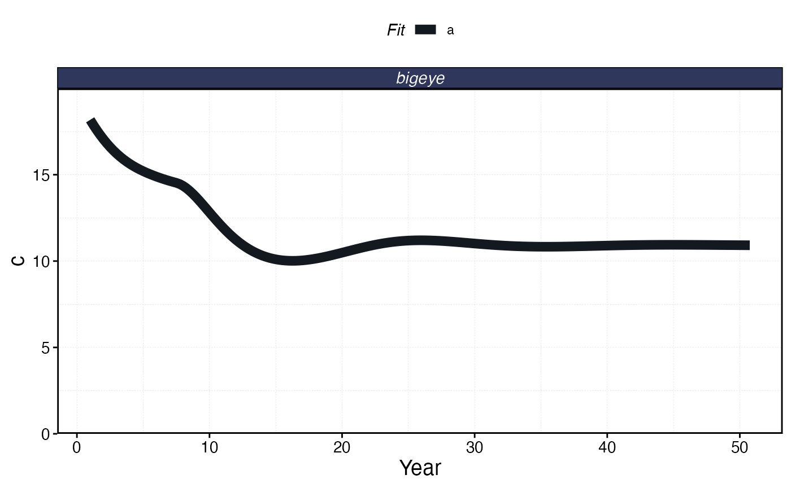

``` r


proc_sim_quota$fleets %>% 
  group_by(step, fleet) %>% 
  summarise(catch = sum(catch)) %>% 
  ggplot(aes(step * time_step, catch, color = fleet)) + 
  geom_line()+
    scale_x_continuous(name = "Year")
```

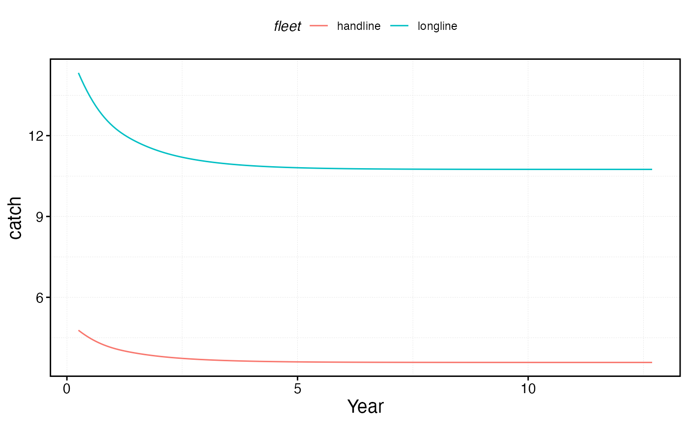

``` r


proc_sim_quota$fleets %>% 
  group_by(step, fleet) %>%
  summarise(effort = sum(effort)) %>% 
  ggplot(aes(step * time_step, effort, color = fleet)) + 
  geom_line() + 
    scale_x_continuous(name = "Year")
```

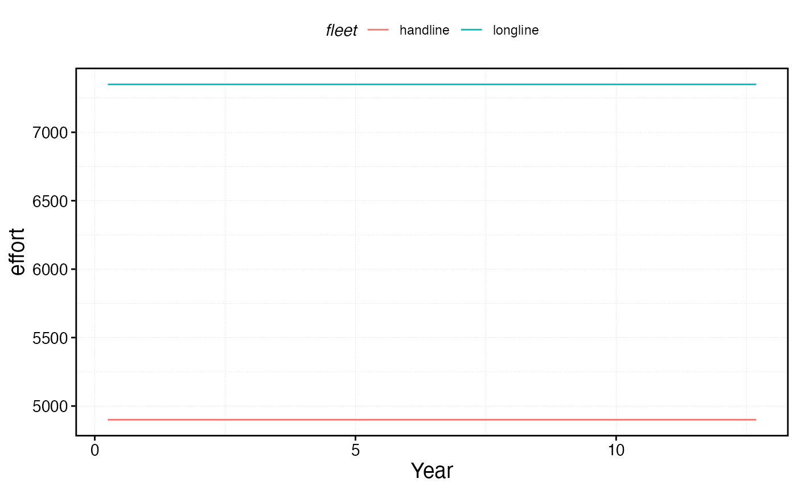

## Effort caps

Another management option is to set a maximum total effort per fleet.
This could reflect regulation (e.g. limited entry permits) or physical
reality (e.g. if effort is measured in “days fished per year” by a fixed
number of vessels, there is a natural ceiling).

Set effort caps via
`manager = list(effort_cap = list(FLEET_NAME = EFFORT_CAP))`, where
`FLEET_NAME` is the name of the fleet and `EFFORT_CAP` is the maximum
total effort allowed.

**Note:** effort caps are only meaningful when
`fleet_model == "open_access"` or `"sole_owner"`. For constant-effort
fleets, effort is already fixed at `base_effort`. Under open-access or
sole-owner dynamics, the cap ensures that while profitability signals
can *reduce* total effort, effort can never expand beyond the cap. The
fleet can still contract below the cap if losses warrant it, but
profitable conditions will not drive effort above the ceiling.

``` r


cap = 1.1*fleets$longline$base_effort

sim_effort <- simmar(fauna = fauna,
                  fleets = fleets,
                  years = years,
                  manager = list(effort_cap = list(longline = cap)))

proc_sim_effort <- process_marlin(sim_effort)

plot_marlin(proc_sim_effort, plot_var = "c", max_scale = FALSE)
```

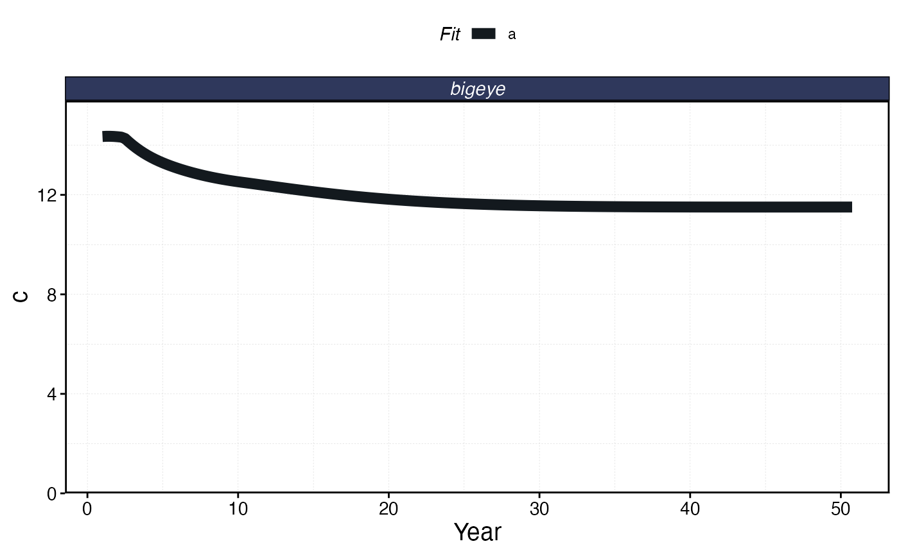

``` r


proc_sim_effort$fleets %>% 
  group_by(step, fleet) %>% 
  summarise(catch = sum(catch)) %>% 
  ggplot(aes(step * time_step, catch, color = fleet)) + 
  geom_line()+
    scale_x_continuous(name = "Year")
```

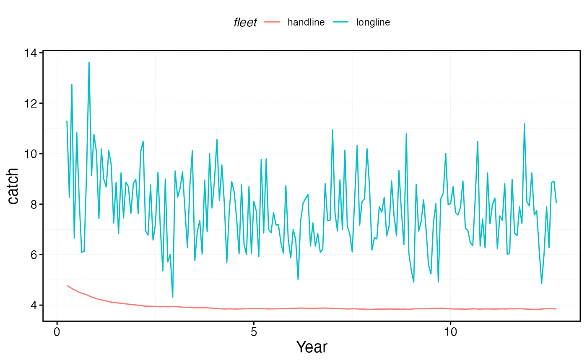

``` r


proc_sim_effort$fleets %>% 
  group_by(step, fleet, patch) %>%
  summarise(effort = unique(effort)) %>% 
  group_by(step, fleet) |> 
  summarise(effort = sum(effort)) |> 
  ggplot(aes(step * time_step, effort, color = fleet)) + 
  geom_line() + 
  geom_hline(yintercept = cap) +
    scale_x_continuous(name = "Year") + 
  scale_y_continuous(limits = c(0, NA))
```

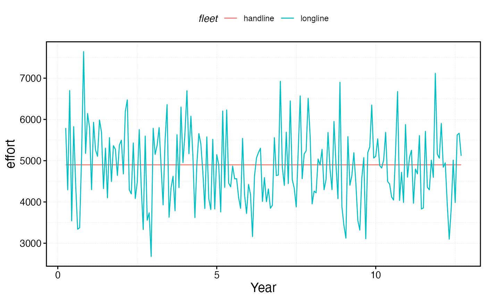

## Manual effort

As an alternative to model-driven effort dynamics, you can manually
specify total effort for each time step. Set `fleet_model = "manual"`
and provide a vector of effort values in the fleet object’s `effort`
field. The vector must have length equal to `years * seasons`.

This is useful when you want to impose an exogenous effort trajectory —
for example, to simulate the historical expansion of a fishery, test the
effects of a known effort time series, or explore counterfactual
scenarios where effort follows a prescribed pattern rather than
responding endogenously to economic signals.

``` r

time_steps <- years * seasons

fleets$longline$fleet_model <- "manual"

fleets$longline$effort <- fleets$longline$base_effort *  rlnorm(time_steps,0,.2)
  
fleets <- tune_fleets(fauna, fleets, tune_type = "depletion")

sim_effort <- simmar(
  fauna = fauna,
  fleets = fleets,
  years = years
)

proc_sim_effort <- process_marlin(sim_effort)

plot_marlin(proc_sim_effort, plot_var = "c", max_scale = FALSE)
```

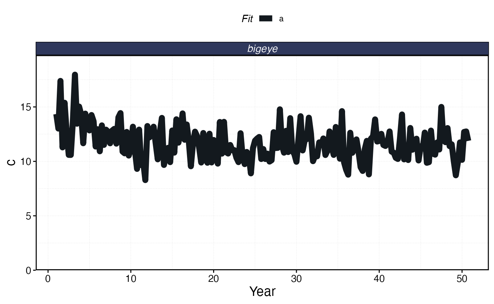

``` r


proc_sim_effort$fleets %>%
  group_by(step, fleet) %>%
  summarise(catch = sum(catch)) %>%
  ggplot(aes(step * time_step, catch, color = fleet)) +
  geom_line() +
  scale_x_continuous(name = "Year")
```

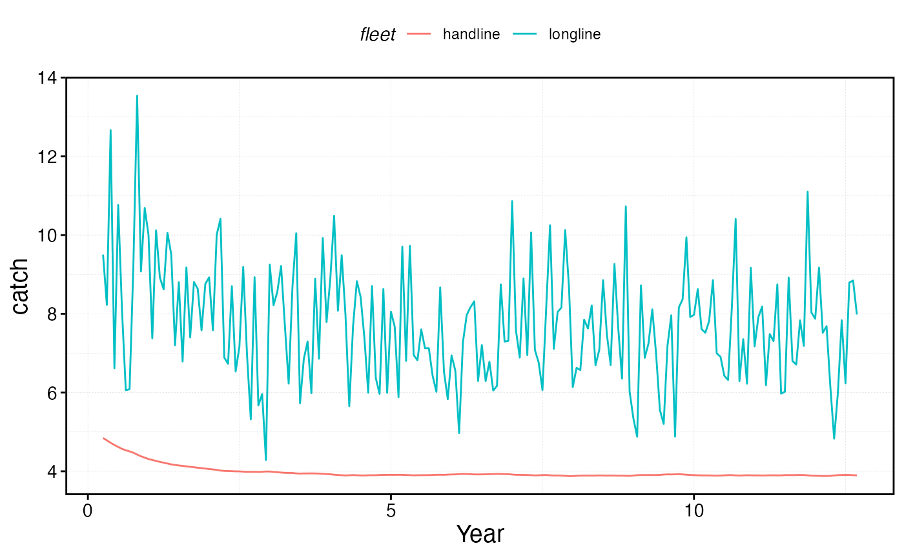

``` r


proc_sim_effort$fleets %>%
  group_by(step, fleet) %>%
  summarise(effort = sum(effort)) %>%
  ggplot(aes(step * time_step, effort, color = fleet)) +
  geom_line() +
  scale_x_continuous(name = "Year")
```

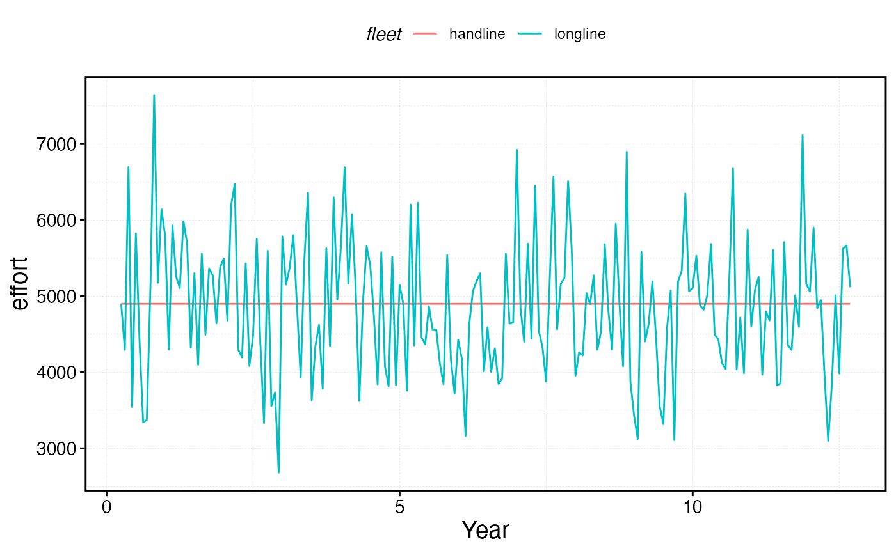
