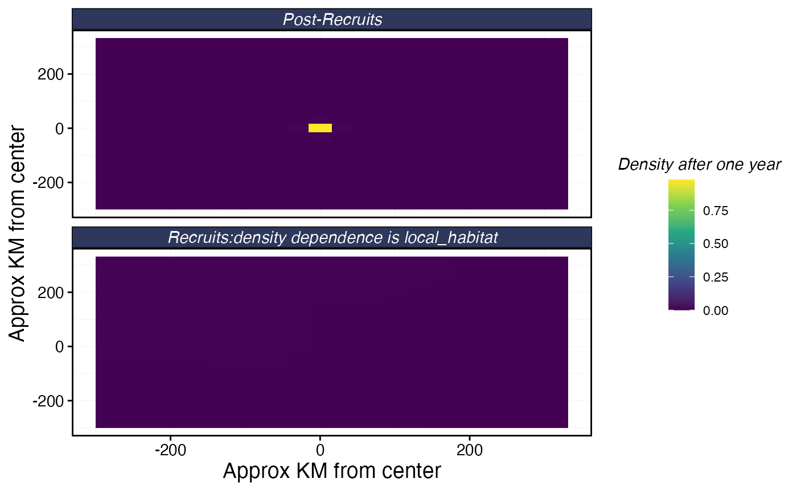
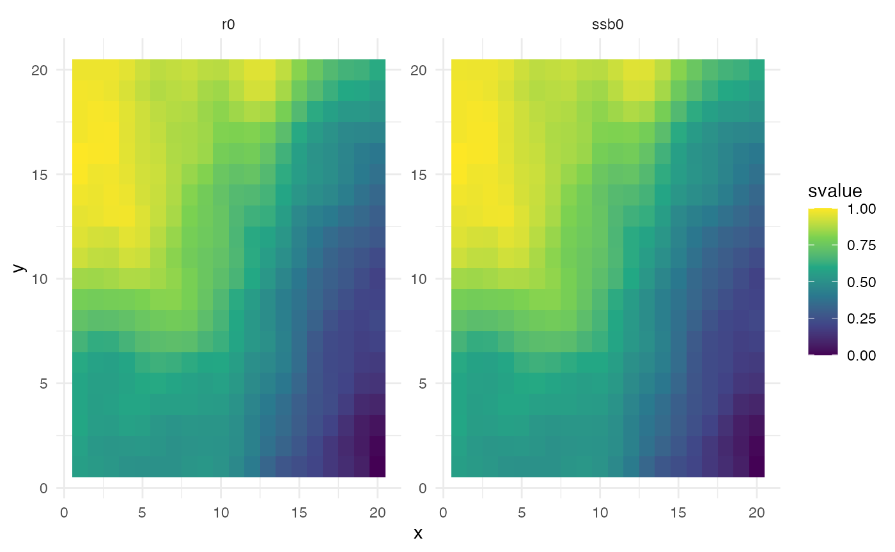
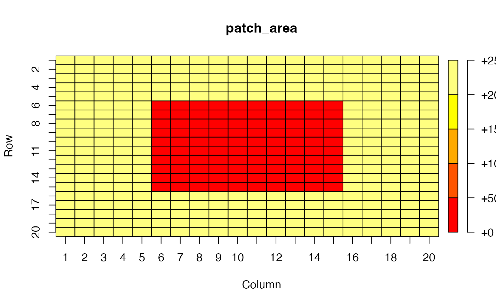
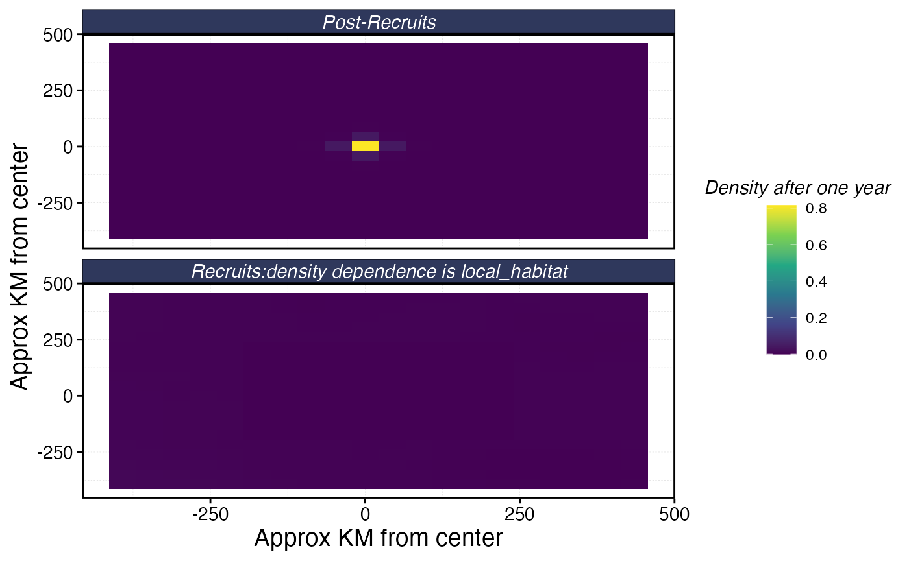
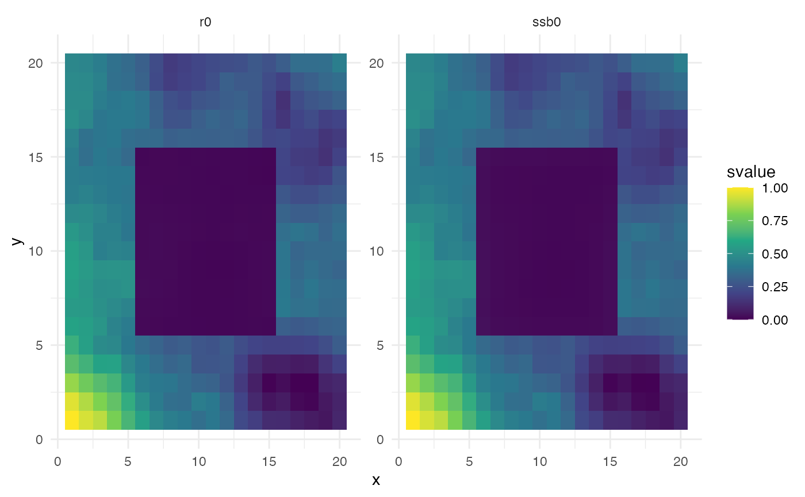

# Setting flexible patch areas

\[EB to fully fill out once this update is complete\]

One new feature of `marlin` is allowing for a flexible `patch_area()`
parameter, in which users can supply a single value (if all grid cells
are the same size), or a matrix or vector of values denoting different
grid cell areas. This is particularly useful for modeling species with
large habitat ranges with a particular focus on a small subset of the
total modeled area.


The area of interest (red) has a finer resolution than the larger
modeled area


Patch areas represented by the area of interest and the species stock
assessment area.

We begin by using the classic example, where patch area is the same.

``` r
# Load required libraries
library(marlin)
# devtools::load_all()
library(tidyverse)

# Set marlin parameters
resolution <- c(20,20) # resolution is in squared patches, so 20 implies a 20X20 system, i.e. 400 patches
years <- 25
patch_area <- 1000 # in square km
 
# Produce patch dataframe
patches <- expand_grid(
  x = seq(1, resolution[1]),
  y = seq(1, resolution[2])
) |> 
  mutate(
    patch_id = row_number(),
    area = patch_area
  )

# Generate habitat matrices
recruit_habitat <- sim_habitat("bigeye",kp = .001, resolution = resolution, patch_area = patch_area, output = "list")
adult_habitat <- sim_habitat("bigeye",kp = .001, resolution = resolution, patch_area = patch_area, output = "list")

# Build fauna object
fauna <-
  list(
    "bigeye" = create_critter(
      common_name = "bigeye tuna",
      adult_home_range = 10,
      recruit_home_range = 4,
      habitat = adult_habitat$critter_distributions$bigeye,
      recruit_habitat = recruit_habitat$critter_distributions$bigeye,
      density_dependence = "local_habitat",
      resolution = resolution,
      patch_area = patch_area,
      steepness = 0.6,
      ssb0 = 1000
    )
  )

# Plot movement for fauna 
fauna$bigeye$plot_movement()
```



``` r

# Calculate other patch metrics
patch_things <- patches # save the original output
patches$r0 <- fauna$bigeye$r0s # add the number of recruits each patch can support under unfished conditions
patches$ssb0 <- fauna$bigeye$ssb0_p # add spawning stock biomass by patch

# Plot the recruits/ssb0 starting conditions over space
patches |> 
  pivot_longer(cols = c(r0, ssb0), names_to = "variable", values_to = "value") |> 
  group_by(variable) |>
  mutate(svalue = value / max(value)) |>
  ggplot(aes(x = x, y = y, fill = svalue)) +
  geom_tile() +
  facet_wrap(~variable, scales = "free") +
  scale_fill_viridis_c() +
  theme_minimal()
```



We now adjust patch area to represent two different spatial resolutions:

``` r
# Set marlin parameters
library(plot.matrix)
# resolution <- c(20,20) # resolution is in squared patches, so 20 implies a 20X20 system, i.e. 400 patches
# years <- 25
patch_area <- matrix(c(rep(50*50, 20*5), rep(c(rep(50*50, 5), rep(10*10, 10), rep(50*50, 5)), 10),
                  rep(50*50, 20*5)), ncol = resolution[1]) # in square km

plot(patch_area)
```



``` r
# Produce patch dataframe
patches <- expand_grid(
  x = seq(1, resolution[1]),
  y = seq(1, resolution[2])
) |>
  mutate(
    patch_id = row_number()) |> 
  left_join(patch_area %>% 
      as.data.frame() %>%
      dplyr::mutate(y = 1:nrow(.)) %>%
      tidyr::pivot_longer(
        -y,
        names_to = "x",
        values_to = "rec_habitat",
        names_prefix = "V",
        names_transform = list(x = as.integer)
        ) 
  )

# Generate habitat matrices
recruit_habitat <- sim_habitat("bigeye",kp = .001, resolution = resolution, patch_area = mean(patch_area), output = "list")
adult_habitat <- sim_habitat("bigeye",kp = .001, resolution = resolution, patch_area = mean(patch_area), output = "list")

# Build fauna object
fauna <-
  list(
    "bigeye" = create_critter(
      common_name = "bigeye tuna",
      adult_home_range = 10,
      recruit_home_range = 4,
      habitat = adult_habitat$critter_distributions$bigeye,
      recruit_habitat = recruit_habitat$critter_distributions$bigeye,
      density_dependence = "local_habitat",
      resolution = resolution,
      patch_area = patch_area,
      steepness = 0.6,
      ssb0 = 1000
    )
  )

# Plot movement for fauna
fauna$bigeye$plot_movement()
```



``` r

# Calculate other patch metrics
patch_things <- patches # save the original output
patches$r0 <- fauna$bigeye$r0s # add the number of recruits each patch can support under unfished conditions
patches$ssb0 <- fauna$bigeye$ssb0_p # add spawning stock biomass by patch

# Plot the recruits/ssb0 starting conditions over space
patches |>
  pivot_longer(cols = c(r0, ssb0), names_to = "variable", values_to = "value") |>
  group_by(variable) |>
  mutate(svalue = value / max(value)) |>
  ggplot(aes(x = x, y = y, fill = svalue)) +
  geom_tile() +
  facet_wrap(~variable, scales = "free") +
  scale_fill_viridis_c() +
  theme_minimal()
```


