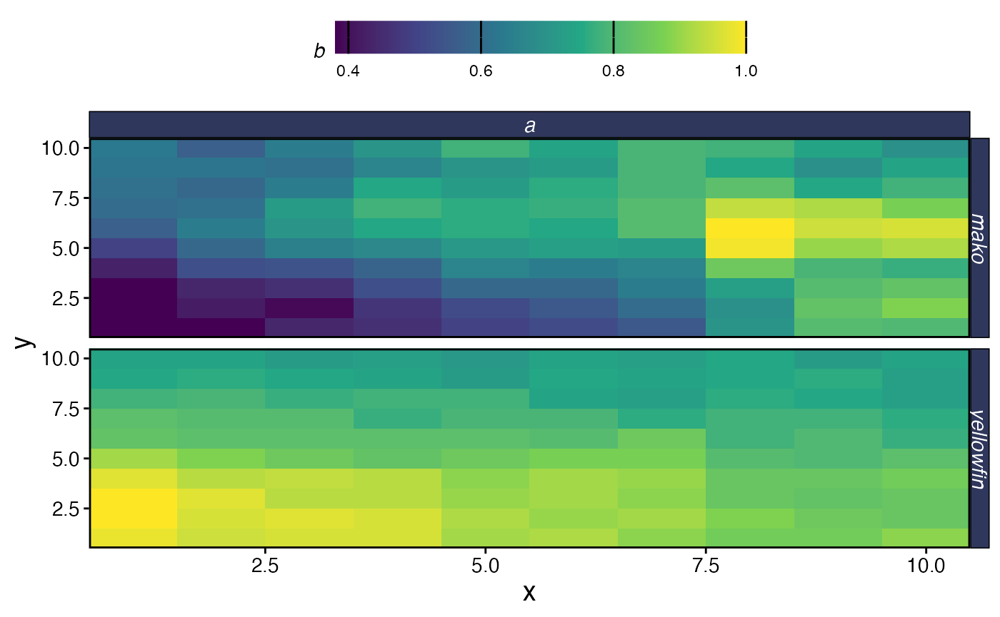
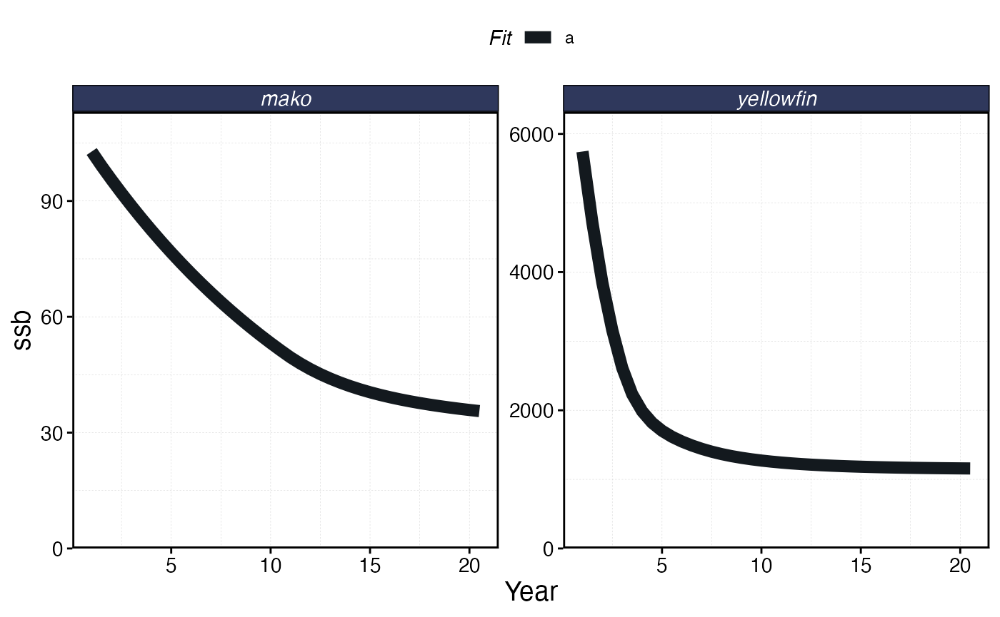
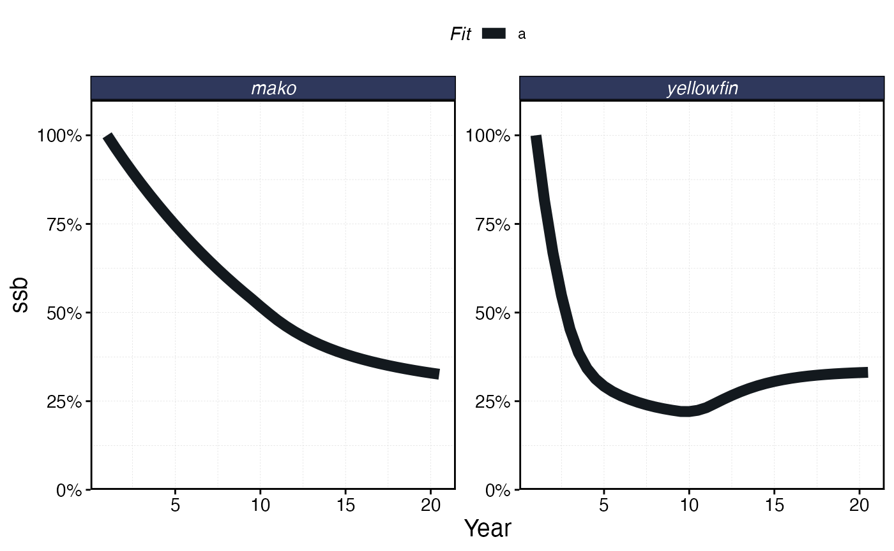
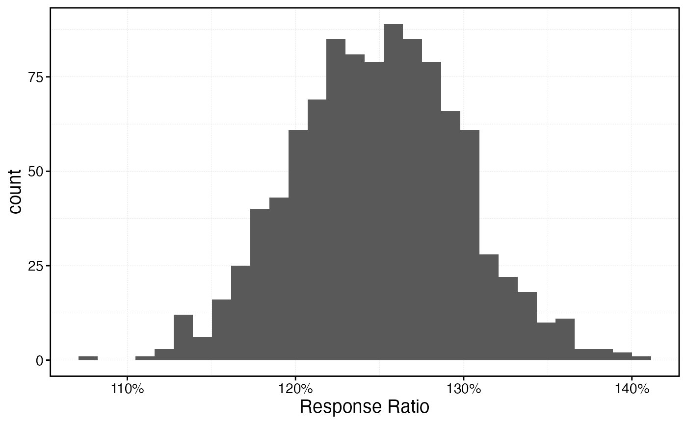
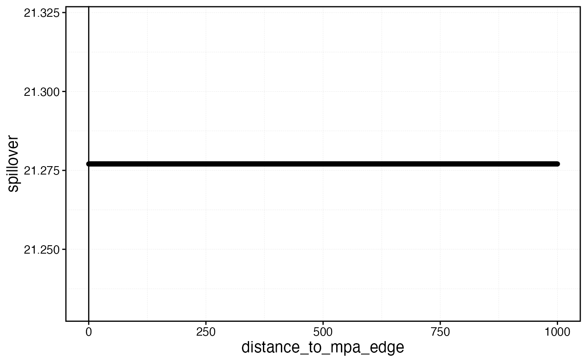
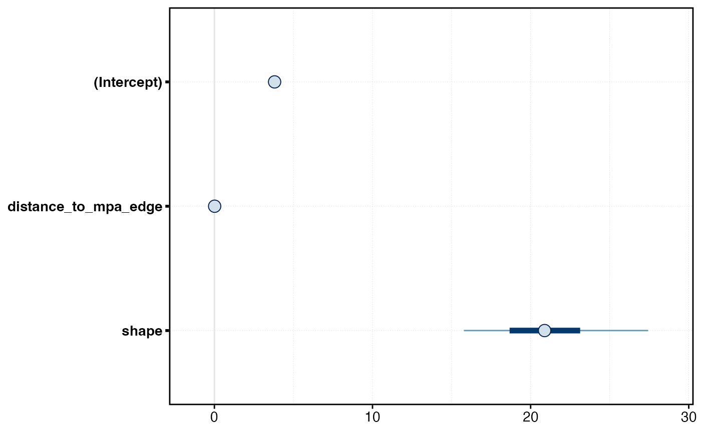
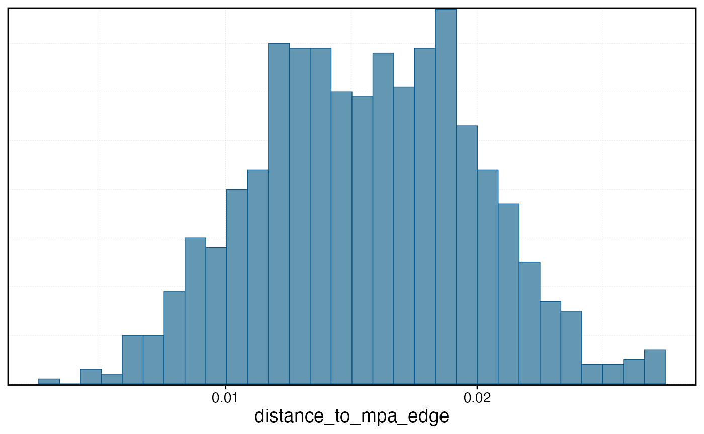
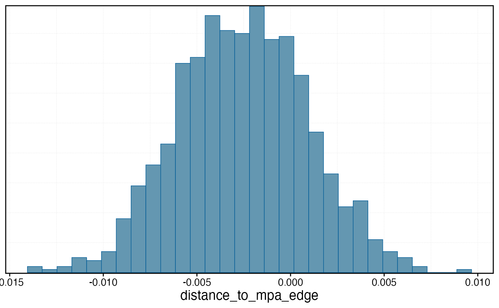
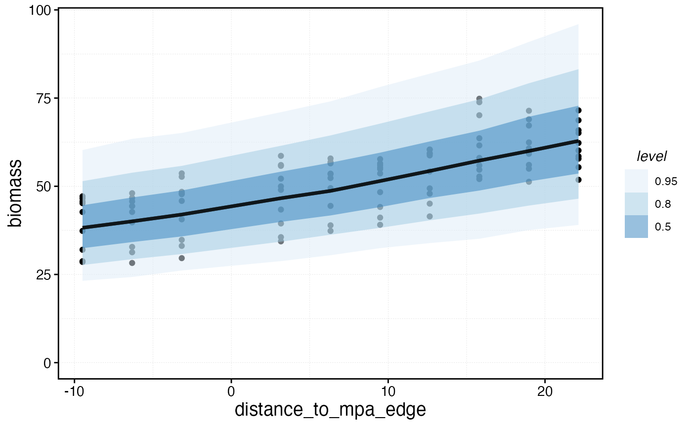

# Measure MPA Gradients

MPA performance is often attempted to be measured by empirical
indicators, such as the biomass inside the reserve relative to the
biomass in a selected reference site outside the reserve. This vignette
shows an example of how to simulate those processes using `marlin`.

We’ll first simulate a system with some heterogeneous habitat.

``` r
library(marlin)

library(tidyverse)

library(patchwork)

library(rstanarm)

library(ggdist)

library(bayesplot)

theme_set(marlin::theme_marlin())

resolution <- c(10, 10) # resolution is in squared patches, so 20 implies a 20X20 system, i.e. 400 patches

patch_area <- 10

seasons <- 2

years <- 20

tune_type <- "depletion"

steps <- years * seasons

yft_home_range <- 2

yft_depletion <- .2

rec_factor <- 10

mako_depletion <- 0.3

make_home_range <- 100

# for now make up some habitat

critters <- c("yellowfin", "mako")

critter_correlation <- -0.4

corr_mat <- matrix(c(1, critter_correlation, critter_correlation, 1), nrow = 2) # correlation matrix


habitats <- sim_habitat(
  critters,
  kp = 0.1,
  critter_correlations = corr_mat,
  resolution = resolution,
  patch_area = patch_area
)


critter_habitats <- habitats$critter_distributions |>
  group_by(critter) |>
  nest() |>
  mutate(habitat = map(
    data,
    \(x) x |>
      select(-patch) |>
      pivot_wider(names_from = x, values_from = habitat) |>
      select(-y) %>%
      as.matrix()
  ))
```

``` r
habitats$critter_distributions |>
  ggplot(aes(x, y, fill = habitat)) +
  geom_tile() +
  facet_wrap(~critter) +
  scale_fill_viridis_c()
```


Simulated Species Habitat

``` r
# create a fauna object, which is a list of lists

yft_habitat <- critter_habitats$habitat[[which(critter_habitats$critter == "yellowfin")]]

mako_habitat <- critter_habitats$habitat[[which(critter_habitats$critter == "mako")]]

fauna <-
  list(
    "yellowfin" = create_critter(
      scientific_name = "Thunnus albacares",
      habitat = yft_habitat, # pass habitat as lists
      recruit_habitat = yft_habitat,
      adult_home_range = yft_home_range, # cells per year
      recruit_home_range = rec_factor * yft_home_range,
      fished_depletion = yft_depletion, # desired equilibrium depletion with fishing (1 = unfished, 0 = extinct),
      density_dependence = "pre_dispersal", # recruitment form, where 1 implies local recruitment
      seasons = seasons,
      ssb0 = 5000,
    ),
    "mako" = create_critter(
      scientific_name = "Isurus oxyrinchus",
      habitat = mako_habitat,
      recruit_habitat = mako_habitat,
      adult_home_range = make_home_range,
      recruit_home_range = rec_factor * .1,
      fished_depletion = mako_depletion,
      density_dependence = "local_habitat", # recruitment form, where 1 implies local recruitment
      burn_years = 200,
      ssb0 = 100,
      seasons = seasons,
      fec_form = "pups",
      pups = 2,
      lorenzen_m = FALSE
    )
  )


fleets <- list("longline" = create_fleet(
  list(
    `yellowfin` = Metier$new(
      critter = fauna$`yellowfin`,
      price = 100, # price per unit weight
      sel_form = "logistic", # selectivity form, one of logistic or dome
      sel_start = .3, # percentage of length at maturity that selectivity starts
      sel_delta = .1, # additional percentage of sel_start where selectivity asymptotes
      catchability = .01, # overwritten by tune_fleet but can be set manually here
      p_explt = 1
    ),
    `mako` = Metier$new(
      critter = fauna$`mako`,
      price = 10,
      sel_form = "logistic",
      sel_start = .1,
      sel_delta = .01,
      catchability = 0,
      p_explt = 1
    )
  ),
  mpa_response = "stay",
  base_effort = 1000 * prod(resolution),
  spatial_allocation = "rpue",
  resolution = resolution
))

a <- Sys.time()

fleets <- tune_fleets(fauna, fleets, tune_type = tune_type) # tunes the catchability by fleet to achieve target depletion

Sys.time() - a
#> Time difference of 3.766673 secs

# run simulations

a <- Sys.time()

spillover_sim <- simmar(
  fauna = fauna,
  fleets = fleets,
  years = years
)

Sys.time() - a
#> Time difference of 0.04042602 secs


proc_spillover <- process_marlin(spillover_sim, time_step = fauna[[1]]$time_step, keep_age = TRUE)

plot_marlin(
  proc_spillover,
  max_scale = TRUE,
  plot_var = "b",
  plot_type = "space"
)
#> Warning in plot_marlin(proc_spillover, max_scale = TRUE, plot_var = "b", : Can
#> only plot one time step for spatial plots, defaulting to last of the supplied
#> steps
```



``` r

plot_marlin(proc_spillover, max_scale = FALSE)
```



``` r

mpa_locations <- expand_grid(x = 1:resolution[1], y = 1:resolution[2]) |>
  arrange(x) |>
  mutate(patch_name = paste(x, y, sep = "_"))

mpas <- mpa_locations$patch_name[1:round(nrow(mpa_locations) * .3)]

# mpas <- sample(mpa_locations$patch_name, round(nrow(mpa_locations) * 0.2), replace = FALSE, prob = mpa_locations$x)

mpa_locations$mpa <- mpa_locations$patch_name %in% mpas

a <- Sys.time()

mpa_spillover <- simmar(
  fauna = fauna,
  fleets = fleets,
  years = years,
  manager = list(mpas = list(
    locations = mpa_locations,
    mpa_year = floor(years * .5)
  ))
)

Sys.time() - a
#> Time difference of 0.276017 secs

proc_mpa_spillover <- process_marlin(mpa_spillover, time_step = fauna[[1]]$time_step)

plot_marlin(proc_mpa_spillover)
```



We can use
[`marlin::get_distance_to_mpas`](https://danovando.github.io/marlin/reference/get_distance_to_mpas.md)
to measure the euclidian distance between the centroid of each cell and
the nearest MPA cell centroid.

``` r
mpa_distances <- get_distance_to_mpas(mpa_locations = mpa_locations, resolution = resolution, patch_area = patch_area)

mpa_distances |>
  ggplot(aes(x, y, fill = distance_to_mpa_edge)) +
  geom_tile() +
  geom_tile(aes(x, y, color = mpa), size = 1.5) +
  scale_fill_gradient2(low = "darkblue", high = "green", mid = "white", midpoint = 0)
#> Warning: Using `size` aesthetic for lines was deprecated in ggplot2 3.4.0.
#> ℹ Please use `linewidth` instead.
#> This warning is displayed once per session.
#> Call `lifecycle::last_lifecycle_warnings()` to see where this warning was
#> generated.
```


Distance of each cell to the nearest MPA edge.

We can also calculate an “MPA gravity”, measured as the sum of all the
distances from the current cell to all MPA cells. So, a single MPA patch
far from any other MPAs might actually have a lower MPA gravity than a
fished patch right next to a very large number of MPA cells.

``` r
mpa_distances |>
  ggplot(aes(x, y, fill = -total_mpa_distance)) +
  geom_tile() +
  geom_tile(aes(x, y, color = mpa), size = 1.5) +
  scale_fill_viridis_c(name = "MPA gravity", option = "magma", direction = -1)
```


MPA gravity per cell.

### Indicators

We can then use these simulated data to generate a series of indicators
of MPA performance

#### Fishing the Line

The complex interactions of the life history and fishing fleet
strategies mean that this “fishing the line” behavior results in a
linear biomass gradient with distance from the MPA for the tuna, but
actually a reverse trend for the shark where biomass is depressed right
by the border due to fishing the line, and then increases with distance.

``` r
conservation_outcomes <- proc_mpa_spillover$fauna

fishery_outcomes <- proc_mpa_spillover$fleets


a <- fishery_outcomes |>
  filter(step == max(step), effort > 0) |>
  left_join(mpa_distances, by = c("x", "y", "patch")) |>
  ggplot(aes(distance_to_mpa_edge, effort, color = factor(step))) +
  geom_point() +
  facet_wrap(~critter, scales = "free_y")


b <- fishery_outcomes |>
  mutate(effort = if_else(effort == 0, NA, effort)) |>
  filter(step == max(step)) |>
  ggplot(aes(x, y, fill = effort)) +
  geom_tile()

a / b
```


Distribution of fishing effort in space post-MPA.

#### Response Ratios

The most common form of indicator used in the empirical MPA monitoring
literature is a “response ratio” *r*, generally measured as some version
of

``` math

r = log(\frac{inside}{outside})
```
Which at lower ratio values is roughly equivalent to the percent
difference in the metric in question inside the MPA relative to outside.

This can be generalized into a regression of the form

``` math

log(Y_i) \sim N(\beta_0 + rMPA_i + \pmb{\beta}\pmb{X_i},\sigma)
```
where $`\beta_0`$ is the value of outcome *Y* when MPA = 0, MPA is a
dummy variable indicating whether observation *i* is inside or outside
of an MPA, and $`\pmb{\beta}`$ is a vector of coefficients for the
vector of covariates $`\pmb{X}`$.

We can use this equation then to calculate response ratios in various
metrics, such as biomass density or mean length of fish.

``` r
rr_data <- conservation_outcomes |>
  filter(step == max(step) | year == floor(years * .5)) |>
  group_by(step, x, y, patch, critter) |>
  summarise(
    biomass = sum(b),
    mean_length = weighted.mean(mean_length, n)
  ) |>
  left_join(mpa_distances, by = c("x", "y", "patch"))
#> `summarise()` has regrouped the output.
#> ℹ Summaries were computed grouped by step, x, y, patch, and critter.
#> ℹ Output is grouped by step, x, y, and patch.
#> ℹ Use `summarise(.groups = "drop_last")` to silence this message.
#> ℹ Use `summarise(.by = c(step, x, y, patch, critter))` for per-operation
#>   grouping (`?dplyr::dplyr_by`) instead.
```

``` r
rr_data |>
  ggplot(aes(distance_to_mpa_edge, biomass, color = factor(step))) +
  geom_vline(xintercept = 0) +
  geom_jitter() +
  facet_wrap(~critter, scales = "free_y")
```


Biomass of each species as a function of distance from MPA border.
Negative distance means inside the MPA.

``` r
rr_data |>
  ggplot(aes(distance_to_mpa_edge, mean_length, color = factor(step))) +
  geom_vline(xintercept = 0) +
  geom_jitter() +
  facet_wrap(~critter, scales = "free_y") +
  scale_y_continuous(name = "Mean Length")
```


Biomass of each species as a function of distance from MPA border.
Negative distance means inside the MPA.

## Quantifying Gradients

``` r
model_critter <- "yellowfin"


baseline <- data.frame(ssb0_p = fauna[[model_critter]]$ssb0_p) |>
  mutate(patch = 1:n()) |>
  mutate(scaled_ssb0_p = as.numeric(scale(ssb0_p)))


mpa_and_ssb <- mpa_distances |>
  left_join(baseline, by = "patch")

survey_indicators <- conservation_outcomes |>
  filter(step == max(step), critter == model_critter) |>
  group_by(step, x, y, patch, critter) |>
  summarise(
    biomass = sum(b),
    mean_length = weighted.mean(mean_length, n)
  ) |>
  left_join(mpa_and_ssb, by = c("x", "y", "patch")) |>
  ungroup()
#> `summarise()` has regrouped the output.
#> ℹ Summaries were computed grouped by step, x, y, patch, and critter.
#> ℹ Output is grouped by step, x, y, and patch.
#> ℹ Use `summarise(.groups = "drop_last")` to silence this message.
#> ℹ Use `summarise(.by = c(step, x, y, patch, critter))` for per-operation
#>   grouping (`?dplyr::dplyr_by`) instead.

response_ratio_model <- stan_glm(
  biomass ~ mpa + scaled_ssb0_p - 1,
  data = survey_indicators,
  chains = 1,
  cores = 1
)
#> 
#> SAMPLING FOR MODEL 'continuous' NOW (CHAIN 1).
#> Chain 1: 
#> Chain 1: Gradient evaluation took 3.1e-05 seconds
#> Chain 1: 1000 transitions using 10 leapfrog steps per transition would take 0.31 seconds.
#> Chain 1: Adjust your expectations accordingly!
#> Chain 1: 
#> Chain 1: 
#> Chain 1: Iteration:    1 / 2000 [  0%]  (Warmup)
#> Chain 1: Iteration:  200 / 2000 [ 10%]  (Warmup)
#> Chain 1: Iteration:  400 / 2000 [ 20%]  (Warmup)
#> Chain 1: Iteration:  600 / 2000 [ 30%]  (Warmup)
#> Chain 1: Iteration:  800 / 2000 [ 40%]  (Warmup)
#> Chain 1: Iteration: 1000 / 2000 [ 50%]  (Warmup)
#> Chain 1: Iteration: 1001 / 2000 [ 50%]  (Sampling)
#> Chain 1: Iteration: 1200 / 2000 [ 60%]  (Sampling)
#> Chain 1: Iteration: 1400 / 2000 [ 70%]  (Sampling)
#> Chain 1: Iteration: 1600 / 2000 [ 80%]  (Sampling)
#> Chain 1: Iteration: 1800 / 2000 [ 90%]  (Sampling)
#> Chain 1: Iteration: 2000 / 2000 [100%]  (Sampling)
#> Chain 1: 
#> Chain 1:  Elapsed Time: 0.019 seconds (Warm-up)
#> Chain 1:                0.024 seconds (Sampling)
#> Chain 1:                0.043 seconds (Total)
#> Chain 1:

response_ratio <- tidybayes::tidy_draws(response_ratio_model) |>
  mutate(response_ratio = mpaTRUE / (mpaFALSE) - 1)


response_ratio |>
  ggplot(aes(response_ratio)) +
  geom_histogram() +
  scale_x_continuous(labels = scales::percent, name = "Response Ratio")
#> `stat_bin()` using `bins = 30`. Pick better value `binwidth`.
```



### Gradients

``` r
model_critter <- "mako"


halpern_foo <- function(pars, y, distance_to_mpa, use = "fit") {
  yhat <- pars[1] / (1 + pars[2] * exp(pars[3] * distance_to_mpa)) + pars[4]

  if (use == "fit") {
    out <- sum(((yhat) - (y))^2)
  } else {
    out <- yhat
  }
}


baseline <- data.frame(ssb0_p = fauna[[model_critter]]$ssb0_p) |>
  mutate(patch = 1:n()) |>
  mutate(scaled_ssb0_p = as.numeric(scale(ssb0_p)))


survey_indicators <- conservation_outcomes |>
  filter(step == max(step), critter == model_critter) |>
  group_by(step, x, y, patch, critter) |>
  summarise(
    biomass = sum(b),
    mean_length = weighted.mean(mean_length, n)
  ) |>
  left_join(mpa_and_ssb, by = c("x", "y", "patch")) |>
  ungroup()
#> `summarise()` has regrouped the output.
#> ℹ Summaries were computed grouped by step, x, y, patch, and critter.
#> ℹ Output is grouped by step, x, y, and patch.
#> ℹ Use `summarise(.groups = "drop_last")` to silence this message.
#> ℹ Use `summarise(.by = c(step, x, y, patch, critter))` for per-operation
#>   grouping (`?dplyr::dplyr_by`) instead.

fishery_indicators <- fishery_outcomes |>
  filter(step == max(step), critter == model_critter) |>
  group_by(step, x, y, patch, critter, fleet) |>
  summarise(
    mean_length = weighted.mean(mean_length, catch),
    catch = sum(catch),
    effort = sum(effort),
    cpue = sum(catch) / sum(effort)
  ) |>
  left_join(mpa_and_ssb, by = c("x", "y", "patch")) |>
  ungroup()
#> `summarise()` has regrouped the output.
#> ℹ Summaries were computed grouped by step, x, y, patch, critter, and fleet.
#> ℹ Output is grouped by step, x, y, patch, and critter.
#> ℹ Use `summarise(.groups = "drop_last")` to silence this message.
#> ℹ Use `summarise(.by = c(step, x, y, patch, critter, fleet))` for per-operation
#>   grouping (`?dplyr::dplyr_by`) instead.


test <- optim(
  rep(0, 4),
  lower = c(-Inf, 0, -Inf, 0),
  halpern_foo,
  y = survey_indicators$biomass,
  distance_to_mpa = survey_indicators$distance_to_mpa_edge,
  method = "L-BFGS-B",
  control = list(eval.max = 1000, iter.max = 1000)
)
#> Warning in optim(rep(0, 4), lower = c(-Inf, 0, -Inf, 0), halpern_foo, y =
#> survey_indicators$biomass, : unknown names in control: eval.max, iter.max

out <- halpern_foo(
  test$par,
  y = survey_indicators$biomass,
  distance_to_mpa = survey_indicators$distance_to_mpa_edge,
  use = "predict"
)

plot(survey_indicators$biomass)
lines(out)
```


``` r

spillpars <- test$par

spillpars[4] <- 0

dists <- seq(0, 1000)
spillover <- halpern_foo(
  spillpars,
  y = survey_indicators$biomass,
  distance_to_mpa = dists,
  use = "predict"
)

zerotol <- 0.05
spillplot <- data.frame(distance_to_mpa_edge = dists, spillover = spillover)

spillover_distance <- spillplot |>
  filter(spillover < (1 + zerotol) * min(spillover)) |>
  slice(1)

spillplot |>
  ggplot(aes(distance_to_mpa_edge, spillover)) +
  geom_point() +
  geom_vline(xintercept = spillover_distance$distance_to_mpa_edge)
```



Aha, so use the model, then calculate the distance at which the
predicted

``` r
b_gradient_model <- stan_glm(
  biomass ~ distance_to_mpa_edge,
  data = survey_indicators |> filter(!mpa),
  family = Gamma(link = "log"),
  chains = 1,
  cores = 1
)
#> 
#> SAMPLING FOR MODEL 'continuous' NOW (CHAIN 1).
#> Chain 1: 
#> Chain 1: Gradient evaluation took 2.4e-05 seconds
#> Chain 1: 1000 transitions using 10 leapfrog steps per transition would take 0.24 seconds.
#> Chain 1: Adjust your expectations accordingly!
#> Chain 1: 
#> Chain 1: 
#> Chain 1: Iteration:    1 / 2000 [  0%]  (Warmup)
#> Chain 1: Iteration:  200 / 2000 [ 10%]  (Warmup)
#> Chain 1: Iteration:  400 / 2000 [ 20%]  (Warmup)
#> Chain 1: Iteration:  600 / 2000 [ 30%]  (Warmup)
#> Chain 1: Iteration:  800 / 2000 [ 40%]  (Warmup)
#> Chain 1: Iteration: 1000 / 2000 [ 50%]  (Warmup)
#> Chain 1: Iteration: 1001 / 2000 [ 50%]  (Sampling)
#> Chain 1: Iteration: 1200 / 2000 [ 60%]  (Sampling)
#> Chain 1: Iteration: 1400 / 2000 [ 70%]  (Sampling)
#> Chain 1: Iteration: 1600 / 2000 [ 80%]  (Sampling)
#> Chain 1: Iteration: 1800 / 2000 [ 90%]  (Sampling)
#> Chain 1: Iteration: 2000 / 2000 [100%]  (Sampling)
#> Chain 1: 
#> Chain 1:  Elapsed Time: 0.032 seconds (Warm-up)
#> Chain 1:                0.031 seconds (Sampling)
#> Chain 1:                0.063 seconds (Total)
#> Chain 1:


plot(b_gradient_model)
```



``` r

cpue_gradient_model <- stan_glm(
  cpue ~ distance_to_mpa_edge,
  data = fishery_indicators |> filter(!mpa),
  family = Gamma(link = "log"),
  chains = 1,
  cores = 1
)
#> 
#> SAMPLING FOR MODEL 'continuous' NOW (CHAIN 1).
#> Chain 1: 
#> Chain 1: Gradient evaluation took 1.6e-05 seconds
#> Chain 1: 1000 transitions using 10 leapfrog steps per transition would take 0.16 seconds.
#> Chain 1: Adjust your expectations accordingly!
#> Chain 1: 
#> Chain 1: 
#> Chain 1: Iteration:    1 / 2000 [  0%]  (Warmup)
#> Chain 1: Iteration:  200 / 2000 [ 10%]  (Warmup)
#> Chain 1: Iteration:  400 / 2000 [ 20%]  (Warmup)
#> Chain 1: Iteration:  600 / 2000 [ 30%]  (Warmup)
#> Chain 1: Iteration:  800 / 2000 [ 40%]  (Warmup)
#> Chain 1: Iteration: 1000 / 2000 [ 50%]  (Warmup)
#> Chain 1: Iteration: 1001 / 2000 [ 50%]  (Sampling)
#> Chain 1: Iteration: 1200 / 2000 [ 60%]  (Sampling)
#> Chain 1: Iteration: 1400 / 2000 [ 70%]  (Sampling)
#> Chain 1: Iteration: 1600 / 2000 [ 80%]  (Sampling)
#> Chain 1: Iteration: 1800 / 2000 [ 90%]  (Sampling)
#> Chain 1: Iteration: 2000 / 2000 [100%]  (Sampling)
#> Chain 1: 
#> Chain 1:  Elapsed Time: 0.031 seconds (Warm-up)
#> Chain 1:                0.031 seconds (Sampling)
#> Chain 1:                0.062 seconds (Total)
#> Chain 1:

effort_gradient_model <- stan_glm(
  effort ~ distance_to_mpa_edge + scaled_ssb0_p,
  data = fishery_indicators |> filter(!mpa),
  family = Gamma(link = "log"),
  chains = 1,
  cores = 1
)
#> 
#> SAMPLING FOR MODEL 'continuous' NOW (CHAIN 1).
#> Chain 1: 
#> Chain 1: Gradient evaluation took 1.3e-05 seconds
#> Chain 1: 1000 transitions using 10 leapfrog steps per transition would take 0.13 seconds.
#> Chain 1: Adjust your expectations accordingly!
#> Chain 1: 
#> Chain 1: 
#> Chain 1: Iteration:    1 / 2000 [  0%]  (Warmup)
#> Chain 1: Iteration:  200 / 2000 [ 10%]  (Warmup)
#> Chain 1: Iteration:  400 / 2000 [ 20%]  (Warmup)
#> Chain 1: Iteration:  600 / 2000 [ 30%]  (Warmup)
#> Chain 1: Iteration:  800 / 2000 [ 40%]  (Warmup)
#> Chain 1: Iteration: 1000 / 2000 [ 50%]  (Warmup)
#> Chain 1: Iteration: 1001 / 2000 [ 50%]  (Sampling)
#> Chain 1: Iteration: 1200 / 2000 [ 60%]  (Sampling)
#> Chain 1: Iteration: 1400 / 2000 [ 70%]  (Sampling)
#> Chain 1: Iteration: 1600 / 2000 [ 80%]  (Sampling)
#> Chain 1: Iteration: 1800 / 2000 [ 90%]  (Sampling)
#> Chain 1: Iteration: 2000 / 2000 [100%]  (Sampling)
#> Chain 1: 
#> Chain 1:  Elapsed Time: 0.036 seconds (Warm-up)
#> Chain 1:                0.046 seconds (Sampling)
#> Chain 1:                0.082 seconds (Total)
#> Chain 1:

mcmc_hist(b_gradient_model, pars = "distance_to_mpa_edge")
#> `stat_bin()` using `bins = 30`. Pick better value `binwidth`.
```



``` r

mcmc_hist(effort_gradient_model, pars = "distance_to_mpa_edge")
#> `stat_bin()` using `bins = 30`. Pick better value `binwidth`.
```



``` r

predictions <- posterior_predict(b_gradient_model, newdata = survey_indicators |> mutate(scaled_ssb0_p = 0), type = "response") |>
  as.data.frame() |>
  mutate(iteration = 1:n()) |>
  pivot_longer(-iteration,
    names_to = "patch", values_to = "biomass_hat",
    names_transform = list(patch = as.integer)
  ) |>
  left_join(mpa_and_ssb, by = "patch")

survey_indicators |>
  ggplot(aes(distance_to_mpa_edge, biomass)) +
  geom_point() +
  stat_lineribbon(data = predictions, aes(distance_to_mpa_edge, biomass_hat), alpha = 0.5) +
  scale_fill_brewer() +
  scale_y_continuous(limits = c(0, NA))
```


