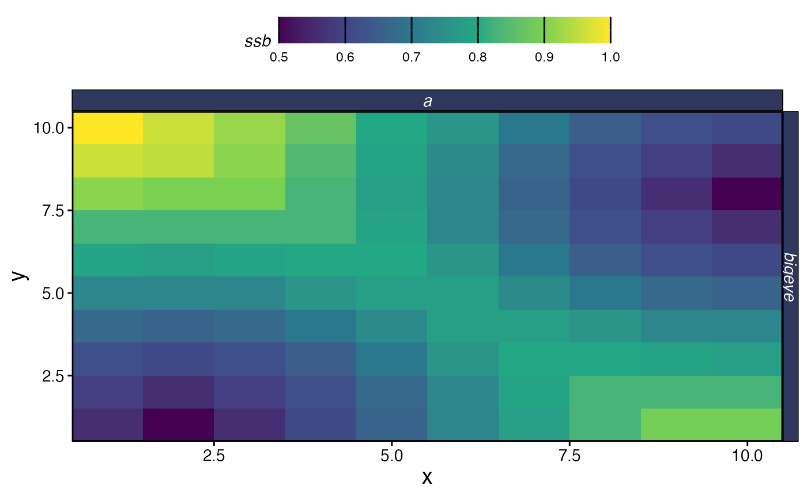
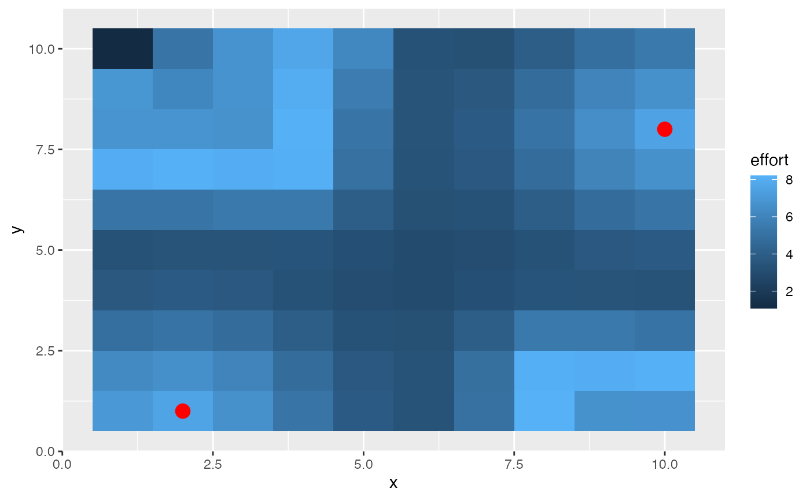

# Setting and Using Distance from Port

A wide range of fleet allocation models are available in the literature
and in `marlin`. When the `spatial_allocation` option of `create_fleet`
is set to `profit` or `ppue` (profit per unit effort), you can also
specify a series of port locations for each fleet, as well as a
cost-per-unit-distance. This will create an underlying “cost per patch”
of fishing, which is then multiplied by the total amount of effort in
each patch in calculating total profits or profit per unit effort.

The net result of this is that you can simulate scenarios where the
fishing fleet prefers to stay closer to port all else being equal,
resulting in the fleet staying in more depleted fishing grounds near
port over more productive but costly patches offshore.

First, let’s set up port locations. Every fleet can have ports in as
many cells as you’d like, and every fleet can have different ports.
Let’s set up a 10x10 system, with two ports, with their locations
specified by x and y coordinates.

``` r
library(marlin)

library(ggplot2)


resolution <- c(10, 10)

patches <- prod(resolution)

years <- 20

ports <- data.frame(x = c(2, 10), y = c(1, 8))
```

Now we’ll create a population of bigeye tuna.

``` r
fauna <-
  list(
    "bigeye" = create_critter(
      scientific_name = "thunnus obesus",
      init_explt = .2,
      explt_type = "f",
      resolution = resolution
    )
  )
```

We’ll then create a fishing fleet with the desired port locations.

``` r
fleets <- list(
  "longline" = create_fleet(
    list("bigeye" = Metier$new(
      critter = fauna$bigeye,
      price = 1,
      sel_form = "logistic",
      sel_start = 1,
      sel_delta = .01,
      catchability = 1e-3,
      p_explt = 1
    )),
    ports = ports,
    base_effort = prod(resolution),
    resolution = resolution,
    spatial_allocation = "marginal_profit",
    cost_per_unit_effort = 1,
    travel_fraction = .5,
    fleet_model = "open_access"
  )
)


fleets <- tune_fleets(fauna, fleets, tune_costs = TRUE)

fleets$longline$cost_per_unit_effort
#> [1] 0.5275075
```

From there, run simulation and see how the fleet concentrates around the
ports.

``` r
port_sim <- simmar(
  fauna = fauna,
  fleets = fleets,
  years = years
)

process_sim <- process_marlin(port_sim)

plot_marlin(
  process_sim,
  plot_var = "ssb",
  plot_type = "space"
)
#> Warning in plot_marlin(process_sim, plot_var = "ssb", plot_type = "space"): Can
#> only plot one time step for spatial plots, defaulting to last of the supplied
#> steps
```



``` r

patch_effort <- tidyr::expand_grid(x = 1:fauna[[1]]$resolution[1], y = 1:fauna[[1]]$resolution[2]) %>%
  dplyr::mutate(effort = port_sim[[length(port_sim)]]$bigeye$e_p_fl$longline)

patch_effort %>%
  ggplot() +
  geom_tile(aes(x, y, fill = effort)) +
  geom_point(data = ports, aes(x = x, y = y), color = "red", size = 4)
```



Note that this behavior is still quite basic. Distance is calculated as
the euclidean distance between patches, and at this time does not
support say having to travel around islands or the like. `marlin` also
assumes that travel costs are just a linear function of distance.
