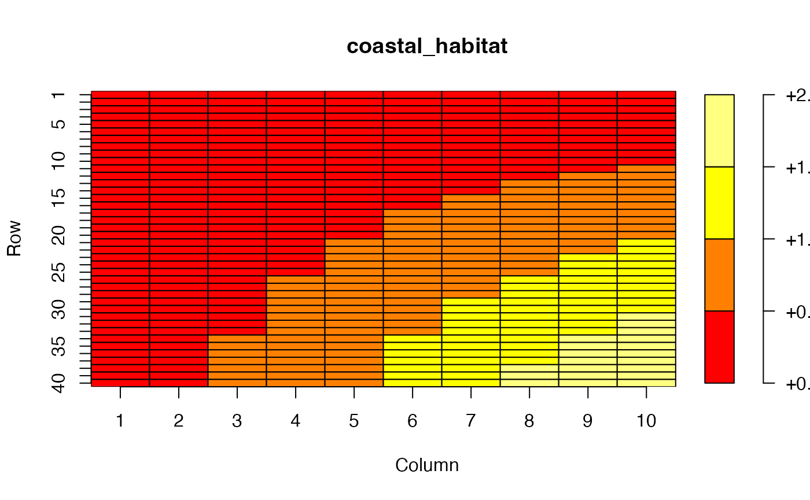

# Don't Be a Square

`marlin` defaults to a square resolution with equal numbers of cells in
the X and Y directions for the simulation grid. But no need for you to
get stuck in a square!

The `resolution` parameter allows you to specify any rectangular shape
for your simulation space.

In the example below, we’ll simulate coastal rockfish species living
along a west-facing coastline with a rapid dropoff to deep waters that
the species does not live in.

In this case, we’ll use the `resolution` parameter to define a system
that is 6 cells wide by 42 cells tall.

Each cell will have an area of 10km², meaning that the simulation area
is 2,520 KM² and covers roughly 132 KM “north” to “south”

``` r
library(marlin)

library(tidyverse)

library(plot.matrix)

options(dplyr.summarise.inform = FALSE)

theme_set(marlin::theme_marlin(base_size = 14))

resolution <- c(100, 100) # specify a 10 wide by 40 tall grid

patch_area <- 10 # 10km2

years <- 10

rockfish_diffusion <- 2 # KM2 / year
```

We’ll now make up a habitat layer in which the species prefers to live
closter to shore (with shore being on the eastern edge of the simulation
space)

``` r
coastal_habitat <- expand_grid(x = 1:resolution[1], y = 1:resolution[2]) %>%
  dplyr::mutate(
    habitat = -.2 + .2 * x * y,
    habitat = habitat / max(habitat) * rockfish_diffusion
  ) |>
  pivot_wider(names_from = x, values_from = habitat) %>%
  select(-y) %>%
  as.matrix()

plot(coastal_habitat)
```



And from there we pass things to the usual sets of functions

``` r
fauna <-
  list(
    "rockfish" = create_critter(
      common_name = "blue rockfish",
      adult_home_range = 10,
      recruit_home_range = 10,
      density_dependence = "post_dispersal",
      habitat = coastal_habitat,
      recruit_habitat = coastal_habitat,
      patch_area = patch_area,
      seasons = 4,
      fished_depletion = .25,
      resolution = resolution,
      steepness = 0.6,
      ssb0 = 42,
      m = 0.4
    ),
    "lingcod" = create_critter(
      common_name = "lingcod",
      adult_home_range = 10,
      recruit_home_range = 10,
      density_dependence = "post_dispersal",
      habitat = coastal_habitat,
      recruit_habitat = coastal_habitat,
      patch_area = patch_area,
      seasons = 4,
      fished_depletion = .7,
      resolution = resolution,
      steepness = 0.6,
      ssb0 = 100,
      m = 0.2
    )
  )


fauna$rockfish$movement_matrix[[1]] -> mat
nnz <- Matrix::nnzero(mat)
total <- prod(dim(mat))
sparsity <- 1 - nnz / total

fleets <- list(
  "dayboats" = create_fleet(
    list(
      "rockfish" = Metier$new(
        critter = fauna$rockfish,
        price = 10,
        sel_form = "logistic",
        sel_start = 1,
        sel_delta = .01,
        catchability = 0,
        p_explt = 1
      ),
      "lingcod" = Metier$new(
        critter = fauna$lingcod,
        price = 10,
        sel_form = "logistic",
        sel_start = 1,
        sel_delta = .01,
        catchability = 0,
        p_explt = 1
      )
    ),
    base_effort = prod(resolution),
    resolution = resolution
  )
)


# fleets <- tune_fleets(fauna, fleets, tune_type = "depletion")

start_time <- Sys.time()

coastline_sim <- simmar(
  fauna = fauna,
  fleets = fleets,
  years = years
)

Sys.time() - start_time
#> Time difference of 5.253862 secs


processed_coastline <- process_marlin(coastline_sim, keep_age = FALSE)

A = coastline_sim$`1_1`$rockfish$c_p_a_fl

# DT <- as.data.table(as.table(A))         # dims + Freq
# setnames(DT, old = "N", new = "Freq", skip_absent = TRUE)
# setnames(DT, old = "Freq", new = "value")  # standardize column name
# # If you need a data.frame:
# df <- as.data.frame(DT)

# 
# tic()
# faster_maybe_processed_coastline <- fast_process_marlin(coastline_sim, keep_age = FALSE)
# toc()
```

``` r
plot_marlin(`Coastline Simulation` = processed_coastline, plot_type = "space")
#> Warning in plot_marlin(`Coastline Simulation` = processed_coastline, plot_type
#> = "space"): Can only plot one time step for spatial plots, defaulting to last
#> of the supplied steps
```


Rectangular simulation of a coastal rockfish species
