# Spatial Allocation Strategies

When a fleet decides *where* to fish, it optimizes some objective across
the available patches. In `marlin`, the `spatial_allocation` argument to
`create_fleet` controls what that objective is. Different objectives
produce very different spatial footprints of fishing effort, which in
turn shape the spatial depletion patterns for every species in the
system.

`marlin` currently supports the following `spatial_allocation` options:

- **`rpue`** (revenue per unit effort): the fleet chases the highest
  catch rates weighted by price. This is the default and a common
  assumption in spatial fleet models.
- **`revenue`**: the fleet moves toward patches with the highest *total*
  revenue, not per-unit-effort. High-effort patches stay attractive even
  as catch rates decline.
- **`ppue`** (profit per unit effort): like `rpue`, but subtracts the
  cost of fishing (including travel costs from port). Patches far from
  port become less attractive.
- **`profit`**: the fleet moves toward patches with the highest *total*
  profit. Similar to `revenue` but cost-aware.
- **`marginal_profit`**: the fleet responds to the *marginal* return of
  adding one more unit of effort to a patch. This is the most
  economically sophisticated option: a patch with high total profit but
  diminishing returns will be less attractive than one where the next
  unit of effort still pays off.
- **`cpue`** / **`catch`**: catch-based variants (not price-weighted).
- **`marginal_revenue`**: like `marginal_profit` but ignoring costs.
- **`manual`**: effort distributed proportionally to continuous weights
  in `fishing_grounds$fishing_ground`.
- **`uniform`**: effort spread equally across all open patches.

The mechanics of how effort is redistributed in response to these
objectives is explained in detail in the “How spatial allocation works”
section below. This vignette then demonstrates each option using a
shared two-species, two-fleet system with fishing ports, so that the
spatial cost structure matters for the cost-aware strategies.

## How spatial allocation works: the algorithm

Spatial effort allocation in `marlin` is handled by the
`allocate_effort` function, which uses a multiplicative velocity-field
update to redistribute a fleet’s total effort across patches in response
to an economic signal (the “objective”). The algorithm is designed to be
robust, gradient-based, and numerically stable even when patches differ
wildly in profitability.

### Step-by-step procedure

For each fleet at each time step:

**1. Flatness detection**  
Before attempting to optimize, the algorithm checks whether the
objective is effectively uniform across patches. If the range-based
coefficient of variation is below a threshold (default 0.1%):

``` math
\text{CV}_{\text{range}} = \frac{\max(O) - \min(O)}{|\text{median}(O)|} < \text{flatness\_tol}
```

then effort is distributed uniformly across all open patches and the
optimization is skipped. This prevents spurious concentration along
edges when there is no meaningful gradient to follow.

**2. Standardization**  
The objective $`O_p`$ in each patch $`p`$ is centered and scaled to
produce a $`z`$-score:

``` math
z_p = \frac{O_p - \text{median}(O)}{\text{scale}(O)}
```

where $`\text{scale}(O)`$ can be the median absolute deviation (default,
most robust), interquartile range, or standard deviation. The $`z`$
scores are then clipped to $`[-c, c]`$ (default $`c = 5`$) to prevent
extreme updates from outliers:

``` math
z_p \leftarrow \max(-c, \min(c, z_p))
```

Closed patches have $`z_p = 0`$.

**3. Velocity field**  
The standardized objective becomes a velocity after removing the mean
across open patches:

``` math
v_p = z_p - \bar{z}_{\text{open}}
```

This ensures that the velocity field integrates to zero over the open
domain, which is necessary for conserving total effort. Patches with
above-average objectives have $`v_p > 0`$ (attracting effort), and
patches with below-average objectives have $`v_p < 0`$ (repelling
effort).

**4. Multiplicative update**  
Current effort $`e_p`$ is updated via:

``` math
e_p^{\text{new}} \propto e_p \exp(\eta \, v_p)
```

where $`\eta`$ (default 1.0) controls the step size. The proportionality
constant is chosen to conserve total effort:

``` math
e_p^{\text{new}} = e_p \exp(\eta \, v_p) \times \frac{E_{\text{total}}}{\sum_p e_p \exp(\eta \, v_p)}
```

This is implemented in log-space for numerical stability. Closed patches
receive $`e_p^{\text{new}} = 0`$.

**5. Optional exploration mixing**  
If `eps_mix` \> 0, the result is blended with a uniform distribution to
allow re-entry into temporarily abandoned patches:

``` math
e_p^{\text{final}} = (1 - \epsilon) \, e_p^{\text{new}} + \epsilon \, \frac{E_{\text{total}}}{N_{\text{open}}}
```

### Why this algorithm?

The multiplicative update has several desirable properties:

- **Gradient-based**: Effort flows “uphill” toward high-value patches
  along the objective gradient.
- **Effort-conserving**: Total effort $`\sum_p e_p`$ is exactly
  preserved.
- **Non-negative**: Effort cannot become negative (provided it starts
  non-negative).
- **Smooth transitions**: The exponential update avoids discontinuous
  jumps, making the dynamics more realistic.
- **Scale-invariant**: The standardization step ensures that the update
  magnitude is comparable across fleets and time steps regardless of
  absolute objective values.

The algorithm is related to replicator dynamics from evolutionary game
theory and gradient flow on the simplex. In the limit of small $`\eta`$,
the continuous-time equivalent is:

``` math
\frac{de_p}{dt} = e_p \left( v_p - \langle v \rangle \right)
```

where $`\langle v \rangle = \sum_p (e_p / E_{\text{total}}) v_p`$ is the
effort-weighted average velocity. This is a stable dynamical system that
converges to a Nash equilibrium where effort is concentrated in patches
with the highest objective values.

### Objectives available

The objective $`O_p`$ is drawn from the “buffet” returned by `go_fish`,
which computes prospective catch, revenue, and profit for each patch
without actually removing fish. The `spatial_allocation` setting maps
to:

| `spatial_allocation` | Objective $`O_p`$ | Description | Economic interpretation |
|----|----|----|----|
| `rpue` | Revenue per unit effort | Value-weighted catch rate | Effort shifts toward patches that produce higher revenue per unit effort. This reflects fleets choosing locations where each unit of effort generates more revenue on average, without explicitly accounting for how crowding reduces returns. |
| `revenue` | Total revenue | Value-weighted catch | Effort shifts toward patches that produce the highest total revenue. This reflects fleets targeting areas with the highest overall value of catch, regardless of operating costs or how returns change as more vessels enter the area. |
| `ppue` | Profit per unit effort | Revenue net of costs per effort | Effort shifts toward patches that produce higher profit per unit effort. This reflects fleets choosing locations where each unit of effort generates more net profit on average, accounting for travel and operating costs. |
| `profit` | Total profit | Revenue minus costs | Effort shifts toward patches that produce the highest total profit. This reflects fleets targeting areas with the highest overall net returns, without explicitly accounting for how additional effort changes profitability. |
| `cpue` | Catch per unit effort | Biomass-weighted catch rate | Effort shifts toward patches that produce higher catch per unit effort. This reflects fleets choosing locations where each unit of effort generates more catch on average, regardless of price. |
| `catch` | Total catch | Biomass-weighted catch | Effort shifts toward patches that produce the highest total catch. This reflects fleets targeting areas with the highest total biomass or catch, regardless of economic value. |
| `marginal_profit` | Marginal profit | Change in total profit from the next unit of effort (finite difference) | Effort shifts toward patches where adding a small amount of additional effort would increase total profit the most. Over time, effort tends to distribute so that the last unit of effort earns similar profit across all actively fished patches. This is the closest approximation to the **Ideal Free Distribution (IFD)**, where effort distributes so that no vessel can increase profit by moving effort to another patch. |
| `marginal_revenue` | Marginal revenue | Change in total revenue from the next unit (finite difference) | Effort shifts toward patches where adding a small amount of effort would increase total revenue the most. Over time, effort tends to distribute so that the last unit of effort generates similar revenue across actively fished patches. This reflects the production-driven component of the **Ideal Free Distribution (IFD)**, but does not fully account for costs. |
| `manual` | User weights | Proportional to `fishing_grounds$fishing_ground` | Effort follows externally specified spatial preferences (e.g., fishing traditions, regulations, or predefined fishing grounds), rather than responding directly to economic outcomes. |
| `uniform` | None | Equal effort across open patches | Effort is spread evenly across space. Useful as a baseline representing no spatial preference or complete uncertainty about conditions. |

**Choosing a strategy for your use case:**

- **Unregulated open-access fishery?** → `revenue` or `rpue` (strong
  tragedy-of-commons)
- **Limited-entry or regulated fishery with individual decisions?** →
  `ppue` (moderate, cost-aware)
- **Cooperative, ITQ system, or single-owner fleet?** →
  `marginal_profit` (sole-owner optimum)
- **Transitional or mixed governance?** → `profit` or `marginal_revenue`
- **Exploring spatial management or MPA impacts across behavioral
  regimes?** → Run multiple scenarios to bracket uncertainty

The marginal variants require `calc_marginal_value` to compute
finite-difference derivatives each step, which adds computational cost
but produces more economically sophisticated spatial behavior
(especially for sole-owner fleets).

## Shared Setup

We’ll use a 10×10 grid with two critters (bigeye tuna and skipjack tuna)
that have different spatial habitats generated by `sim_habitat`, and two
fishing fleets (a longline fleet under open access dynamics and a
handline fleet under constant effort). Two ports are placed
asymmetrically to create spatial cost gradients.

``` r
library(marlin)
library(ggplot2)
library(dplyr)
library(tidyr)

theme_set(marlin::theme_marlin(base_size = 12) +
            theme(legend.position = "top"))

resolution <- c(20, 20)
patches <- prod(resolution)
years <- 20
seasons <- 2
time_step <- 1 / seasons

# Two ports: one nearshore corner, one offshore
ports <- data.frame(x = c(1, 8), y = c(1, 9))
```

### Habitat

We use `sim_habitat` to generate spatially correlated habitat for each
species. The `kp` parameter controls the spatial smoothness (lower =
smoother), and we supply a negative cross-species correlation so that
the two species prefer different parts of the seascape. This creates a
spatial tradeoff: fleets cannot maximize catch of both species in the
same patch.

``` r
# Negative correlation: species prefer different areas
critter_correlations <- matrix(c(1, -0.5,
                                 -0.5, 1), nrow = 2)

habitats <- sim_habitat(
  critters = c("bigeye", "skipjack"),
  kp = 0.1,
  critter_correlations = critter_correlations,
  resolution = resolution,
  patch_area = 1,
  output = "list"
)

# Extract the habitat matrices
bigeye_habitat <- habitats$critter_distributions$bigeye
skipjack_habitat <- habitats$critter_distributions$skipjack

# Quick look at the generated habitats
habitat_df <- expand_grid(critter = c("bigeye", "skipjack"),
                          x = 1:resolution[1],
                          y = 1:resolution[2]) %>%
  arrange(critter, x, y) %>%
  mutate(
    habitat = c(as.vector(bigeye_habitat),
                as.vector(skipjack_habitat))
  )

ggplot(habitat_df) +
  geom_tile(aes(x, y, fill = habitat)) +
  geom_point(data = ports, aes(x, y),
             color = "red", size = 3, shape = 17) +
  scale_fill_viridis_c(option = "D") +
  facet_wrap(~critter) +
  coord_equal() +
  labs(title = "Underlying Habitat Quality",
       subtitle = "Red triangles = port locations",
       fill = "Habitat")
```

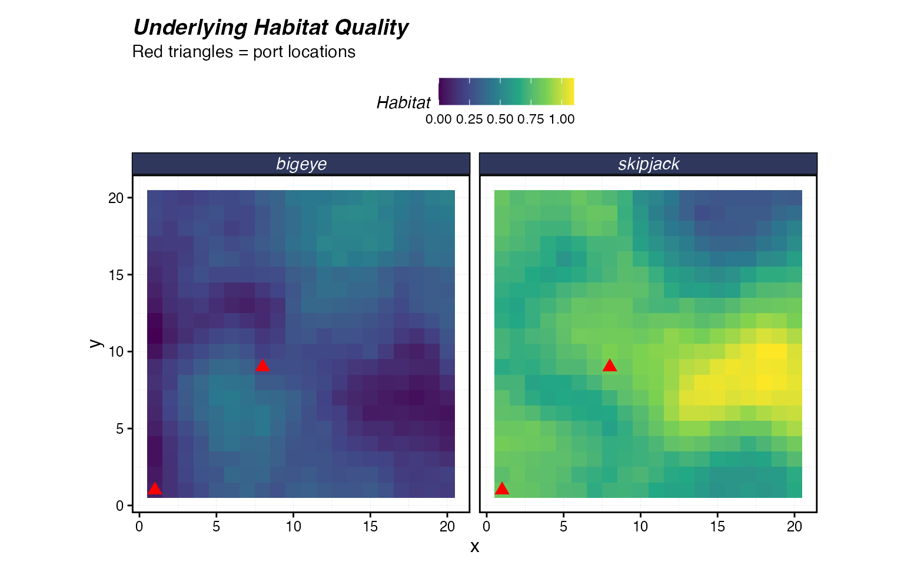

### Fauna

Both species use the habitats generated above. Bigeye are a
slower-moving, more heavily fished species, while skipjack are more
mobile and less depleted.

``` r
fauna <-
  list(
    "bigeye" = create_critter(
      common_name = "bigeye tuna",
      habitat = list(bigeye_habitat),
      season_blocks = list(1:seasons),
      adult_home_range = 5,
      recruit_home_range = 10,
      density_dependence = "local_habitat",
      seasons = seasons,
      depletion = 0.5,
      init_explt = 0.2,
      explt_type = "f",
      resolution = resolution,
      steepness = 0.6,
      ssb0 = 1000
    ),
    "skipjack" = create_critter(
      scientific_name = "Katsuwonus pelamis",
      habitat = list(skipjack_habitat),
      season_blocks = list(1:seasons),
      adult_home_range = 3,
      recruit_home_range = 8,
      density_dependence = "local_habitat",
      seasons = seasons,
      depletion = 0.6,
      init_explt = 0.15,
      explt_type = "f",
      resolution = resolution,
      steepness = 0.7,
      ssb0 = 800
    )
  )
```

### Fleet Builder

To keep the code DRY, we define a helper function that creates the
two-fleet system for any pair of `spatial_allocation` settings. The
longline fleet operates under open access (total effort responds to
profitability) and the handline fleet under constant effort. Both fleets
have the same port locations and a `travel_fraction` of 0.3, meaning
travel costs comprise 30% of total costs at equilibrium.

``` r
build_fleets <- function(longline_allocation, handline_allocation) {

  fleets <- list(
    "longline" = create_fleet(
      list(
        "bigeye" = Metier$new(
          critter = fauna$bigeye,
          price = 10,
          sel_form = "logistic",
          sel_start = 1,
          sel_delta = 0.01,
          catchability = 0,
          p_explt = 2
        ),
        "skipjack" = Metier$new(
          critter = fauna$skipjack,
          price = 5,
          sel_form = "logistic",
          sel_start = 0.8,
          sel_delta = 0.1,
          catchability = 0,
          p_explt = 1
        )
      ),
      ports = ports,
      base_effort = patches,
      resolution = resolution,
      spatial_allocation = longline_allocation,
      fleet_model = "open_access",
      cr_ratio = 1,
      travel_fraction = 0.7
    ),
    "handline" = create_fleet(
      list(
        "bigeye" = Metier$new(
          critter = fauna$bigeye,
          price = 10,
          sel_form = "logistic",
          sel_start = 1.2,
          sel_delta = 0.1,
          catchability = 0,
          p_explt = 1
        ),
        "skipjack" = Metier$new(
          critter = fauna$skipjack,
          price = 8,
          sel_form = "logistic",
          sel_start = 0.5,
          sel_delta = 0.2,
          catchability = 0,
          p_explt = 2
        )
      ),
      ports = ports,
      base_effort = patches,
      resolution = resolution,
      spatial_allocation = handline_allocation,
      fleet_model = "constant_effort",
      cr_ratio = 1,
      travel_fraction = 0.5
    )
  )

  fleets <- tune_fleets(fauna, fleets, tune_type = "depletion")

  fleets
}
```

### Plotting Helpers

We define helpers to extract the final-step effort and biomass and plot
them as spatial maps with port locations.

``` r
plot_effort <- function(sim, fleet_name, title = "") {
  final_step <- sim[[length(sim)]]
  effort_vec <- final_step[[1]]$e_p_fl[, fleet_name]

  patch_effort <- expand_grid(
    x = 1:resolution[1],
    y = 1:resolution[2]
  ) %>%
    mutate(effort = effort_vec)

  ggplot(patch_effort) +
    geom_tile(aes(x, y, fill = effort)) +
    geom_point(data = ports, aes(x, y),
               color = "red", size = 3, shape = 17) +
    scale_fill_viridis_c(option = "C") +
    labs(title = title, fill = "Effort") +
    coord_equal() +
    theme(plot.title = element_text(size = 11))
}

plot_biomass <- function(proc, title = "") {
  last_step <- max(proc$fauna$step)

  ssb_df <- proc$fauna %>%
    filter(step == last_step) %>%
    group_by(critter, x, y) %>%
    summarise(ssb = sum(ssb, na.rm = TRUE), .groups = "drop")

  ggplot(ssb_df) +
    geom_tile(aes(x, y, fill = ssb)) +
    geom_point(data = ports, aes(x, y),
               color = "red", size = 2, shape = 17) +
    scale_fill_viridis_c(option = "B") +
    facet_wrap(~critter) +
    coord_equal() +
    labs(title = title, fill = "SSB") +
    theme(plot.title = element_text(size = 11))
}
```

## Scenario 1: `rpue` vs `revenue`

In this scenario the longline fleet allocates effort based on `rpue`
(revenue per unit effort) while the handline fleet chases total
`revenue`.

The `rpue` fleet moves toward patches where catch rates are highest per
unit effort. This tends to spread effort more evenly, because as a
high-RPUE patch attracts more effort, catch rates decline there relative
to less-fished patches.

The `revenue` fleet, by contrast, gravitates toward patches with the
highest *total* revenue regardless of how much effort is already there.
This can lead to stronger concentration of effort in productive patches,
since high effort × moderate catch rate can still produce high total
revenue.

Neither strategy accounts for travel costs, so port location does not
directly influence where these fleets fish.

``` r
fleets_1 <- build_fleets("rpue", "revenue")

time_1 <- system.time({
  sim_1 <- simmar(fauna = fauna, fleets = fleets_1, years = years)
})

proc_1 <- process_marlin(sim_1, time_step = time_step)

plot_effort(sim_1, "longline", "Longline Effort (rpue)")
```

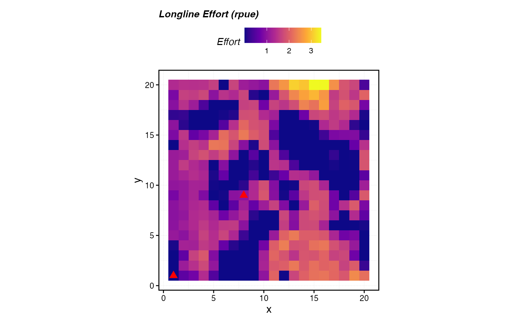

``` r
plot_effort(sim_1, "handline", "Handline Effort (revenue)")
```

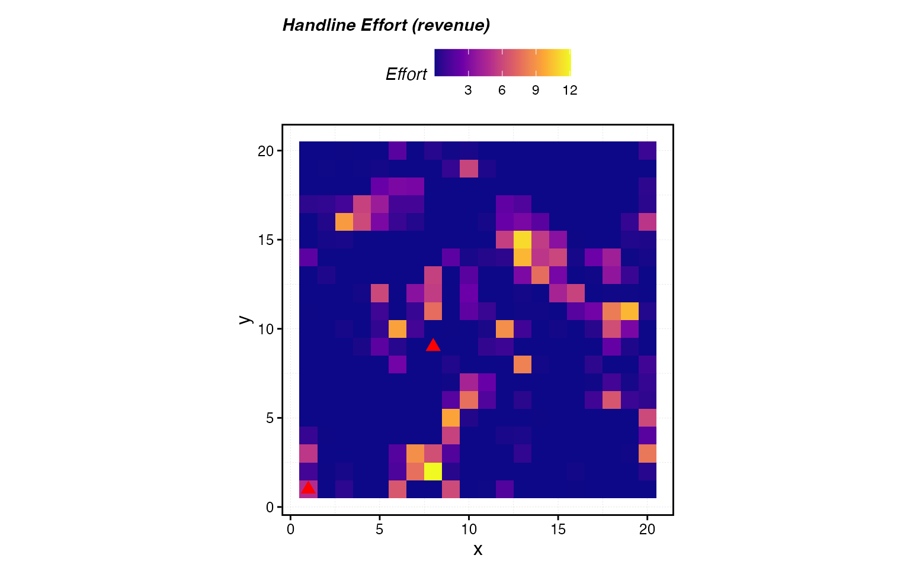

``` r
plot_biomass(proc_1, "SSB — rpue vs revenue")
```

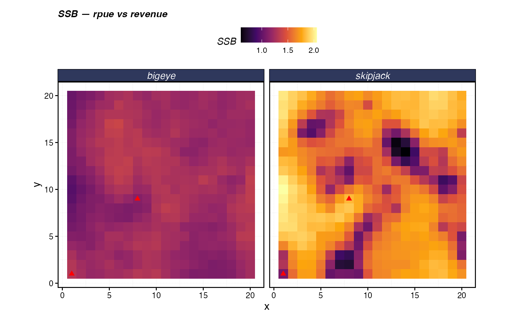

Notice how the longline fleet (rpue) distributes effort more diffusely
across productive patches, while the handline fleet (revenue)
concentrates more heavily in the highest-biomass areas. The biomass maps
show the resulting depletion patterns: species are drawn down most where
their habitat overlaps with each fleet’s effort hotspots.

## Scenario 2: `ppue` vs `profit`

Now we contrast the two cost-aware strategies. The longline fleet uses
`ppue` (profit per unit effort) and the handline fleet uses total
`profit`. Both account for the cost of traveling from port, but they
differ in whether the objective is per-unit-effort or total.

Because `ppue` divides profit by effort, it penalizes patches where
effort is high relative to returns. The `profit` strategy rewards
patches where total profit (revenue minus costs) is maximized, which can
favor concentrating effort in nearby productive patches even if per-unit
returns are declining.

With `travel_fraction = 0.3` and two asymmetrically placed ports, we
should see both fleets pulled toward the ports relative to the
cost-naive strategies above.

``` r
fleets_2 <- build_fleets("ppue", "profit")

time_2 <- system.time({
  sim_2 <- simmar(fauna = fauna, fleets = fleets_2, years = years)
})

proc_2 <- process_marlin(sim_2, time_step = time_step)

plot_effort(sim_2, "longline", "Longline Effort (ppue)")
```

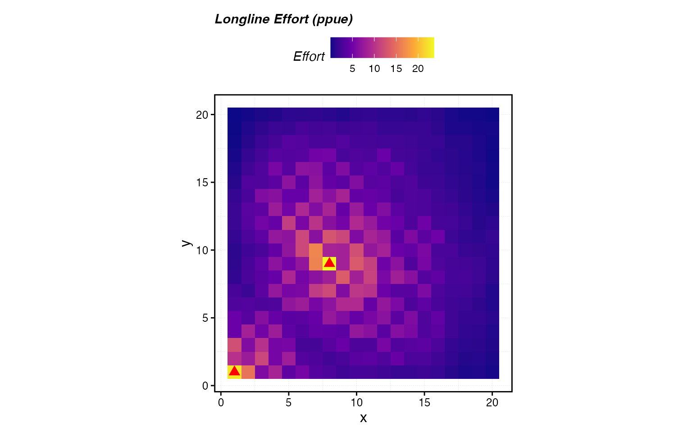

``` r
plot_effort(sim_2, "handline", "Handline Effort (profit)")
```

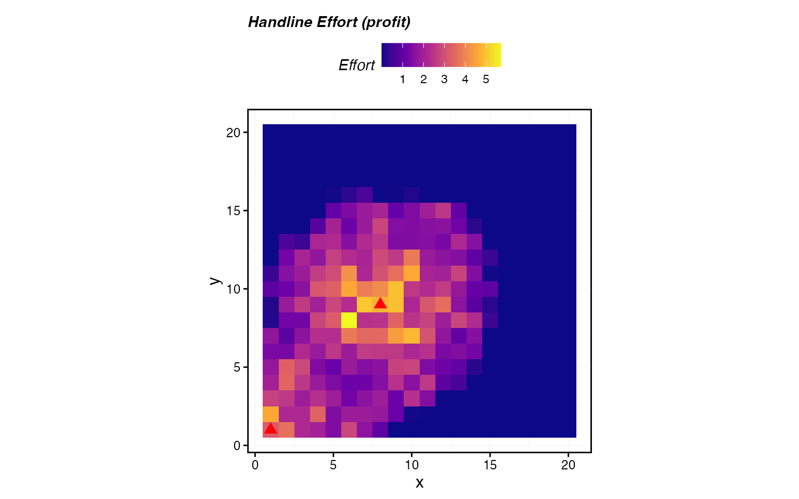

``` r
plot_biomass(proc_2, "SSB — ppue vs profit")
```

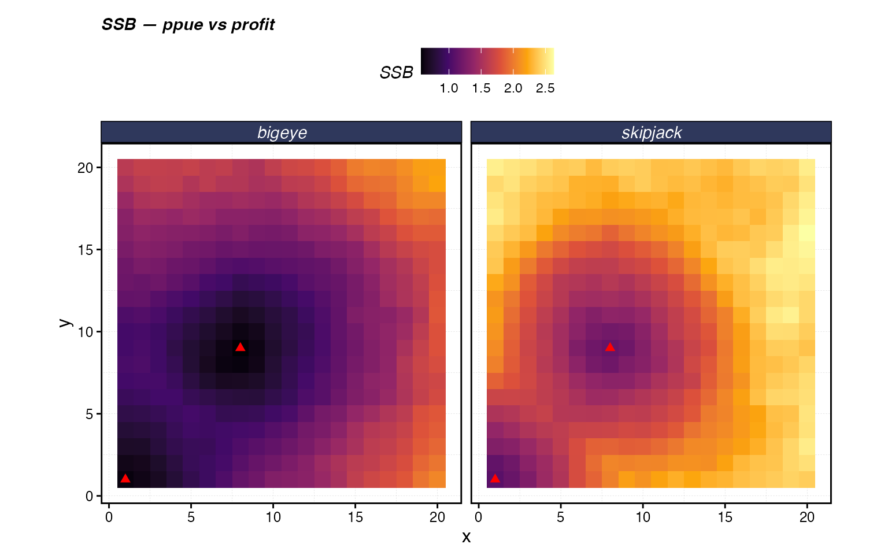

Compare these maps to Scenario 1. The cost-aware fleets are pulled
toward the port locations (red triangles), and patches far from any port
receive less effort than they would under `rpue` or `revenue`. The
biomass maps show that remote patches retain more biomass under
cost-aware allocation, since fleets fish them less intensively.

## Scenario 3: `marginal_profit` vs `rpue`

Finally, we demonstrate `marginal_profit`, the most economically
sophisticated allocation strategy. The longline fleet now allocates
based on the *marginal return* to an additional unit of effort in each
patch, while the handline fleet uses the simpler `rpue` as a baseline
for comparison.

Under `marginal_profit`, the fleet responds to diminishing returns: even
if a patch has high total profit or high RPUE, if the *next* unit of
effort there would yield little additional return, the fleet reallocates
toward patches where marginal returns are still high. This tends to
produce the most even spatial distribution of effort among all the
profit-aware strategies, because it directly penalizes
over-concentration.

``` r
fleets_3 <- build_fleets("marginal_profit", "rpue")

time_3 <- system.time({
  sim_3 <- simmar(fauna = fauna, fleets = fleets_3, years = years)
})

proc_3 <- process_marlin(sim_3, time_step = time_step)

plot_effort(sim_3, "longline", "Longline Effort (marginal_profit)")
```

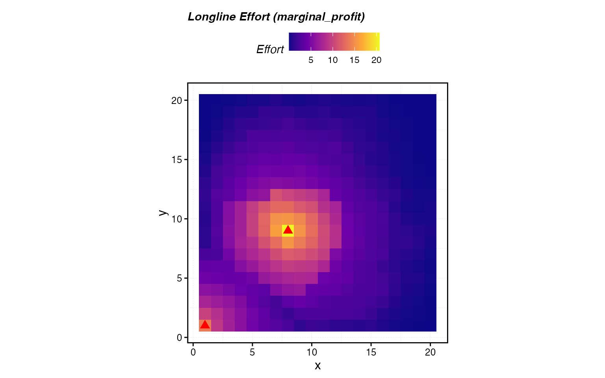

``` r
plot_effort(sim_3, "handline", "Handline Effort (rpue)")
```

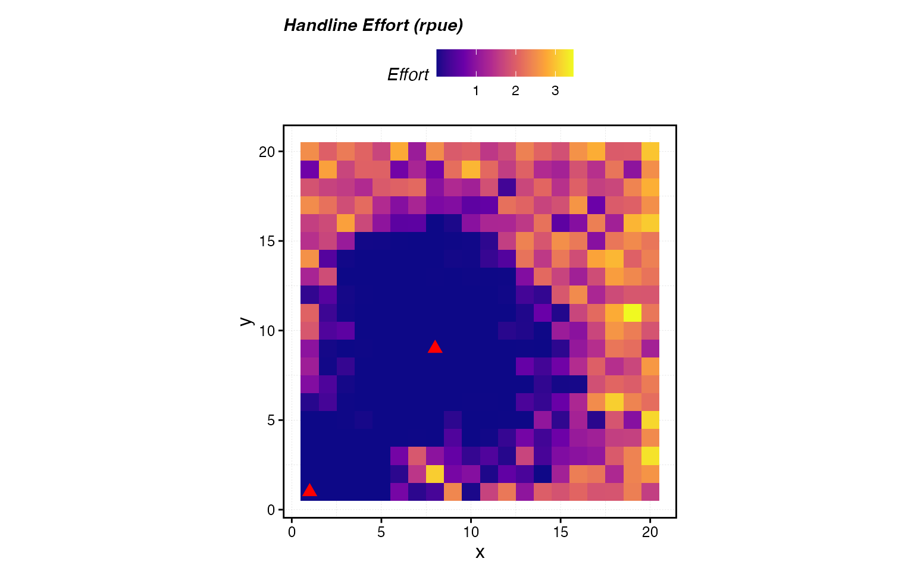

``` r
plot_biomass(proc_3, "SSB — marginal_profit vs rpue")
```

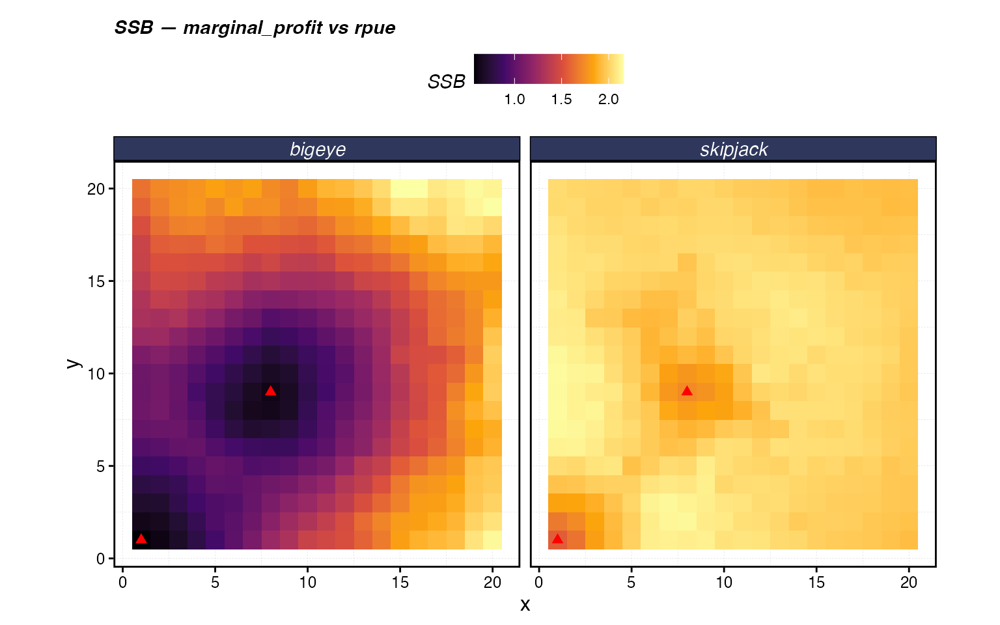

The `marginal_profit` fleet (longline) typically produces a smoother
effort surface than any of the other cost-aware strategies. Compared to
the `rpue` handline fleet sharing the same waters, the marginal profit
fleet is more sensitive to congestion: it avoids piling into patches
that are already heavily fished, even if those patches still have high
average returns. The biomass maps reflect this — depletion tends to be
more spatially uniform under `marginal_profit`.

## Scenario 4: `sole_owner` vs `open_access`

The previous scenarios varied the *spatial* allocation strategy while
keeping the fleet model (how total effort changes over time) fixed. Now
we flip that: both fleets use the same spatial allocation (`ppue`) but
differ in their *fleet model*.

The classic result from fisheries economics is that open access fleets
fish until average profit is zero (all rents dissipated), while a sole
owner — who internalizes the stock externality — stops expanding effort
when the *marginal* profit of the next unit of effort hits zero. This
corresponds to maximum economic yield (MEY), which occurs at lower
effort and higher biomass than the open access equilibrium.

In `marlin`, `fleet_model = "sole_owner"` implements this by using the
same dynamic entry/exit machinery as open access, but replacing the
profitability signal: instead of responding to total profits, the sole
owner responds to the effort-weighted mean of patch-level marginal
profits computed by `calc_marginal_value`.

We build this scenario manually rather than using `build_fleets`, since
the fleets differ in `fleet_model` rather than `spatial_allocation`.

``` r
fleets_oa <- list(
  "longline" = create_fleet(
    list(
      "bigeye" = Metier$new(
        critter = fauna$bigeye,
        price = 10,
        sel_form = "logistic",
        sel_start = 1,
        sel_delta = 0.01,
        catchability = 0,
        p_explt = 2
      ),
      "skipjack" = Metier$new(
        critter = fauna$skipjack,
        price = 5,
        sel_form = "logistic",
        sel_start = 0.8,
        sel_delta = 0.1,
        catchability = 0,
        p_explt = 1
      )
    ),
    ports = ports,
    base_effort = patches,
    resolution = resolution,
    spatial_allocation = "ppue",
    fleet_model = "open_access",
    cr_ratio = 1,
    travel_fraction = 0.7
  ),
  "handline" = create_fleet(
    list(
      "bigeye" = Metier$new(
        critter = fauna$bigeye,
        price = 10,
        sel_form = "logistic",
        sel_start = 1.2,
        sel_delta = 0.1,
        catchability = 0,
        p_explt = 1
      ),
      "skipjack" = Metier$new(
        critter = fauna$skipjack,
        price = 8,
        sel_form = "logistic",
        sel_start = 0.5,
        sel_delta = 0.2,
        catchability = 0,
        p_explt = 2
      )
    ),
    ports = ports,
    base_effort = patches,
    resolution = resolution,
    spatial_allocation = "ppue",
    fleet_model = "open_access",
    cr_ratio = 1,
    travel_fraction = 0.5
  )
)

fleets_so <- fleets_oa
fleets_so$longline$fleet_model <- "sole_owner"
fleets_so$handline$fleet_model <- "sole_owner"

fleets_oa <- tune_fleets(fauna, fleets_oa, tune_type = "depletion")
fleets_so <- tune_fleets(fauna, fleets_so, tune_type = "depletion")
```

Now we run both simulations side by side.

``` r
years_4 <- 50  # longer run to let both fleet models reach equilibrium

time_4a <- system.time({
  sim_4a <- simmar(fauna = fauna, fleets = fleets_oa, years = years_4)
})

time_4b <- system.time({
  sim_4b <- simmar(fauna = fauna, fleets = fleets_so, years = years_4)
})

proc_4a <- process_marlin(sim_4a, time_step = time_step)
proc_4b <- process_marlin(sim_4b, time_step = time_step)
```

The key comparison is the trajectory of total effort and profits over
time. The open access fleet should converge to zero profits, while the
sole owner should stabilize at lower effort with positive profits.

``` r
effort_ts <- bind_rows(
  proc_4a$fleets %>%
    group_by(step, fleet) %>%
    summarise(effort = sum(effort), .groups = "drop") %>%
    mutate(model = "open_access"),
  proc_4b$fleets %>%
    group_by(step, fleet) %>%
    summarise(effort = sum(effort), .groups = "drop") %>%
    mutate(model = "sole_owner")
)

ggplot(effort_ts, aes(step * time_step, effort, color = model)) +
  geom_line() +
  facet_wrap(~fleet) +
  scale_x_continuous(name = "Year") +
  scale_y_continuous(name = "Total Effort", limits = c(0, NA)) +
  labs(title = "Total Effort: Open Access vs Sole Owner",
       color = "Fleet Model")
```

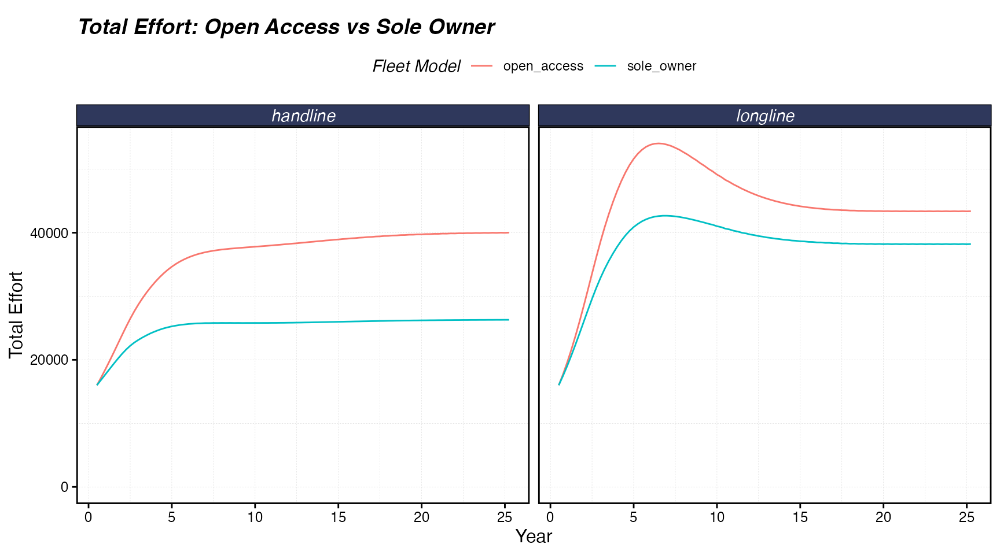

The sole owner settles at lower effort than open access for both fleets,
because it stops expanding when marginal returns hit zero rather than
waiting for average returns to be exhausted.

We can also compare profits over time. Open access should converge
toward zero, while the sole owner retains positive profits at
equilibrium (the hallmark of MEY).

``` r
profit_ts <- bind_rows(
  proc_4a$fleets %>%
    group_by(step, fleet) %>%
    summarise(revenue = sum(revenue), catch = sum(catch), .groups = "drop") %>%
    mutate(model = "open_access"),
  proc_4b$fleets %>%
    group_by(step, fleet) %>%
    summarise(revenue = sum(revenue), catch = sum(catch), .groups = "drop") %>%
    mutate(model = "sole_owner")
)

ggplot(profit_ts, aes(step * time_step, revenue, color = model)) +
  geom_line() +
  facet_wrap(~fleet) +
  scale_x_continuous(name = "Year") +
  labs(title = "Revenue: Open Access vs Sole Owner",
       color = "Fleet Model",
       y = "Revenue")
```

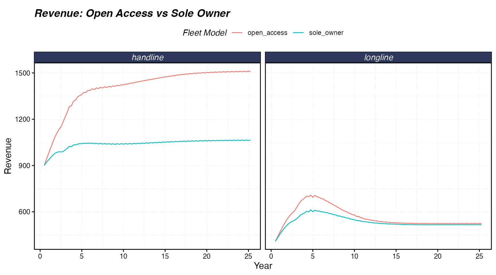

Finally, compare the spatial effort and biomass footprints at the end of
each simulation.

``` r
plot_effort(sim_4a, "longline", "Longline Effort (open_access)")
```


``` r
plot_effort(sim_4b, "longline", "Longline Effort (sole_owner)")
```

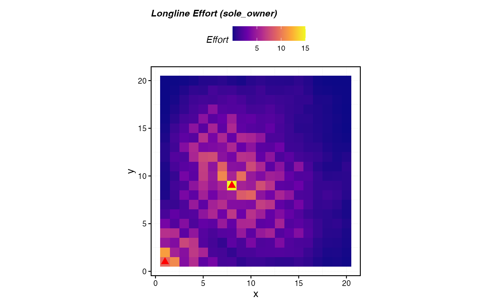

``` r
plot_biomass(proc_4a, "SSB — open_access")
```

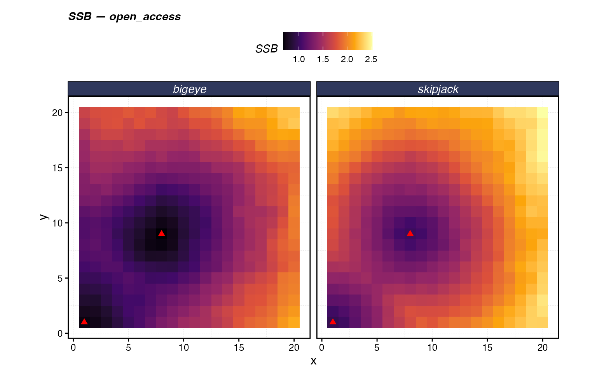

``` r
plot_biomass(proc_4b, "SSB — sole_owner")
```

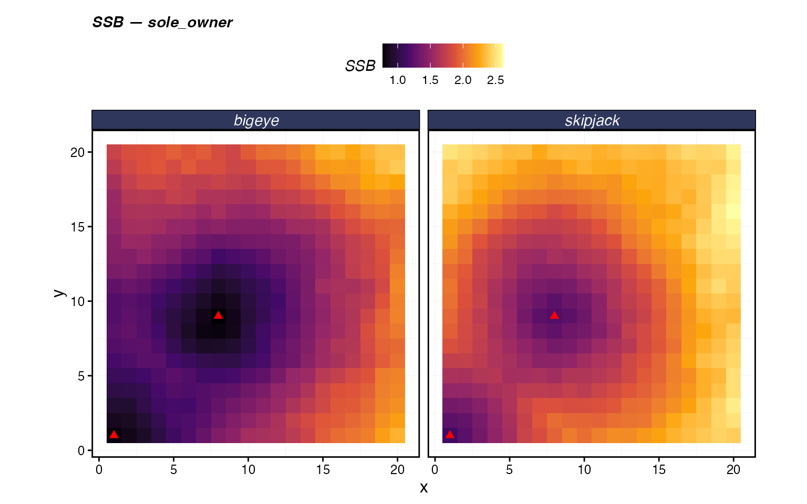

The sole owner leaves more biomass in the water because it fishes less
intensively. This is the fundamental tradeoff: open access maximizes
effort and dissipates rents, while the sole owner restrains effort to
maximize total profit, resulting in higher biomass and positive economic
returns.

## Runtime Comparison

The `marginal_profit` spatial allocation strategy and the `sole_owner`
fleet model both require computing numerical derivatives of the profit
function via `calc_marginal_value` at every time step, which adds extra
`go_fish` evaluations (one per fleet at minimum). This makes them
meaningfully slower than strategies that only need the quantities
already computed by the standard `go_fish` call.

``` r
runtime <- tibble(
  scenario = c("rpue / revenue", "ppue / profit", "marginal_profit / rpue",
               "open_access (ppue)", "sole_owner (ppue)"),
  seconds = c(time_1["elapsed"], time_2["elapsed"], time_3["elapsed"],
              time_4a["elapsed"], time_4b["elapsed"]),
  years_run = c(rep(years, 3), years_4, years_4)
) %>%
  mutate(
    sec_per_year = round(seconds / years_run, 2),
    relative = round(sec_per_year / min(sec_per_year), 1)
  )

knitr::kable(runtime,
             col.names = c("Scenario", "Seconds", "Years", "Sec/Year", "Relative to fastest"),
             digits = 2,
             caption = "Wall-clock time for simmar() by scenario. Sec/Year normalizes for different run lengths.")
```

| Scenario               | Seconds | Years | Sec/Year | Relative to fastest |
|:-----------------------|--------:|------:|---------:|--------------------:|
| rpue / revenue         |    0.64 |    20 |     0.03 |                 1.0 |
| ppue / profit          |    0.62 |    20 |     0.03 |                 1.0 |
| marginal_profit / rpue |    1.61 |    20 |     0.08 |                 2.7 |
| open_access (ppue)     |    1.51 |    50 |     0.03 |                 1.0 |
| sole_owner (ppue)      |    3.85 |    50 |     0.08 |                 2.7 |

Wall-clock time for simmar() by scenario. Sec/Year normalizes for
different run lengths.

## Summary Comparison

To see all five spatial allocation strategies side by side, we extract
final-step effort across Scenarios 1–3 and compare in a single figure.

``` r
extract_effort <- function(sim, fleet_name, label) {
  final_step <- sim[[length(sim)]]
  effort_vec <- final_step[[1]]$e_p_fl[, fleet_name]

  expand_grid(x = 1:resolution[1], y = 1:resolution[2]) %>%
    mutate(
      effort = effort_vec,
      strategy = label
    )
}

all_efforts <- bind_rows(
  extract_effort(sim_1, "longline", "rpue"),
  extract_effort(sim_1, "handline", "revenue"),
  extract_effort(sim_2, "longline", "ppue"),
  extract_effort(sim_2, "handline", "profit"),
  extract_effort(sim_3, "longline", "marginal_profit")
) %>%
  mutate(strategy = factor(strategy,
    levels = c("rpue", "revenue", "ppue", "profit", "marginal_profit")))

ggplot(all_efforts) +
  geom_tile(aes(x, y, fill = effort)) +
  geom_point(data = ports, aes(x, y),
             color = "red", size = 2, shape = 17) +
  scale_fill_viridis_c(option = "C") +
  facet_wrap(~strategy, ncol = 3) +
  coord_equal() +
  labs(
    title = "Effort Distribution by Spatial Allocation Strategy",
    subtitle = "Red triangles = port locations",
    fill = "Effort"
  )
```

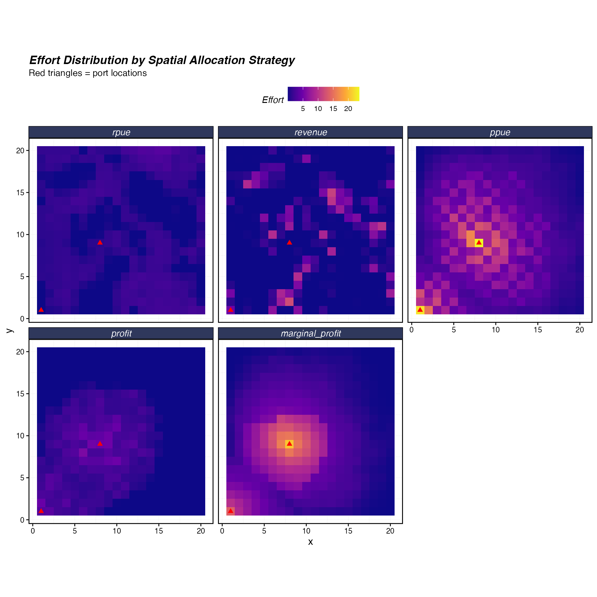

We can do the same for SSB to see how each allocation strategy shapes
the resulting biomass landscape. The rows correspond to the fleet
allocation pairings (longline / handline), and the columns to each
species.

``` r
extract_ssb <- function(proc, longline_alloc, handline_alloc) {
  last_step <- max(proc$fauna$step)

  proc$fauna %>%
    filter(step == last_step) %>%
    group_by(critter, x, y) %>%
    summarise(ssb = sum(ssb, na.rm = TRUE), .groups = "drop") %>%
    mutate(strategy = paste0(longline_alloc, " / ", handline_alloc))
}

all_ssb <- bind_rows(
  extract_ssb(proc_1, "rpue", "revenue"),
  extract_ssb(proc_2, "ppue", "profit"),
  extract_ssb(proc_3, "marginal_profit", "rpue")
)

ggplot(all_ssb) +
  geom_tile(aes(x, y, fill = ssb)) +
  geom_point(data = ports, aes(x, y),
             color = "red", size = 1.5, shape = 17) +
  scale_fill_viridis_c(option = "B") +
  facet_grid(strategy ~ critter) +
  coord_equal() +
  labs(
    title = "SSB by Allocation Strategy (longline / handline)",
    subtitle = "Red triangles = port locations",
    fill = "SSB"
  )
```

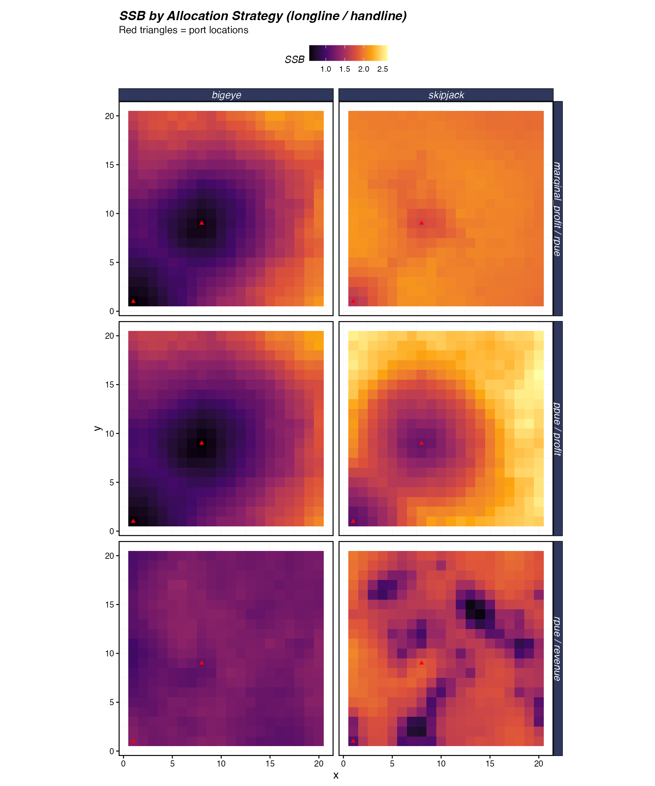

Some patterns to look for across these panels:

- **`rpue` vs `revenue`**: The per-unit strategy (`rpue`) tends to
  spread effort more evenly, while the total strategy (`revenue`)
  concentrates effort in high-biomass patches. Since neither accounts
  for travel costs, effort extends freely into remote patches.
- **`ppue` vs `profit`**: Adding travel costs shifts effort toward
  ports. The per-unit version (`ppue`) is especially reluctant to send
  effort far from port, creating biomass refugia in remote areas.
- **`marginal_profit`**: Produces the smoothest effort surface among
  cost-aware strategies, because it directly penalizes diminishing
  returns from effort concentration. This leads to the most spatially
  uniform depletion.
- **`sole_owner` vs `open_access`**: With the same spatial allocation
  (`ppue`), the sole owner reaches equilibrium at lower total effort and
  higher biomass than open access, retaining positive profits where open
  access dissipates them. This is the classic MEY vs. open-access
  result, now playing out in a spatially explicit setting.

The choice of `spatial_allocation` can substantially change the spatial
footprint of fishing, which in turn affects local depletion patterns,
the effectiveness of spatial management tools like MPAs, and the
economic outcomes of the fishery. See the `port-distance` and
`fleet-management` vignettes for more on how these fleet options
interact with other `marlin` features.
