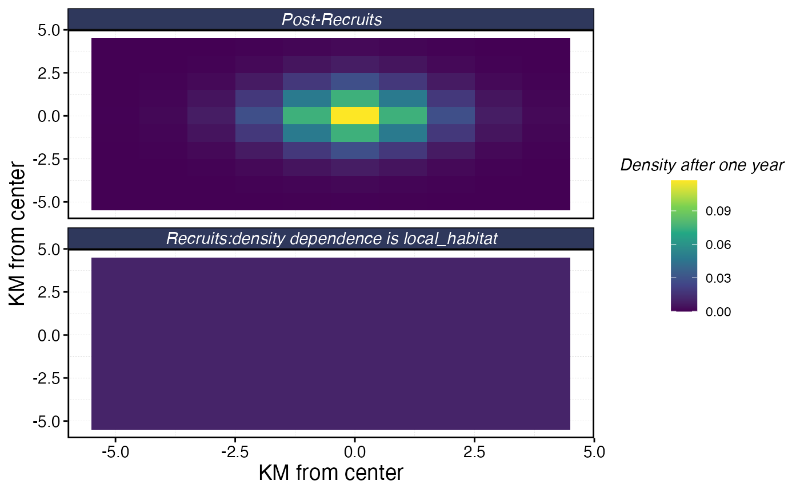

# Tune Home Range

``` r
library(marlin)
library(tidyverse)
#> ── Attaching core tidyverse packages ──────────────────────── tidyverse 2.0.0 ──
#> ✔ dplyr     1.2.0     ✔ readr     2.1.6
#> ✔ forcats   1.0.1     ✔ stringr   1.6.0
#> ✔ ggplot2   4.0.2     ✔ tibble    3.3.1
#> ✔ lubridate 1.9.4     ✔ tidyr     1.3.2
#> ✔ purrr     1.2.1     
#> ── Conflicts ────────────────────────────────────────── tidyverse_conflicts() ──
#> ✖ dplyr::filter() masks stats::filter()
#> ✖ dplyr::lag()    masks stats::lag()
#> ℹ Use the conflicted package (<http://conflicted.r-lib.org/>) to force all conflicts to become errors
seasons <- 1
patch_area <- 10 #km2
fauna <-
  list(
    "bigeye" = create_critter(
      common_name = "bigeye tuna",
      adult_home_range = 4,
      density_dependence = "local_habitat",
      seasons = seasons,
      fished_depletion = .25,
      resolution = c(10,10),
      steepness = 0.6,
      ssb0 = 42,
      m = 0.4
    )
  )

fauna$bigeye$plot_movement()
```


